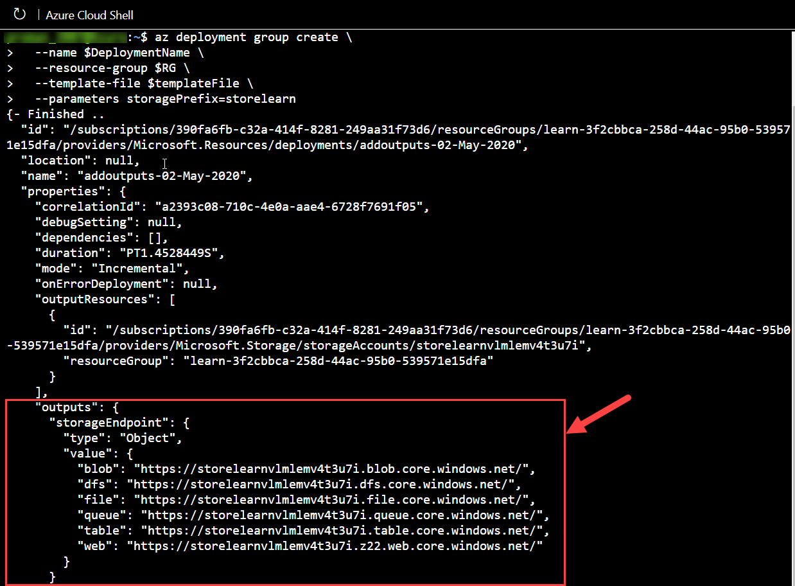

# Add outputs to your template - Exercise

## Review template
At the end of the previous exercise, your template had the following template:

:::code language="JSON" source="../samples/exercise4-function-2.json":::

It deploys your storage account, but it doesn't return any information about the storage account. You may need to capture properties of the new resource,  so they'd be available later for reference or to pass them on to another template should you be using [nested templates](https://docs.microsoft.com/azure/azure-resource-manager/templates/linked-templates).

### Add outputs

You can use outputs in your templates to return properties from the resources you just deployed. For example, it might be helpful to get the endpoints for your new storage account.

In this exercise you will change to your template to add output values. in the code below, you will  notice, the new **outputs** section.  It uses functions **[reference(variables('uniqueStorageName')).primaryEndpoints]** to extract the endpoint of the storage account you are deploying using your constructed **uniqueStorageName** name. The type of returned value is set to object, which means it will returns a JSON object.

It uses the reference function to get the runtime state of the storage account. To get the runtime state of a resource, you pass in the name or ID of a resource. In this case, you use the same variable you used to create the name of the storage account.

1. Open Visual Studio Code from the Azure shell provides here in the sandbox by using the following command.
       
```shell
    code azuredeploy.json
```

2. Copy and paste the highlighted code sections, or the whole file and replace the content of your existing template.

:::code language="JSON" source="../samples/exercise6-add-output.json" highlight="47-52":::

3. Save you changes and close the editor.

## Deploy your template

You're ready to deploy your template and get at the returned values.

Again, like in the previous exercises, you need to specify a resource group that will contain the resources. Before running the deployment command. In the **sandbox** provided here, you already have a resource group to target your deployment.

1. To get the name of the resource group in the sandbox, you can use an Azure CLI command. The Resource Group name might already be stored in the variable $RG from the last exercises.  in the shell use following command:

```bash
echo $RG
```

in no result is displayed, Type the code below in the sandbox to store the value of the Resource Group name in the "RG" variable for Azure CLI to use to deploy the template.

```azurecli
RG=$(az group list --query "[?contains(name, 'learn')].name" -o tsv)
```

To run this deployment, you will use Azure CLI that is built in the Azure shell that is currently available in the sandbox provided for this exercise.  To deploy your new template version, use the code below.  This code will store the template name, the date (used to create the deployment name) and the constructed deployment name in variables to be used by the **az deployment** command as parameters.

Copy and execute this code block in the shell provided.
> [!IMPORTANT]
> Don't forget to change **{your-Prefix-name}** in the code below with the same prefix you used in the last exercise.

:::code language="azurecli" source="../samples/exercise6-add-output.sh" highlight="9":::

The deployment command returns results in a JSON format. Look for `ProvisioningState` to see whether the deployment succeeded.


You'll also see in the output of the **AZ** command, an object similar to the following example only if the output is in JSON format:



### Review your work

You've done a lot in the last six exercises. You created a template with parameters that are easy to provide. The template is reusable in different environments because it allows for customization and dynamically creates needed values. It also returns information about the storage account that you could use in your script.

## let's look at the resource group and deployment history.

1. Sign in to the Azure [Azure portal for sandbox](https://portal.azure.com/learn.docs.microsoft.com?azure-portal=true).

2. From the left menu, select Resource groups, and select the resource group you deployed to.


Depending on the steps you took, you should have at least one and perhaps several storage accounts in the resource group (several if you did not use the same storage account name in all exercises). You should also have several successful deployments listed in the history field. Select the deployments link.


4. You see all of your deployments in the history. Select the deployment with the "addoutputs" prefix. Show deployment history and review the inputs and outputs. You can also review the template.


Congratulations, you've completed all the exercises in this learn module to build a template and deploy it to Azure.
