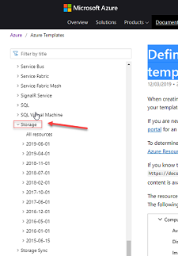

### Adding resources to your ARM template

When writing ARM templates to deploy resources in your subscriptions, you'll need to find and use information about the resource providers and types of resources.

For example, in the next exercise, you'll be adding a storage account to your template. In that case, you'll need to work with the **Microsoft.Storage** resource provider. This resource provider offers many resources types:

1. storageAccounts
1. storageAccounts/blobServices
1. storageAccounts/tableServices
1. storageAccounts/queueServices
1. storageAccounts/fileServices

The name of a resource type is normally displayed in the format: **{resource-provider}/{resource-type}**. Therefore, the resource type for a storage account is **Microsoft.Storage/storageAccounts**. You can use the following listing of the [Resource providers for Azure services](https://docs.microsoft.com/azure/azure-resource-manager/management/azure-services-resource-providers) to identify which providers you require to deploy a specific service. Once you know which provider and resource type you wish to deploy, you need to find the right properties to use for each resource type.

For that you go to the [Define resources in Azure Resource Manager templates](https://docs.microsoft.com/azure/templates/) page and in the left side menu find the resource you are trying to deploy. Right now you should be scrolling down to **Storage**.



There you will find each resource types and versions of the apiVersion that you need to identify the properties needed in your template.  for example, the latest version of the apiVersion for storage account provides you with the required template format in a JSON notation.  Including all the properties that can be defined in the template.

```json
{
  "name": "string",
  "type": "Microsoft.Storage/storageAccounts",
  "apiVersion": "2019-06-01",
  "sku": {
    "name": "string",
    "tier": "string"
  },
  "kind": "string",
  "location": "string",
  "tags": {},
  "identity": {
    "type": "SystemAssigned"
  },
  "properties": {
    "customDomain": {
      "name": "string",
      "useSubDomainName": "boolean"
    },
    "encryption": {
      "services": {
        "blob": {
          "enabled": "boolean",
          "keyType": "string"
        },
        "file": {
          "enabled": "boolean",
          "keyType": "string"
        },
        "table": {
          "enabled": "boolean",
          "keyType": "string"
        },
        "queue": {
          "enabled": "boolean",
          "keyType": "string"
        }
      },
      "keySource": "string",
      "keyvaultproperties": {
        "keyname": "string",
        "keyversion": "string",
        "keyvaulturi": "string"
      }
    },
    "networkAcls": {
      "bypass": "string",
      "virtualNetworkRules": [
        {
          "id": "string",
          "action": "Allow",
          "state": "string"
        }
      ],
      "ipRules": [
        {
          "value": "string",
          "action": "Allow"
        }
      ],
      "defaultAction": "string"
    },
    "accessTier": "string",
    "azureFilesIdentityBasedAuthentication": {
      "directoryServiceOptions": "string",
      "activeDirectoryProperties": {
        "domainName": "string",
        "netBiosDomainName": "string",
        "forestName": "string",
        "domainGuid": "string",
        "domainSid": "string",
        "azureStorageSid": "string"
      }
    },
    "supportsHttpsTrafficOnly": "boolean",
    "isHnsEnabled": "boolean",
    "largeFileSharesState": "string",
    "routingPreference": {
      "routingChoice": "string",
      "publishMicrosoftEndpoints": "boolean",
      "publishInternetEndpoints": "boolean"
    }
  },
  "resources": []
}
```

Every resource you deploy has at **least** the following three properties:

- **type**: Type of the resource. This value is a combination of the namespace of the resource provider and the resource type, such as Microsoft.Storage/storageAccounts, which you'll use in this part of the exercise.
- **apiVersion**: The version of the REST API to use for creating the resource. Each resource provider published its own API versions, so this value is specific to the type.  To get the information regarding which apiVersion is the one, you should be using refer to the [Define resources in Azure Resource Manager templates](https://docs.microsoft.com/azure/templates/) page.  It has the information needed to select the right apiVersion.<br>For the storage account you'll be deploying in this exercise, the afore mentioned page will provide you with all the properties that this particular [resource requires](https://docs.microsoft.com/azure/templates/microsoft.storage/2019-06-01/storageaccounts#property-values).
- **name**: The name you want to give the resource.  In some cases, it will need to be a unique name.

The majority of resources also require a **location** property, which sets the region where it is deployed. The other properties will vary depending on the resource type and API version.

In the case of the next exercise, considering that you will be adding a storage account to the empty template.
