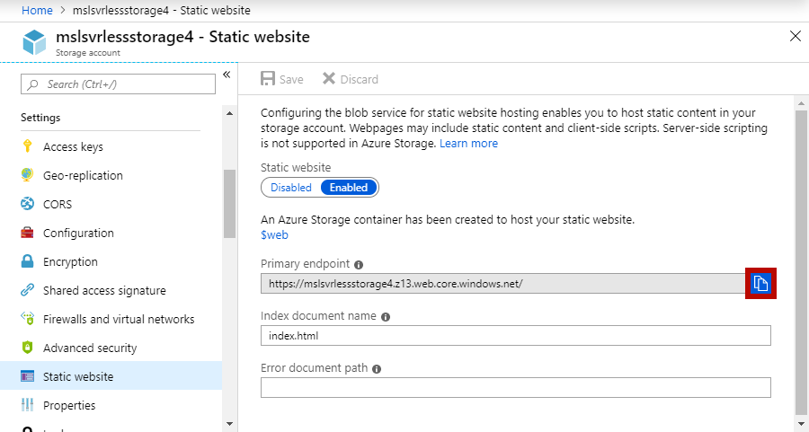
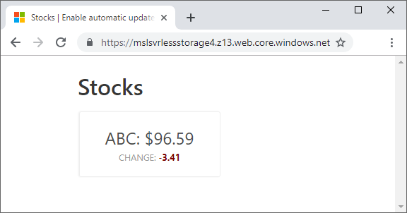

Up to this point you have only run the application on your machine. The next step is to deploy the app to Azure.

## Customize Visual Studio Code Azure Functions extension

To give you control over the settings associated with creating Azure Functions apps, update the Azure Functions extension to enable advanced settings.

1. Click **File > Preferences > Settings**
2. Navigate through **User Settings > Extensions > Azure Functions**
3. Check the checkbox for **Azure Function: Advanced Creation**


## Deploy the function app

1. Open the Visual Studio Code command palette via **CTRL/CMD+Shift+P**.

2. Search for and select the **Azure Functions: Deploy to Function App** command.

3. When prompted, provide the following information.

   | Name              | Value                                                        |
   | ----------------- | ------------------------------------------------------------ |
   | Subscription      | Select your subscription                                     |
   | Function app      | Select **Create new Function App in Azure**                  |
   | Function app name | Enter a unique name                                          |
   | OS                | Select **Windows**                                           |
   | Plan              | Select **Consumption**                                       |
   | Language          | Select **JavaScript**                                        |
   | Resource group    | Select **<rgn>[sandbox resource group name]</rgn>**          |
   | Storage account   | Select the account you created earlier                       |

A new function app is created in Azure and the deployment begins. The Azure Functions Visual Studio Code extension first creates the Azure resources and deploys the function app.

Once complete, the Azure Functions extension reports the primary endpoint of the function in a message box as shown by this screenshot.


The function app name (labeled as **1** in the image) is the unique name you provided to the extension as you created the app. The app end point (labeled as **2**) is the function app name followed by *azurewebsites.net*.

Open *public/index.html.js* and replace `<FUNCTION_APP_ENDPOINT>` with the function's endpoint.

### Upload local settings

Another message box will also appear in Visual Studio code which asks you if you want to upload local settings. Click the **Upload settings** button to copy the values from *local.settings.json* to the server.


If the message box never appears or has dismissed from Visual Studio Code, you can still upload your local settings by opening the Visual Studio Code command palette via **CTRL/CMD+Shift+P** and select **Azure Functions: Upload local settings**.

## Configure static websites in Azure Storage

<!-- REVIEW - Need to update prerequisites to include Azure Storage extension -->

Use the following steps to configure the Azure Storage account to host a static website.

1. Open the Visual Studio Code command palette via **CTRL/CMD+Shift+P**.
2. Search for and select the **Azure Storage: Configure static website** command.

   | Name              | Value                                                             |
   | ----------------- | ----------------------------------------------------------------- |
   | Subscription      | Select your subscription                                          |
   | Storage account   | Select the account you created earlier                            |
   | Default file      | Select **index.html** as the index document name for the account. |
   | Error document    | Press **Enter** to accept the default 404 error document path     |
   | Deployment folder | Select the folder of the functions app                            |

Now that static website hosting enabled on your storage account, you need to get the primary endpoint of the website.

1. Open the Visual Studio Code command palette via **CTRL/CMD+Shift+P**.
2. Search for and select the **Azure Storage: Open in portal** command.
3. Select and subscription and storage account
4. Once the portal is open in the browser, navigate to **Settings > Static Website**
5. Click the **Copy** button next to the *Primary endpoint* box



You use the endpoint value to set up CORS settings for the function app in the next section.

### Add CORS origin

1. Open the Visual Studio Code command palette via **CTRL/CMD+Shift+P**.
2. Search for and select the **Azure Functions: Open in portal** command.
3. Select the subscription and function app name.
4. Once the portal is open in the browser, click on the **Platform features** tab.
5. Click **CORS**.
6. Check the checkbox next to **Enable Access-Control-Allow-Credentials**.
7. Add an entry with the *static website* **primary endpoint** as the value (make sure to remove the trailing `/`). You should be able to paste this value in from your clipboard.
8. Click **Save** to persist the CORS settings.


## Deploy the web application to Azure Storage

1. Open the Visual Studio Code command palette via **CTRL/CMD+Shift+P**.
2. Search for and select the **Azure Storage: Deploy to static website** command.
3. Select the subscription and Storage account.
4. When prompted for a folder, select **browse** and *public/index.html*.
5. A notification should appear that the upload was successful.
6. Click the button to open the app in a browser.

## Observe automatic updates

Now you can make change to the application's data and observe how to the data is automatically updated.

Again, consider having Visual Studio Code on one side of the screen and the running application on the other. This way you can see the UI update as changes are made to the database.

In Visual Studio integrated terminal, enter the following command and watch as the UI is automatically updated.

```bash
npm run update
```

