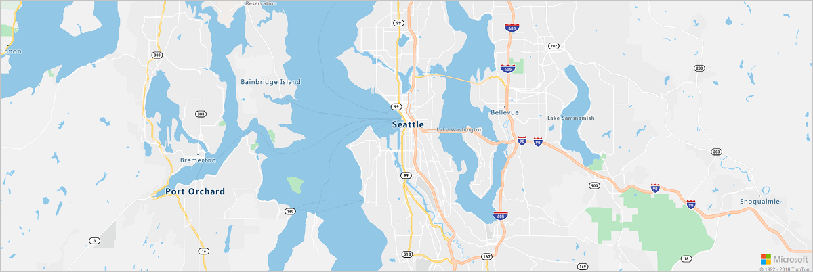
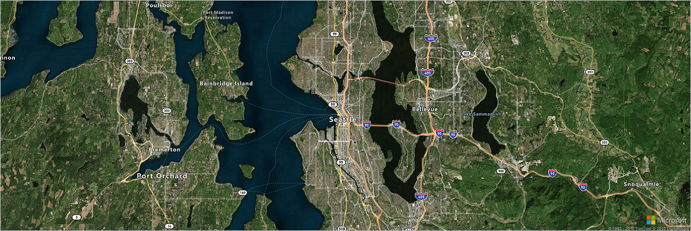

The Azure Maps web SDK has a wide variety of tools for visualizing spatial data on an interactive map on a webpage. Before we get started adding the map to a webpage, let's look at some of the capabilities.

## Render a map

The Azure Maps web SDK has an interactive JavaScript map control that you can add to a webpage. Maps are drawn (*rendered*) by using the *Spherical Mercator projection coordinate system*, a standard for web-based mapping applications. This system stretches the map at both the North and the South pole to create a square map that can be drawn on-screen. A result of the stretching is that the further away from the equator you get, the more stretched the map is. Countries like Greenland appear substantially larger than they are in reality.

Maps can be rendered in different styles. These styles include:

- **Road**: A standard map style that displays roads and natural and artificial features, with feature labels

    

- **Satellite**: A combination of satellite and aerial imagery

    

- **Satellite with road labels**: A combination of satellite and aerial imagery, with an overlay of roads and labels

    

- **High-contrast**: A dark road map with higher contrast than other styles

    

More styles are described in [Azure Maps supported map styles](/azure/azure-maps/supported-map-styles?azure-portal=true).

## Move around the map

Azure Maps controls can be configured to be fully interactive, so the user can zoom, move, rotate, and tilt the map view. When zoomed in and tilted, the map can show 3D representations of the shape of buildings. Move around the map by using a mouse or trackpad, or a touchscreen that supports pinching to zoom and dragging. The map control has zoom, compass, pitch, and style picker controls that can be enabled and shown on the map.

You also can set the map navigation in your app code. For example, you can set the view to a specific location. You can disable or enable user navigation capabilities in settings for the map control.

## Layers

Maps can be augmented with layers. A layer visualizes data on top of a map. In a later unit in this module, you'll use a layer on a map to visualize air quality data.

When you create an app that uses a map control, you can choose from different layer types. All layer types render data sources that contain either GeoJSON data or [MapBox vector tiles](https://github.com/mapbox/vector-tile-spec?azure-portal=true). We'll cover GeoJSON later in this module

The different layer types include:

- **Symbol layer**:  Symbol layers put either a pin icon or a custom icon loaded from an image file at a specific location on the map. For example, different icons might show the location of various types of social support in a city, such as food banks, homeless shelters, or refuges.

- **Bubble layer**: Bubble layers put circular bubbles at locations on the map. The bubbles can be configured to show the data they're representing, such as setting the bubble size or color. For example, during a pandemic, different bubble sizes might show the number of people who have contracted an illness, with the color reflecting the mortality rate.

- **Heat map**: Heat map layers represent the density of data using a range of colors to show "hot spot" areas on a map. For example, a heat map might be used to show the relative risk of earthquakes based on the number and strength of previous earthquakes.

The locations of features in a layer are defined by a data source. The data source also can provide data to use to configure controls on the layer. Examples are what image to display or how large to make a bubble.

In this unit, you learned about the Azure Maps web SDK, including styles, navigation, and layers. Next, you'll create an Azure Maps account, so you can use the web SDK in a web app.
