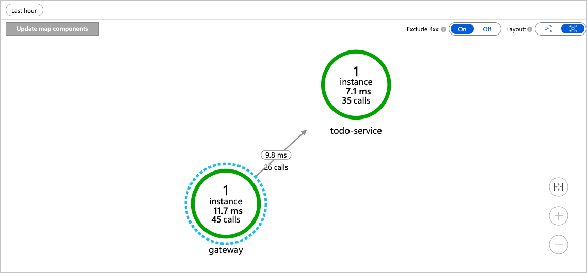

Monitor our services with Azure Spring Cloud's distributed tracing mechanism, to better understand microservices issues.

We now have a complete microservices stack:

- A Spring Boot microservice, that stores its data in MySQL.
- A gateway based on Spring Cloud Gateway.

However, even with only those two components, it already is quite challenging to monitor and study performance issues in our architecture.

To solve that issue, we're going to set up a distributed tracing solution:

- We'll instrument our applications by adding the `spring-cloud-starter-zipkin` dependency, so that they send telemetry data.
- In Azure Spring Cloud, this telemetry data will automatically be ingested and analyzed by Azure Monitor.

## Enable distributed tracing to better understand the architecture

In our two applications (`todo-service` and `gateway`), open up the `pom.xml` file and add the following Maven dependency as a child element of the __first__ `<dependencies>` element.

```java
        <dependency>
            <groupId>org.springframework.cloud</groupId>
            <artifactId>spring-cloud-starter-zipkin</artifactId>
        </dependency>
```

This dependency will add distributed tracing capabilities to our microservice and gateway.

Now you need to update those applications on Azure Spring Cloud.

Redeploy the `todo-service` microservice:

```bash
cd todo-service
./mvnw clean package -DskipTests
az spring-cloud app deploy -n todo-service --jar-path target/demo-0.0.1-SNAPSHOT.jar
cd ..
```

Redeploy the `gateway` gateway:

```bash
cd gateway
./mvnw clean package -DskipTests
az spring-cloud app deploy -n gateway --jar-path target/demo-0.0.1-SNAPSHOT.jar
cd ..
```

### Once everything is deployed

1. Go to [the Azure portal](https://portal.azure.com/?WT.mc_id=azurespringcloud-mslearn-judubois).
2. Go to the overview page of your Azure Spring Cloud cluster and select "Distributed tracing" in the menu.
3. This setting should already be on "Enable".
4. You will have access to an "application map", storing your tracing data.

> [!TIP]
> Tracing data can take a couple of minutes to be ingested by the system, so use this time to generate some load, and wait for the data to arrive.

You should now have access to a full application map and to a search engine that allows to find performance bottlenecks.


