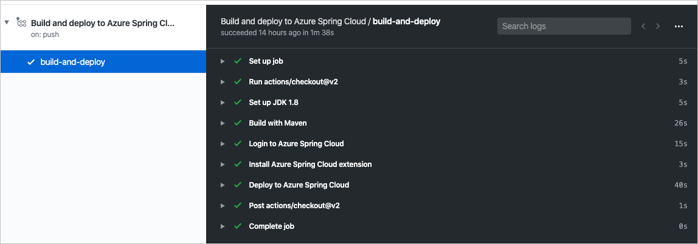

Our microservice and gateway are easy to deploy manually, but it is of course better to automate all those tasks! We are going to use [GitHub actions](https://github.com/features/actions) as a Continuous Integration / Continuous Deployment platform (or CI/CD for short).

We will automate the deployment of the `todo-service` microservice that we developed earlier. It is exactly the same configuration that would need to be done for the gateway, so if you want to automate it too, you can just copy/paste what is being done in the current module.

## Configure GitHub

[Create a new GitHub repository](https://github.com/new) and commit the code from the `todo-service` microservice into that repository:

> [!CAUTION]
> Make sure you substitute the Git URL from your own github repository (make sure you use the HTTPS URL, not the SSH URL).

```bash
cd todo-service
git init
git add .
git commit -m 'Initial commit'
git remote add origin <GIT HTTPS URL HERE>
git push origin master
cd ..
```

You now need to allow access from your GitHub workflow to your Azure Spring Cloud cluster. Open up a terminal and copy/paste the following commands.

```bash
# Get the ARM resource ID of the resource group
RESOURCE_ID=$(az group show --name "$RESOURCE_GROUP_NAME" --query id -o tsv)

# Create a service principal with a Contributor role to the resource group.
SPNAME="sp-$(az spring-cloud list --query '[].name' -o tsv)"
az ad sp create-for-rbac --name "${SPNAME}" --role contributor --scopes "$RESOURCE_ID" --sdk-auth
```

This should output a JSON text, that you need to copy.

Then, in your project's GitHub repository, select `Settings > Secrets` and add a new secret called `AZURE_CREDENTIALS`. Paste the JSON text you just copied into that secret.

## Create a GitHub Action

Inside the `todo-service` directory, create a new directory called `.github/workflows` and add a file called `azure-spring-cloud.yml` in it. This file is a GitHub workflow and will use the secret we just configured above to deploy the application to your Azure Spring Cloud instance.

In that file, copy/paste the following content, performing the indicated substitutions:

> [!CAUTION]
> You must substitute the name of your Azure Spring Cloud cluster for `<SPRING_CLOUD_NAME>` and the name of the resource group for `<RESOURCE_GROUP>` in the YAML below.

```yaml
name: Build and deploy to Azure Spring Cloud

on: [push]

jobs:
  build-and-deploy:
    runs-on: ubuntu-latest
    steps:
    - uses: actions/checkout@v2
    - name: Set up JDK 1.8
      uses: actions/setup-java@v1
      with:
        java-version: 1.8
    - name: Build with Maven
      run: mvn package -DskipTests -Pcloud
    - name: Login to Azure Spring Cloud
      uses: azure/login@v1
      with:
        creds: ${{ secrets.AZURE_CREDENTIALS }}
    - name: Install Azure Spring Cloud extension
      run: az extension add -y --name spring-cloud
    - name: Deploy to Azure Spring Cloud
      run: az spring-cloud app deploy --resource-group <RESOURCE_GROUP> --service <SPRING_CLOUD_NAME> --name todo-service --jar-path target/demo-0.0.1-SNAPSHOT.jar
```

This workflow does the following:

- It sets up the JDK.
- It compiles and packages the application using Maven.
- It authenticates to Azure Spring Cloud using the credentials we just configured.
- It adds the Azure Spring Cloud extensions to the Azure CLI (this step should disappear when the service is in final release).
- It deploys the application to your Azure Spring Cloud instance.

This workflow is configured to be triggered whenever code is pushed to the repository.
There are many other [events that trigger GitHub actions](https://help.github.com/en/articles/events-that-trigger-workflows). You could, for example, deploy each time a new tag is created on the project.

## Test the GitHub Action

You can now commit and push the `azure-spring-cloud.yml` file we just created.

Going to the `Actions` tab of your  GitHub project, you should see that your project is automatically built and deployed to your Azure Spring Cloud instance:



Congratulations! Each time you `git push` your code, your microservice is now automatically deployed to production.
