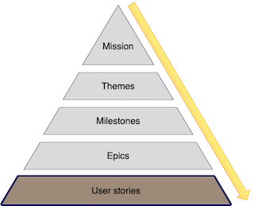

:::row:::
    :::column span="2":::
        **User Stories**
    :::column-end:::
:::row-end:::
:::row:::
    :::column span="1":::
        
    :::column-end:::
:::row-end:::

User stories are the base artifacts for Agile planning. A user story is a high-level definition of a requirement. It should contain enough information that the requirement is understood, and a reasonable estimate of the effort required to build it can be made.

User stories are written throughout the development life cycle, but the core of them are written when you create an epic. Typically, the whole team involved, and often stakeholders from the business or even customers, and the stories are written in a workshop-like forum. Further stories will evolve as the epic proceeds, to address new requirements or to split existing stories that have become too complex. Some stories will even evolve into epics in their own right if they turn out to be complex or emerge as functionality worth extending.

A good user story contains a summary of the requirement, no more than one or two sentences, a series of stories about the requirement, a test of the story’s success, and a rough estimate. Those stories typically follow a format something like:

> As a < type of user >, I want < some goal > so that < some reason >

They tell the story of what the user wants, expects, and needs from the requirement. Let’s look at an example story for our recommendation engine.

> Story: Build a content-based recommendation algorithm. 
> * As a customer, I want to see recommendations based on my prior purchases, so I can find the best items to buy.
> * etc...
> Test: The algorithm returns three content-based recommendations for a customer’s user ID.
> Estimate: 3 days.

Estimates are controversial and complicated. There are [many](https://www.berteig.com/how-to-apply-agile/9-agile-estimation-techniques/) [ways](https://techbeacon.com/app-dev-testing/fast-estimation-better-approach-agile-estimation) of [estimating](https://www.agilealliance.org/resources/experience-reports/estimates-terrible/) and even variants on the units: [time](https://rubygarage.org/blog/3-reasons-to-estimate-with-story-points) and [points](https://www.atlassian.com/agile/project-management/estimation) for example. There’s even a movement for ["no estimates" that’s worth reading about](https://techbeacon.com/app-dev-testing/noestimates-debate-unbiased-look-origins-arguments-thought-leaders-behind-movement).

This story is a formal user story; many organizations use more lightweight and informal representations. If a story feels like it has too much detail, then the traditional approach is to split the story into smaller stories.
