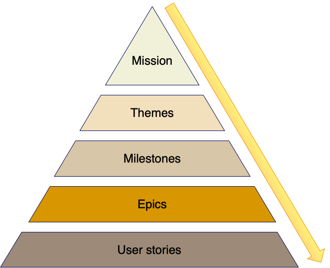

You've started at a new startup, Fabrikam, who are building a new AI-powered fashion app. At Fabrikam, we have an MVP product but now we need to grow. We have to keep our product managers, engineers, and designers on task with specific, attainable goals. You've been tasked by leadership with developing a product road map to keep the product moving forward.

## What is a product road map?

A product road map is a plan for your product. It's a strategic document that helps you plan for your product, its growth, and keeps your team on track in executing on that growth. It's what allows your Product organization, and your Product Managers, to know and report where you are, where you’re going, and what the steps are along the path.

A good road map is the "north star" for your product. It connects the long-term vision your organization has for the product with the operational and customer reality on the ground. From your road map, your Product and Engineering teams derive the list of work that they'll undertake, like the features you want to build for the product, and populate backlogs.

A road map is a living document. Its development is iterative and organic. It changes as priorities and focuses change, as the product grows, you learn what product market fit looks like, and you learn from your customers. A real product road map is never finished.

## How often do you update your road map?

How often you update your road map usually depends on how mature your organization is, early-stage startups like Fabrikam generally have road maps that range out 3 to 6 months and are updated monthly. A larger or more mature organization might plan quarterly with some, less stable, future plans laid out for future quarters.

## Who works on a product road map?

A great product road map is a collaboration between many partners across your organization. Owned and collated by your Product team, it draws on inputs from internal groups like Engineering, Support, Marketing, and Sales. It's driven by external data collected from your product, your customers, your competitors, your investors, and the market.

A good Product Manager is constantly gathering this data, validating, and feeding into the road map, and seeing how, or if, it impacts plans. The Product Manager also feeds in the outcomes of the ongoing work you’re doing, whether the features you have build had an impact on metrics like user adoption, customer satisfaction, or whatever else drives your business.

The outcomes from our road map then become part of the inputs, together with the continuous data gathered from the other sources, and combines to form an iterative, cyclical, document.

A product road map is hard to build. It’s a balancing act of finding the right features to build, evaluating customer asks versus product goals and then applying the engineering and design resources you have available to you.

## What does a road map look like?

The final form of your road map could be represented in many different ways. Sometimes it's a wall of Post It notes in your office showing your plan for the product, other times it's [a spreadsheet](https://github.com/msft4startups/learn-modules/raw/master/product_module/ProductRoadmapTemplate.xlsx) or document, or stored in a specialized road map tool.

## What makes up a typical road map?

To build a road map, we work top down; from the least granular component to the most granular.

* Mission: your reason for building the product.
* Themes: high-level components of the product, for example, "Acquire new customers."
* Milestones: groups of epics, time-boxed, for example, three months worth of work.
* Epics: collections of user stories that often represent a feature, for example, Authentication.
* User Stories: user-centric stories that describe a requirement, for example "Giving the user the ability to reset their password". User stories are usually collected in an epic.

This approach is recommended because the top-level components are closer to the mission and should be a logical progression of detail, easily rolled up and tied to that mission. The alternative, starting from the base and writing up a series of user stories, leaves a lot of space between your mission and its practical application. We find if you start with that base you end up twisting the top-level components into the shape of the user stories and not vice-versa.
