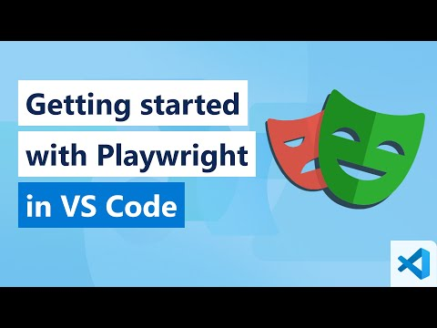
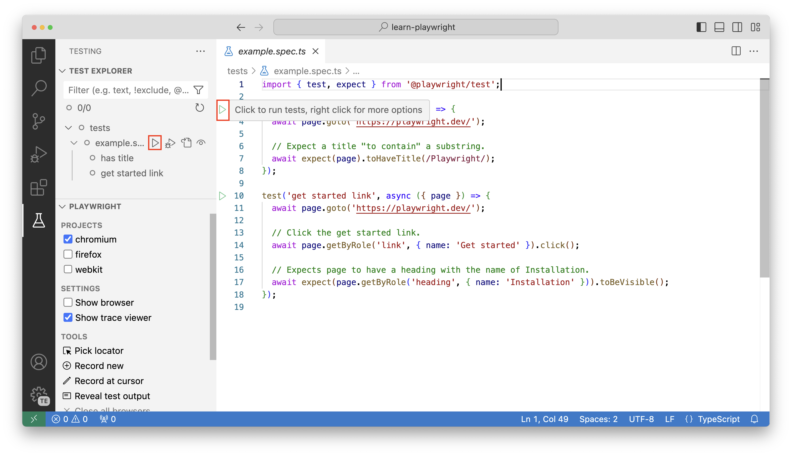
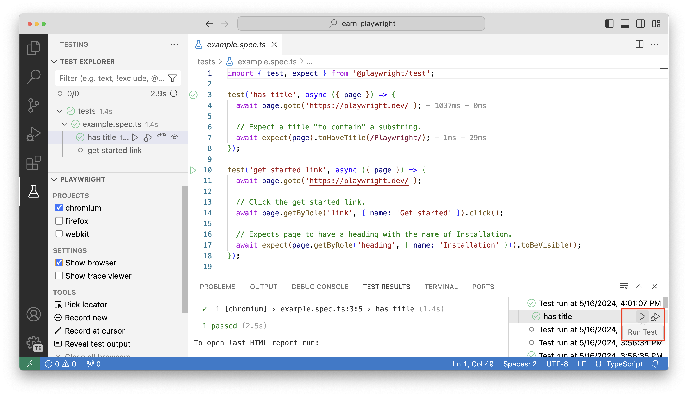
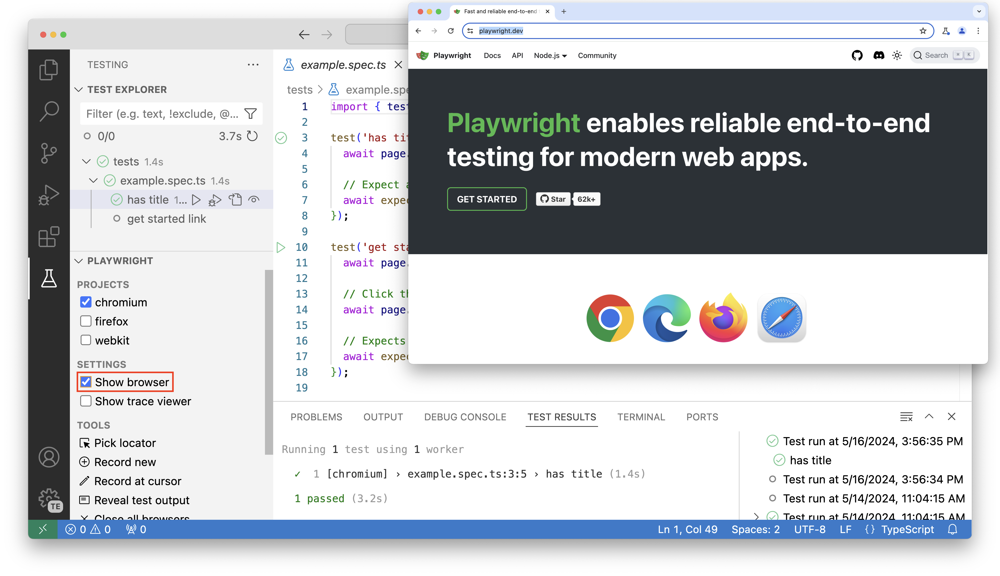
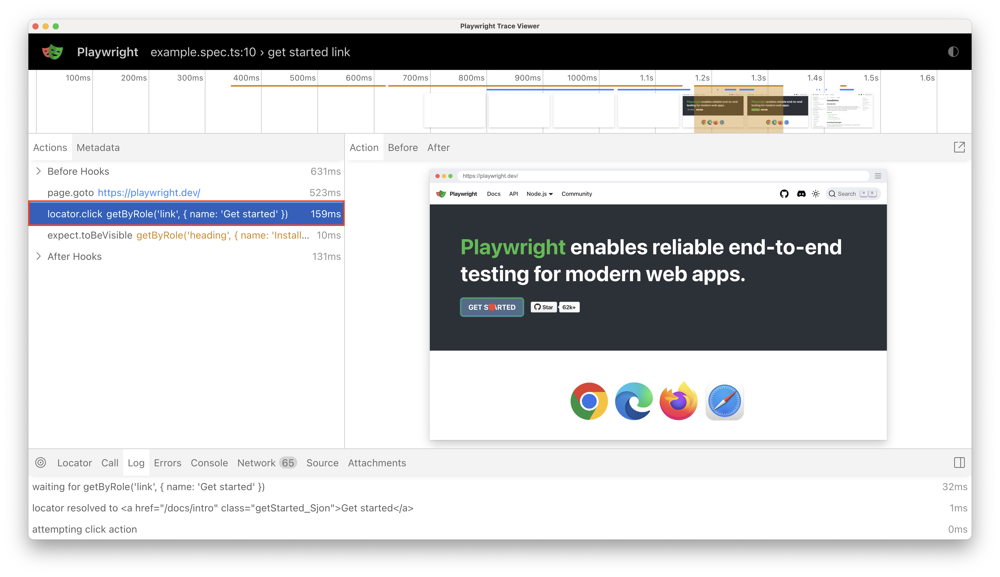
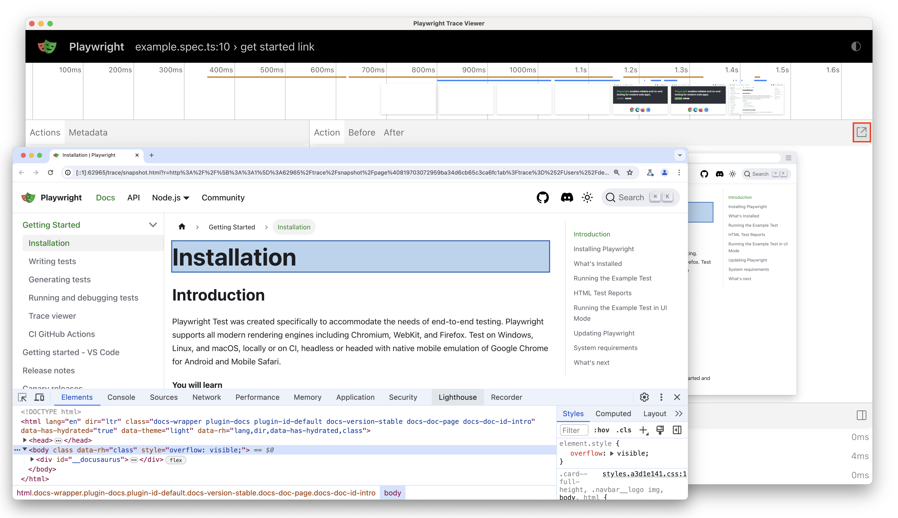
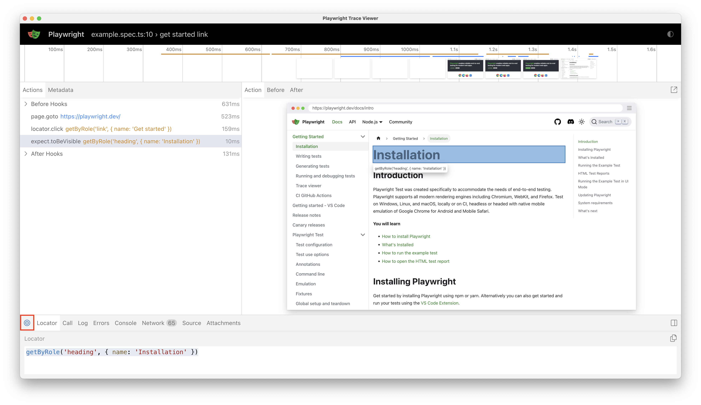
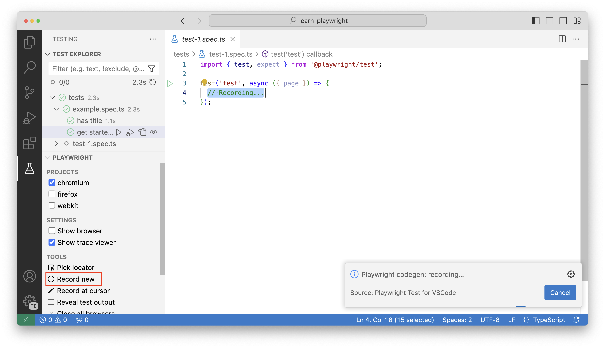
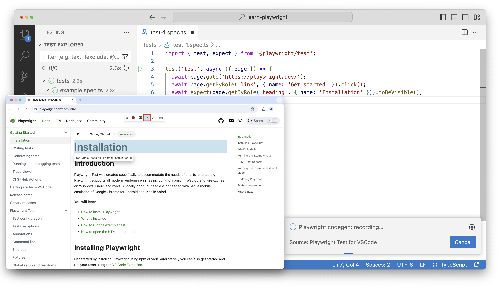

In the previous section, we walked through core concepts related to the Playwright Test Configuration and Playwright Test Specification - but we used the Playwright Commandline (CLI) for executing our tests and viewing reports.

What if we could do it *within our Visual Studio Code environment* and have a more **visual** interaction process for authoring, running, and debugging, our tests.

With the [Playwright Visual Studio Code Extension](https://marketplace.visualstudio.com/items?itemName=ms-playwright.playwright), you get a superior developer experience *and some unique tooling features* that would make it your preferred way to interact with the Playwright Test runner. Let's jump in and take a tour.

## Getting Started
The [Playwright docs](https://playwright.dev/docs/getting-started-vscode) has a comprehensive tutorial with the video walkthrough that I recommend you watch in your own time. In this lesson, we try to walk through a subset of these exercises to get you familiar with usage.

## Install Playwright Extension
[Install the extension](https://marketplace.visualstudio.com/items?itemName=ms-playwright.playwright) from the VS Code Marketplace. Once installed, you should spot a beaker icon in the left-hand side of your VS Code window as shown in the screenshot. Note how the extension *automatically* detects and gathers the test specifications in your project.

## Run Test (Headless)
To run tests in headless manner (no browser window), make sure that *Show browser* and *Show trace viewer* option are unchecked. Select the green play button on line 3 of the example.spec.ts file to run the first test. You can also select the gray play buttons, in the test explorer sidebar, to run all tests in the file or to run a specific test.

Once you run your tests the `Test Results` tab, it opens a window where you can see the entire history of test executions. You can also drill down into a test and `Rerun Test Run` to re-run that specific test.

## Show Browser (Headed)
If you want to run in *headed* *mode, which means running your tests with a browser window open, you can toggle "Show browser" before running the tests.

Playwright is a very fast user, which can make it difficult to keep track of what is happening in the test when using "Show browser". For debugging, we recommend using the `Show trace Viewer` option.

## Show Trace Viewer (Headed)
Select "Show trace viewer" and select on the green play button of the second test. That will launch the trace viewer window, which shows you a visual representation of the test execution.

At the top, you'll see a timeline of the test that you can hover over to see the state of the browser. To select a specific time range to focus on, click and drag the timeline.

In the left sidebar, you can see the actions that were performed during the test execution. If you select the `locator.click` action, you'll see a red dot on the `Get Started` button in the DOM snapshot.

Next select on the assertion, `expect.toBeVisible`, and you'll see our DOM snapshot changed to show the Installation page with a highlight on the heading that we're asserting. Above the DOM snapshot, you can select on the *Before* and *After* buttons to see the state of the DOM before and after the action was performed.

The DOM snapshot can be popped out to a separate window by clicking on the pop out icon in the top right corner. It can be useful if you want to inspect the DOM while debugging your test.

Speaking of debugging you can also pick a locator from the DOM snapshot by clicking on the `Pick Locator` button in the bottom panel. Then hover over elements on the DOM snapshot to see the locator for that element. Clicking on it adds it to the Locator box at the bottom of the trace viewer where you can edit it before copying it to your clipboard.

Feel free to explore on your own the rest of the features of the trace viewer such as the *Call*, *Console*, *Network*, *Source* tabs, etc.

## Debugging Tests
For debugging, we recommend running your tests with the *Show trace viewer* option and using the trace of your tests to better understand what is happening.

However, with the VS Code extension you can also debug your tests right in VS Code, see error messages, create breakpoints, and live debug your tests. [Learn more from the docs](https://playwright.dev/docs/getting-started-vscode) or watch this video to get a sense of the debugging support.

## Generating Tests
[CodeGen](https://playwright.dev/docs/codegen-intro) generates your tests for you as you perform actions in the browser - making it the simplest way to get started for authoring tests for complex workflows.

To generate a test, select on the *Record test* button in the testing sidebar in VS Code. This opens up a browser window where you can perform actions that will be recorded, and turned into a test. You'll also notice how a new file in the `tests` folder is created with the generated test.

Type in a URL in the browser window and start performing actions like a user would. You'll see the actions being recorded in the test file in VS Code.

Let's recreate the simple test we ran earlier by going to the Playwright website and clicking on the `Get Started` button. We can then select the *Assert Visibility* icon from the Codegen toolbar and select on the `Installation` heading to assert that it's visible.

Learn more on generating tests in this video.

]

## Next Steps
In this section, you learned how to use the Visual Studio Code extension to find and run tests, and how to work with the Trace Viewer to get a more visual experience for debugging tests.

And we learned how Visual Studio Code provides richer tools for *Generating Tests* using the Record a New Test, Pick Locator, and Record at Cursor features. Now - it's time to **apply** our *Playwright Fundamentals* learnings in a guided project to build an end-to-end test specification for our sample app!