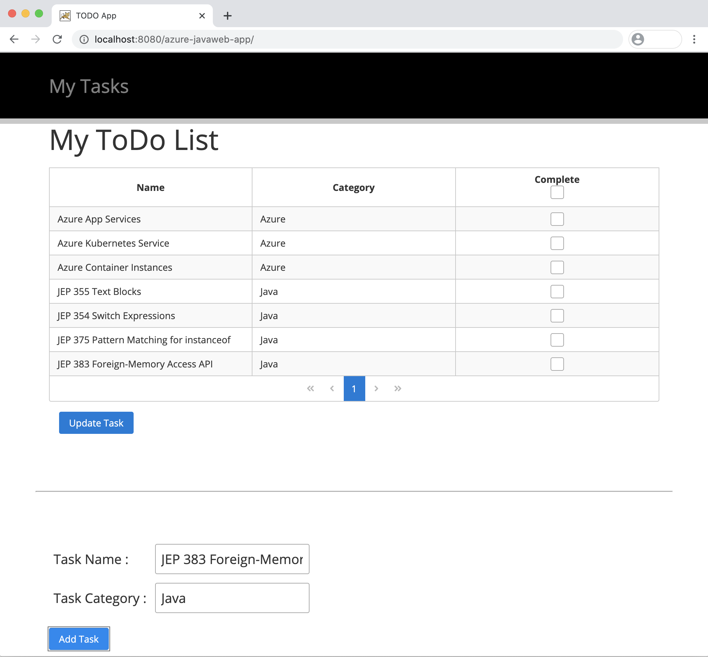

Java has been working in various environments. Java has been widely used in many places, especially on the server side. Along with this, various Java web application frameworks have also been provided. Many web frameworks have been provided, such as JavaServer Pages (JSP), Java Servlet, Struts, JavaServer Faces (JSF), and Spring MVC. As an execution environment, Apache Tomcat started its project in November 1998, is provided as a reference implementation of Servlet and JSP and as OSS, and has been used by many users.

This module creates a Todo application as a simple Java web application and runs it on Azure App Service.
Todo applications utilize JSF as the MVC framework and PrimeFaces for their internal implementation.
JSF is a component-based framework that allows you to create Java web applications.
PrimeFaces provides JSF's extended UI component, which makes it easier to create rich Ajax-enabled screens such as Single Page Application (SPA).

## Learning objectives

By the end of this module, you’ll be able to:

- Creating a Java (JSF) Web Application
- Run JSF application on Tomcat
- Run your application on Tomcat in Azure App Services

## Prerequisites

- [Azure CLI](https://docs.microsoft.com/cli/azure/install-azure-cli?view=azure-cli-latest&WT.mc_id=java-9121-yoterada) installed on your computer
- [JDK 11](https://docs.microsoft.com/azure/developer/java/fundamentals/java-jdk-long-term-support) and [Tomcat 9.0.x](https://tomcat.apache.org/download-90.cgi) installed on your computer
- Familiarity with editing text and code files in any text editor
- Basic familiarity with the HTTP protocol
