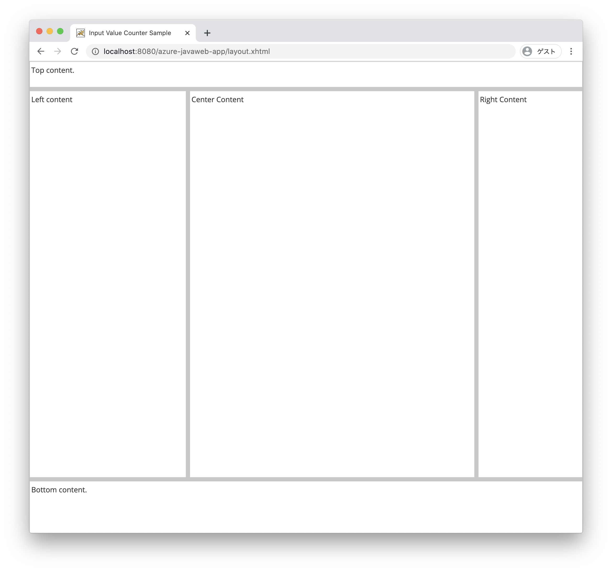
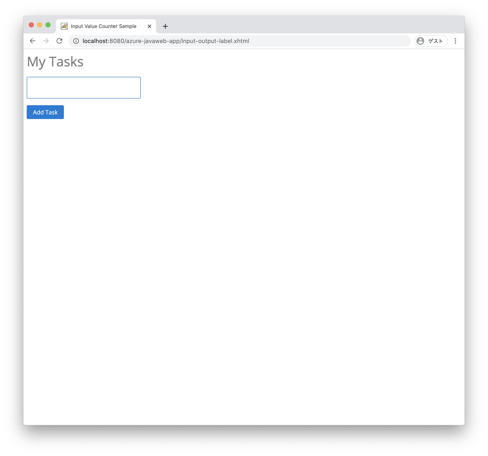
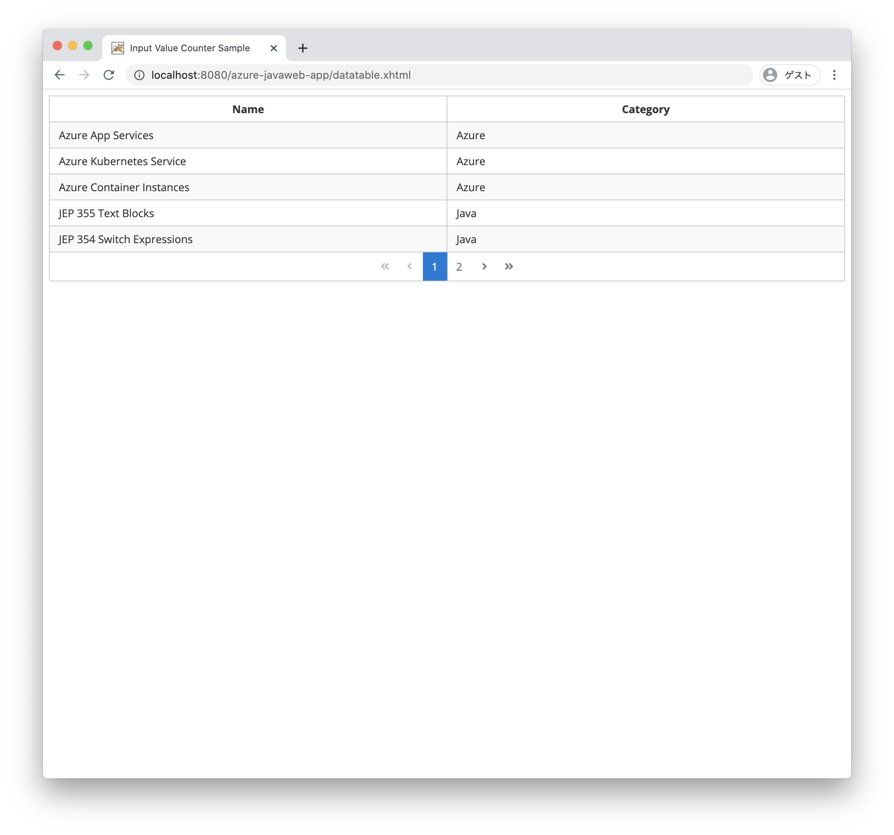

# Introduction of PrimeFaces

[PrimeFaces](https://www.primefaces.org/showcase/) is one of the most popular UI Component libraries in JavaServer Faces and widely used by many global companies. If you use the framework, you can create rich Web Application with very easily.  
In this module, we will create Simple Todo List application like follows. And in this section, we will learn the PrimeFaces component which we will use in the Application.


## PrimeFaces Component in the Application

本節では、Todo アプリケーションを作成するために使用する PrimeFaces の代表的なコンポーネントを紹介します。  
[PrifeFaces が提供するコンポーネントの一覧](https://www.primefaces.org/showcase/) にはサンプル・コードを交えて詳しく紹介されていますので、本節で取り上げる以外のコンポーネントを利用したい場合は、`showcase` ご参照ください。

### PrimeFaces Layout

`PrimeFaces Layout` は画面全体のレイアウトを作成します。PrimeFaces では様々なレイアウトを構成可能になっています。例えば、一般的によく見る、ヘッダ、フッダ、メニューなどを作成したいような場合、下記の `p:layout` , `p:layoutUnit` タグを利用することで簡単に画面のレイアウトを構成できます。  
Todo アプリでは `position="north"` と `position="center"` を使用します。

```xml
<p:layout fullPage="true">
    <p:layoutUnit position="north" size="50">
        <h:outputText value="Top content." />
    </p:layoutUnit>
    <p:layoutUnit position="south" size="100">
        <h:outputText value="Bottom content." />
    </p:layoutUnit>
    <p:layoutUnit position="west" size="300">
        <h:outputText value="Left content" />
    </p:layoutUnit>
    <p:layoutUnit position="east" size="200">
        <h:outputText value="Right Content" />
    </p:layoutUnit>
    <p:layoutUnit position="center">
        <h:outputText value="Center Content" />
    </p:layoutUnit>
</p:layout>
```




### PrimeFaces OutputLabel, InputText, CommandButton

次に、`p:outputLabel` , `p:inputText`, `p:commandButton` について紹介します。

   ```xml
    <h:form>
        <p:outputLabel id="out" value="My Tasks" />
        <p:inputText id="name" value="#{todocontroller.name}" />
        <p:commandButton id="addtask" value="Add Task"  
            action="#{todocontroller.buttonAddAction()}"
            styleClass="ui-priority-primary" />
    </h:form>
   ```

#### p:outputLabel 

[p:outputLabel](https://www.primefaces.org/showcase/ui/misc/outputLabel.xhtml) はテキストを表示するためのコンポーネントで、標準で提供されている outputLabel を拡張しています。ここでは `value="My Tasks"` と静的な文字列を記載しているため、画面でも `My. Taks` が表示されていますが、動的に出力する文字列を変更したい場合、下の `p:inputText` で記載されているように EL式 `#{todocontroller.name}` に置き換え、バッキング・ビーンのフィールドとバインドさせる事で動的な文字列を表示させることも可能です。  

#### p:inputText

[p:inputText](https://www.primefaces.org/showcase/ui/input/inputText.xhtml) は入力可能なテキスト・フィールドを扱うためのコンポーネントで、標準で提供されている inputText を拡張しています。  
EL式 `#{todocontroller.name}` で対応するバッキング・ビーン (TodoListController) のクラスで定義されているフィールドに値をバインドし、ユーザから入力された値は、`name` で参照できるようになります。

#### p:commandButton

[p:commandButton](https://www.primefaces.org/showcase/ui/button/commandButton.xhtml) はボタンを表示するためのコンポーネントで、標準で提供されている commandButton を拡張しています。ボタンが押された時、`action` に記載する EL 式 `#{todocontroller.buttonAddAction()` が実行されます。具体定期には対応するバッキング・ビーン (TodoListController) のクラスで定義されている `buttonAddAction()` メソッドが呼び出されます。   
また、`update="target-id"` をボタンの属性に追加する事で Ajax で処理を実行する事もできます。 


#### JSF ページに対応するバッキング・ビーン

上記の Facelets (XHTML) に対応するバッキング・ビーンの実装例を下記に記載します。  
`p:inputText` に入力された内容は、`TodoListController` クラスの `name` にバインドし、プログラム内で扱う事ができます。また、`p:commandButton` でボタンが押されると、`TodoListController` クラスの `buttonAddAction()` メソッドが呼び出され、ユーザが `name` に入力した値を、標準出力に表示します。

   ```
import lombok.Getter;
import lombok.Setter;
import javax.faces.view.ViewScoped;
import javax.inject.Named;
import java.io.Serializable;

@Named("todocontroller")
@ViewScoped
public class TodoListController implements Serializable {

    @Setter @Getter
    private String name;

    public void buttonAddAction(){
        System.out.println("Input Value is " name);
        // write some command action
    }
}
   ```

If you create the XHTML and Backing Bean, you can  see like the followign screen.



### PrimeFaces DataTable

[p:dataTable](https://www.primefaces.org/showcase/ui/data/datatable/paginator.xhtml) は HTML の表を表示するためのコンポーネントで、標準で提供されている table を拡張しています。`paginator` の属性を追加する事で　Paginator 機能を簡単に利用する事が可能です。ここでは　Paginator の Transition の機能を表の下部に配置し `paginatorPosition="bottom"` 、一画面で表示可能な項目は 5 件 `rows="5"` で設定しています。  
表の表示項目は `TodoListController` クラスの `todoItems` を利用しています。`todoItems` は `List<TodoItem>` を参照しており、List 内の各要素 (`TodoItem`) は `var="item"` で利用可能です。  
つまり、`#{item.name}` や　`#{item.category}` で `TodoItem` インスタンスの各値を表示しています。

```xml
    <h:form>
        <p:dataTable id="itemTables" var="item" 
            value="#{todocontroller.todoItems}" paginator="true"
            paginatorPosition="bottom" rows="5">

            <p:column headerText="Name">
                <h:outputText value="#{item.name}" />
            </p:column>
            <p:column headerText="Category">
                <h:outputText value="#{item.category}" />
            </p:column>

        </p:dataTable>
    </h:form>
```

下記に `TodoListController` クラスの実装例を記述します。  
この例では、このインスタンスの生成時に `@PostConstruct` の `init()` メソッドでダミーの `List<TodoItem>` データを生成しています。  
つまり起動時にダミーのデータが生成されていますので、この内容が表示されます。

```java
import com.microsoft.samples.model.TodoItem;
import lombok.Getter;
import lombok.Setter;
import javax.annotation.PostConstruct;
import javax.faces.view.ViewScoped;
import javax.inject.Named;
import java.io.Serializable;
import java.util.ArrayList;
import java.util.List;

@Named("todocontroller")
@ViewScoped
public class TodoListController implements Serializable {

	private static final long serialVersionUID = 8118071083254011575L;

    @Setter @Getter
    private List<TodoItem> todoItems;

    @PostConstruct
    public void init(){
        TodoItem item1 = new TodoItem("App Services","Azure",false);
        TodoItem item2 = new TodoItem("Azure Kubernetes Service","Azure",false);
        TodoItem item3 = new TodoItem("JEP 359","Java",false);
        TodoItem item4 = new TodoItem("JEP 368","Java",false);
        TodoItem item5 = new TodoItem("MicroProfile","Java",false);
        TodoItem item6 = new TodoItem("Spring Boot","Java",false);
        TodoItem item7 = new TodoItem("Jakarta EE","Java",false);

        todoItems = new ArrayList<>();
        todoItems.add(item1);
        todoItems.add(item2);
        todoItems.add(item3);
        todoItems.add(item4);        
        todoItems.add(item5);
        todoItems.add(item6);        
        todoItems.add(item7);
    }
}
```

下記に `TodoItem ` クラスの実装を記述します。  
このクラスは、表示用のデータ・モデルとして利用します。  
[Project Lombok](https://projectlombok.org/) の [@Data](https://projectlombok.org/features/Data) アノテーションを付加しているため、全フィールドに対して自動的に Setter/Getter メソッドが追加され `toString()`, `equals(Object o)`,  `hashCode()` などのメソッドがオーバライドされています。

```java
import java.io.Serializable;
import lombok.Data;

@Data
public class TodoItem implements Serializable {

	private static final long serialVersionUID = -8967340396649549045L;
	private Long id;
    private String category;
    private String name;
    private boolean complete;

    public TodoItem() {}

    public TodoItem(String name, String category, boolean complete) {
        this.name = name;
        this.category = category;
        this.complete = complete;
    }

    public TodoItem( String name, String category) {
        this.category = category;
        this.name = name;
        this.complete = false;
    }

    @Override
    public String toString() {
        return String.format(
                "TodoItem[id=%d, category='%s', name='%s', complete='%b']",
                id, category, name, complete);
    }
}
```

上記の DataTable を記述し実行すると下記のような画面が表示されます。


