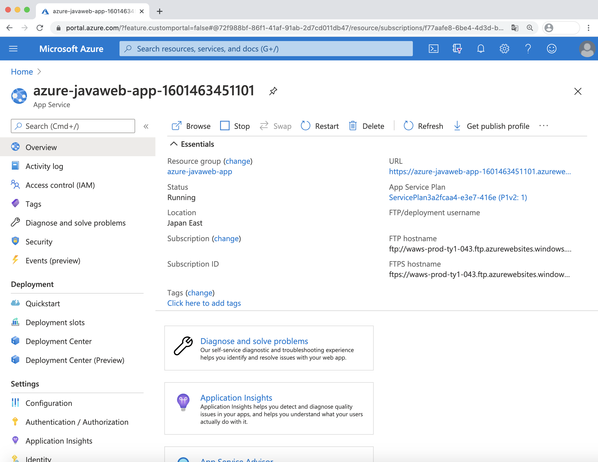
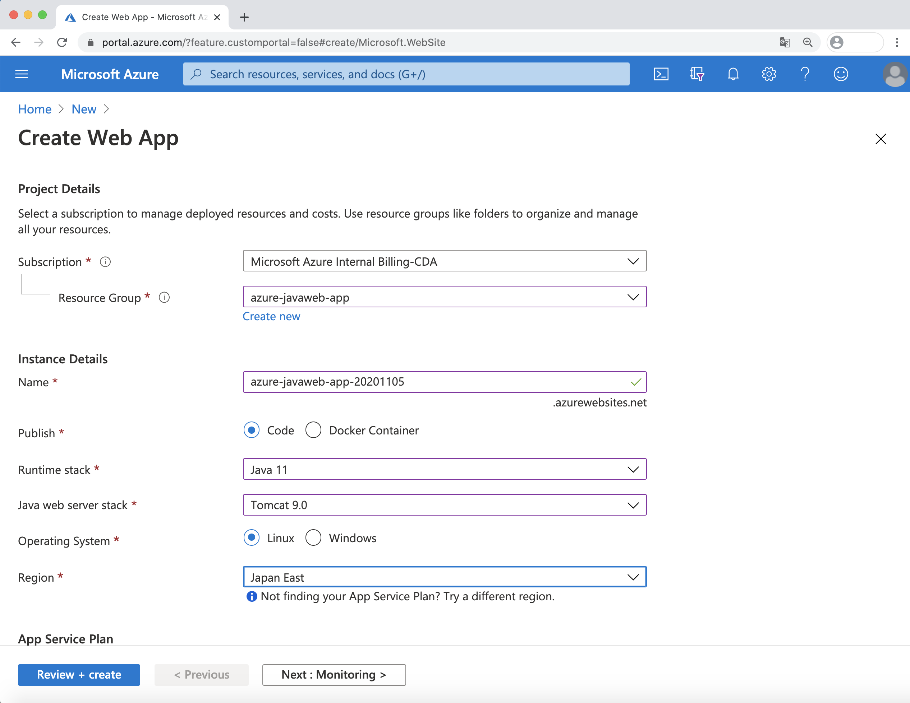

Now that we have confirmed the operation in the local environment, we will explain how to deploy the Java Web Application to the Cloud environment.
Azure allows you to deploy Java web applications to different environments depending on your purpose like below.

* General VM (Linux, Windows)
* Azure App Service
* Azure App Service for Container
* Azure Container Instances
* Azure Kubernetes Service
* Azure Red Hat OpenShift
* Azure Spring Cloud

どの環境にデプロイするかは、作成するアプリケーションや提供するサービスに応じて、柔軟に選択していただくことができます。
前セクションで作成したアプリケーションは Tomcat 上で稼働するアプリケーションですので、ここでは Azure 上でいち早くそして簡単に Tomcat を作成し稼働させる環境を選択したいと思います。Tomcat を動作させる環境として Azure では Platform as a Service として Azure App Service を提供しています。  
本節では、Azure App Service の概要について紹介します。

You can flexibly choose which environment to deploy according to the application to be created and the service to be provided.
The application created in the previous section is an application that runs on Tomcat, so here I would like to select an environment that allows you to quickly and easily create and run Tomcat on Azure. Azure provides Azure App Service as Platform as a Service as the environment for running Tomcat.
This section gives you an overview of Azure App Service.


## What is Azure App Service

Azure App Service は、Web アプリケーション、REST API、およびモバイル バックエンドを実行するための HTTP ベースのサービスです。  
Windows 環境と Linux 環境を用意し、利用者の希望に応じて、環境を選択できます。
セキュリティ、負荷分散、自動スケーリング、自動管理機能などを備え、Azure DevOps、GitHub などの CI/CD 環境と統合することも可能です。  
これを利用する事で、OS の管理、Java VM, Tomcat のバージョン管理を Azure にまかせ、利用者はビジネス・アプリケーションの構築に集中でき、少ない管理項目で、本番環境用まで適用できます。

Azure App Service is an HTTP-based service for running web applications, REST APIs, and mobile backends.
A Windows environment and a Linux environment are available, and the environment can be selected according to the user's wishes.
It features security, load balancing, autoscaling, automanaging, and even integrates with CI / CD environments such as Azure DevOps and GitHub.
By using this, you can leave OS management and Java VM, Tomcat version control to Azure, and users can concentrate on building business applications, and with few management items, it can be applied to production environments.




また、Azure App Service を利用すると、Azure の Portal 画面からブラウザを利用して、SSH, Bash でログインを行なったり、ブラウザからアプリケーション・ログを確認できますので、障害発生時などの解析でとても便利です。

Also, if you use Azure App Service, you can log in with SSH or Bash using a browser from the Azure Portal screen, and you can check the application log from the browser, which is very convenient for analysis in the event of a failure. 


## Java Deployment Options for App Service



まず、最初に App Service で利用する Java VM のバージョンを選択します。App Service では下記のように `Java 11` もしくは `Java 8` のいずれかを選択できます。
`Java 11` を選択した場合、さらに下記の実行環境を選択します。`Java SE (Embedded Web Server)` は、組み込みの Web サーバを内包する Executable JAR ファイルを実行する際に選択します。また、Tomcat は 7.0 〜 Tomcat 9.0 まで複数のバージョンを用意していますので、実装したアプリケーションの実行環境として適切な環境を選択します。  
また、`Java 8` を選択した場合、下記の実行環境を選択できます。`Java  11` に加え `JBoss EAP 7.2 (Preview)` が追加されていますので、仮に JBoss 環境でアプリケーションを実行したい場合は、こちらを選択します。  

First, select the version of Java VM to use with App Service. In App Service, you can select either `Java 11` or` Java 8` as shown below.
If you select `Java 11`, then select the execution environment below. Select `Java SE (Embedded Web Server)` when executing the Executable JAR file that contains the embedded web server. In addition, Tomcat is available in multiple versions from 7.0 to Tomcat 9.0, so select the appropriate environment for the execution environment of the implemented application.
If you select `Java 8`, you can select the following execution environment. In addition to `Java 11`,` JBoss EAP 7.2 (Preview) `has been added, so if you want to run your application in a JBoss environment, select this.

| Runtime Stack |  Java 11  |  Java 8  |
| ---- | ---- | ---- |
|Java Web Server Stack|  Java SE (Embedded Web Server)  |  Java SE (Embedded Web Server)  |
|^|   |  JBoss EAP 7.2 (Preview)  |
|^| Tomcat 9.0   |  Tomcat 9.0  |
|^| Tomcat 8.5   |  Tomcat 8.5  |
|^| Tomcat 8.0   |  Tomcat 8.0  |
|^| Tomcat 7.0  | Tomcat 7.0  |


今回の ToDo サンプル・アプリケーションは Tomact 9.0.39 上で稼働しますので、Tomcat 9.0 を選択します。
This ToDo sample application runs on Tomact 9.0.39, so select Tomcat 9.0.

## Maven Plugin for Azure App Service

Microsoft は Java 開発者が容易に Azure を利用できるようにするため、`Maven Plugins for Azure Services` を提供しています。	

Microsoft offers the `Maven Plugins for Azure Services` to make Azure easier for Java developers.

* Maven Plugin for Azure App Service
* Maven Plugin for Azure Functions	
* Maven Plugin for Azure Spring Cloud

これらのプラグインを利用する事で、作成したアプリケーションを簡単に Azure 環境にデプロイできるようになりますので、プラグインをご利用下さい。　　
今回は、App Service にデプロイするため、`Maven Plugin for Azure App Service` を利用します。  

By using these plugins, you can easily deploy the created application to the Azure environment, so please use the plugins.
This time, we will use `Maven Plugin for Azure App Service` to deploy to App Service.

`Maven Plugin for Azure App Service` を利用するために下記のコマンドを実行してください。
Execute the following command to use `Maven Plugin for Azure App Service`.

```bash
mvn com.microsoft.azure:azure-webapp-maven-plugin:1.12.0:config
```