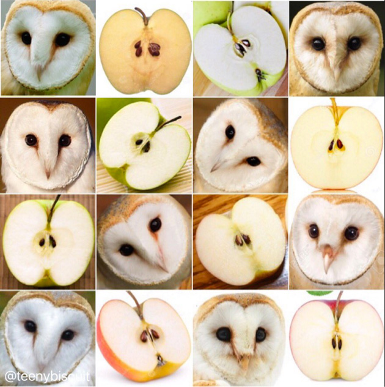

Machine learning is permeating mobile and web app development. To create modern, interactive apps that can evolve over time, it's a good idea to learn how to build and use machine learning models. In this module, you'll learn how to create a web app using Vue.js. In this app, you'll embed a machine learning model that is trained using the Custom Vision AI service.

## What is Vue.js?

Vue (pronounced /vjuː/, like view) is a progressive framework for building user interfaces. It's designed to be incrementally adoptable. Vue can also power sophisticated Single-Page Applications. For more information about Vue, visit [the project's docs](https://vuejs.org/v2/guide). You don't have to use Vue.js to create apps using machine learning models, but this example app demonstrates that particular framework's methodology.

## What is a machine learning model?

[Machine learning](https://en.wikipedia.org/wiki/Machine_learning) (ML), a subset of artificial intelligence, is the study of algorithms and statistical models. Computer systems can use these models to do a specific task without using explicit instructions as they rely on patterns and inference instead. Machine learning algorithms are used in a wide variety of applications, such as email filtering and computer vision. Machine learning helps in situations where it is difficult to develop a conventional algorithm to complete a given task.

## Why create a web app including an ML model?

In this module, you'll create a web app that hosts a machine learning model locally. This app will analyze images using this model. YOu will also set up a service to perform "CI/CD" (Continuous Integration/Continuous Delivery) of fresh content whenever you push new code to your web app's codebase on GitHub. This process is one you often see in production apps that can be refreshed when a fresh model is available for use.

In a business context you might need to confirm that various images are properly identified, verifying the alignment of a screw, for example. In this example app, we'll build something much simpler (and more fun) - a way to differentiate between images that are tricky to decipher. Inspired by the work of Karen Zack, known as @teenybiscuit on Instagram and Twitter, we'll train a model on Custom Vision AI using images of dalmatians and chocolate chip ice cream. We'll then use images from the collages that Karen created to test the model.

An example of some of Karen Zack's collages of tricky images.

## What architecture will work for this project?

When you build a web app using machine learning technologies, you have a few choices on how to use the models that the training process produces. You could host the model externally in the cloud. Then you could use an API to query it using the data with which you want to perform inference. Alternately, you could host the model itself within the web app's codebase.

An advantage to doing the latter is that your app will perform inference offline, as no API calls to an internet-connected service are made. Instead, the app uses the model that is included in the build process of the web app. A disadvantage to using a local model is that when you edit a model by retraining it you're obliged to rebuild your web app to refresh the model. In this module, we will create an architecture for this web app to enable a GitHub Action to rebuild the app if a developer pushes code to its repository.
