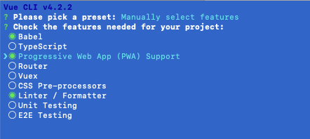
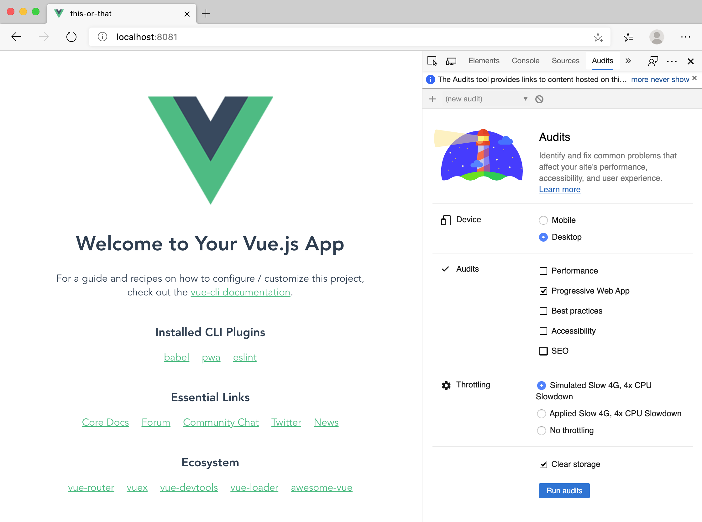

Before you begin, make sure you have the following software installed on your machine:

-   [Node.js](https://nodejs.org/download/)
-   [NPM](https://docs.npmjs.com/downloading-and-installing-node-js-and-npm)
-   [Visual Studio Code](https://code.visualstudio.com/download)
-   [The Vue CLI](https://cli.vuejs.org)

> [!NOTE]
> You will need Node and NPM available on your machine to work with the Vue CLI. You can also try the Vue UI, which is a GUI overlying the Vue CLI. Launch a GUI for the CLI by entering `vue ui`, and create your app in a more visual fashion.

## Scaffold your app

After you have Node, NPM, and the Vue CLI installed, creating a new app is easy. Use `cd` to navigate to the folder where you want your code to go, open a command prompt or terminal, and enter:

```bash
    vue create this-or-that
```

When the CLI asks whether you want to use presets or a manual scaffold, choose 'manual.' This way you have control over the plugins you want to install.



Make sure you choose **Progressive Web App** in the choices on this screen of the CLI setup routine. You want to create an app that works both online and offline.

> [!NOTE]
> Make sure that you select Vue 2 when installing the Vue CLI.

Once the basic app is built, run it by entering:

```bash
    cd this-or-that && npm run serve
```

You should see a basic Vue.js app scaffolded in your browser locally.



In the Developer Tools, select **Audits**, and review the Lighthouse area of your app. You can test how your Progressive Web App performs using this tool, but you won't do this until later when you deploy the app to azurewebsites.net.

## Build the inference interface

Now you need to build a very simple interface that will load an image against which the model can perform inference. The model will provide a score differentiating images by the level of certainty that it determines an image corresponds to a given label. In this case, we will provide some images of dalmatians and chocolate chip ice cream. You will train the model later.

First, rename the file `HelloWorld.vue` in your codebase's `/src/components` folder to `DetectImage.vue`. Remove references to `HelloWorld` in `App.vue` as well. Now your `App.vue` file looks like this:

```html
<template>
    <div id="app">
        <DetectImage msg="What do you see?" />
    </div>
</template>

<script>
    import DetectImage from './components/DetectImage.vue';

    export default {
        name: 'app',
        components: {
            DetectImage,
        },
    };
</script>

<style>
    #app {
        font-family: 'Avenir', Helvetica, Arial, sans-serif;
        -webkit-font-smoothing: antialiased;
        -moz-osx-font-smoothing: grayscale;
        text-align: center;
        color: #2c3e50;
        margin-top: 60px;
    }
</style>
```

Create a folder in `/src/assets` called *images* to house the images you will use for inference. Extract [this zip file](https://github.com/MicrosoftDocs/mslearn-build-pwa-and-push-new-models-ad-hoc/raw/master/media/training%20images.zip) into that folder. This file includes seventeen images, including a blank one.

These images are the ones Karen Zack used to create her dalmatians v ice cream collage.

Display an image and a button to switch it by editing the `<template>` in `DetectImage.vue` to include the following layout.

```html
<div>
    <h1>{{ msg }}</h1>
    <div>
        
    </div>
    <div>
        <button class="button" @click="next()" :disabled="disable">Next</button>
    </div>
    <div v-for="pred in predictions" :key="pred.index">
        {{ pred.label }}: {{ pred.probability.toFixed(0) + '%' }}
    </div>
    <div v-if="!predictions.length">hmm.....</div>
</div>
```

Add a `data()` method under the closing parenthesis of the `props` object (add a comma at the close of that object) in `DetectImage.vue` to create placeholders for data.

```javascript
data() {
    return {
        image: 0,
        numImages: 16,
    };
},
```

Under this object, create a `computed` property to return the index of an image, and to disable the button in the template if the index is reached.

```JavaScript
computed: {
    getImgIndex() {
        return this.image.toString();
    },
    disable() {
        if (this.image == this.numImages) {
            return true;
        } else return false;
    },
},
```

Create a `methods` object under the computed properties object to capture user interaction.

```javascript
methods: {
    next() {
        this.image++;
        this.predictions = [];
        setTimeout(this.predict, 500);
    },
},
```

Finally, add some styles by overwriting the `<styles>` block at the bottom of the `DetectImage.vue` file.

```HTML
<style scoped>
h3 {
    margin: 40px 0 0;
}
.image {
    min-height: 300px;
    max-height: 300px;
    max-width: 100%;
}
.button {
    width: 200px;
    height: 50px;
    border-radius: 5px;
    background-color: blueviolet;
    color: white;
    font-size: 20pt;
    margin: 10px;
}
.button:disabled,
.button[disabled] {
    border: 1px solid #999999;
    background-color: #cccccc;
    color: #666666;
}
</style>
```

Now, you should be able to click through a gallery of 16 images, one after the other, starting with a blank one. Next, you need to build a model for use in this app.
