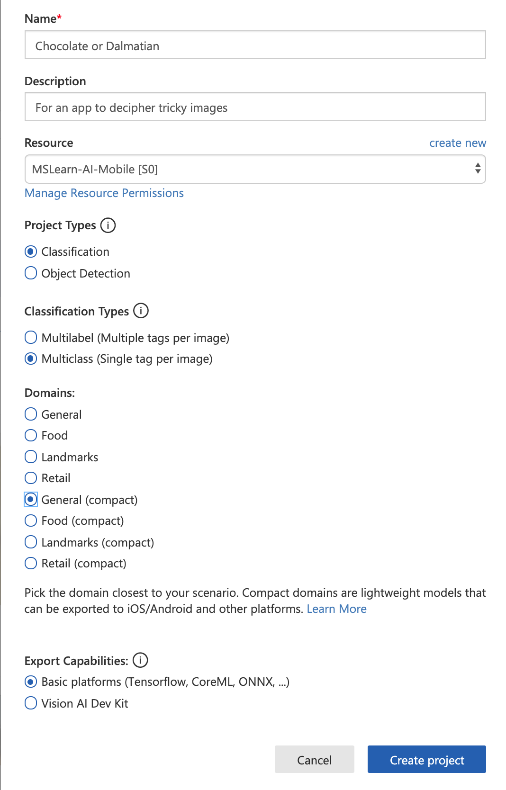
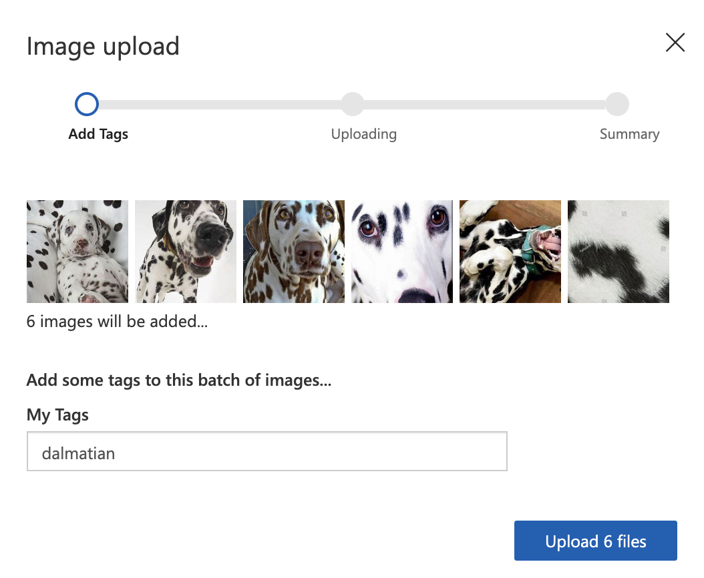
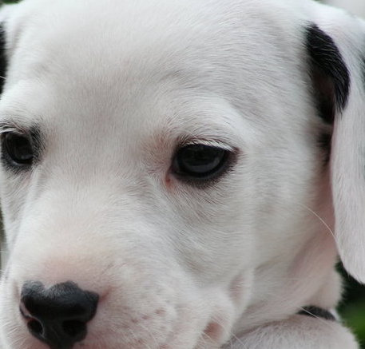

Now, you can start training a custom machine learning model using images different from the ones you use in your app. The ones in your app will be used to test the model's accuracy in performing inference. You will create the model itself in Custom Vision AI's interface using a different image set.

> [!NOTE]
> You are only going to train on a few images, which in a production system is inadequate for the creation of a quality model. This training set is for demo purposes only.

Download this [compressed file of twelve training images](https://github.com/MicrosoftDocs/mslearn-build-pwa-and-push-new-models-ad-hoc/raw/master/media/training%20images.zip), and extract it to your local computer.

## Custom Vision AI

In a browser, navigate to [Custom Vision AI](https://www.customvision.ai) and log in. Create a new project called *Chocolate or Dalmatian*. In the popup, give your project a description, and allocate a Resource so that your model can be trained in the cloud. Create a new one, if needed.



Make sure to give this project the type *Classification* as it will simply determine between types. It's a Multiclass Classification Type of project, as it will offer one single tag per image. Choose *General (compact)* as you will export it for TensorFlow.js.

## Train your model

Now you are ready to train on your image set.

In the folder you downloaded, you'll find two folders, one labeled 'ice cream' and the other 'dalmatian'. Select the `+` icon in your Custom Vision AI project, and select the images in the `dalmatian` folder. Tag those `dalmatian`. Do the same process for the `ice cream` folder, tagging those `ice cream`.



You now have your twelve training images uploaded and tagged. Select the *gear* icon at the top, and select *Quick Training*. You will see the results with performance analyzed. Test your data on a new image of ice cream or a dalmatian. Here is one to try:



Drag this image to your desktop, and then select the *checkmark* icon in the Custom Vision AI interface, and browse to find the image on your desktop. The model classifies this new image as a dalmatian!


## Download your model

Select the *down arrow* icon at the top of the Custom Vision AI interface to download your model and its associated assets. Select *TensorFlow* as the model type, and `tensorflow.js` in the dropdown list.


A zipped file will be exported to your local computer. Extract this file, and name the resultant folder `models`. Inside this folder you'll find four files: a `cvexport.manifest` file, a `labels.txt` file, a `model.json` file, and a `weights.bin`.

Upload the entire `models` folder into the `public` directory of your web app.

Now you can integrate these files so that they are usable by the app.

## Integrate the model into the web app

The first thing to do is install a special npm package into your web app, *customvision-tfjs*. This library enables a web app to make use of tensorflow.js using models trained on Custom Vision AI.

1. In your `package.json` file in the root of your web app, add `"customvision-tfjs": "^1.0.1",` to the `dependencies` list.

1. In the same file, also add `"raw-loader": "^4.0.0",` to the `devDependencies` list. You need this package to manage reading .txt files from your Vue app.

1. In the same file, add `"webpack-cli": "^3.3.10"` to the `devDependencies` list so that the webpack CLI will be usable within the app, which is necessary for text file parsing.

Stop your web app if it's running by pressing <kbd>Ctrl+C</kbd>, and run `npm i` from the root, via your terminal. This will install this package.

Now you can restart your web app and continue working (`npm run serve`).

Next, integrate the packages you just installed by adding this line right under the opening `<script>` tag in `DetectImage.vue`:

```
import * as cvstfjs from "customvision-tfjs";
import labels from "raw-loader!../../public/models/labels.txt";
```

Now, you need to allow the raw-loader package to read from the `labels.txt` file for your model's tags.

To do this, create a new file in the root of your app called `webpack.config.js`. In this file, add the following code.

```javascript
module.exports = {
    module: {
        rules: [
            {
                test: /\.txt$/i,
                use: 'raw-loader',
            },
        ],
    },
};
```

Next, add three more data elements to the `data` object in the `<script>` block of `DetectImage.vue`.

```javascript
labels: labels,
model: null,
predictions: []
```

The app is now ready to consume the model, and the list of labels and make an array of predictions.

Now, add a `mounted` lifecycle hook after the closing comma at the end of the `computed` object.

```javascript
async mounted() {
    this.image++;
    //load up a new model
    this.model = new cvstfjs.ClassificationModel();
    await this.model.loadModelAsync("models/model.json");
    //parse labels
    this.labels = labels.split("\n").map(e => {
      return e.trim();
    });
    //run prediction
    this.predict();
  },
```

When the app is mounted, this asynchronous method will fire, incrementing the image array, loading the model, parsing labels, and running a prediction method.

Add an asynchronous prediction method into the `methods` object.

```javascript
async predict() {
      //execute inference
      let prediction = await this.model.executeAsync(this.$refs.img);
      let label = prediction[0];
      //build up a predictions object by parsing details to labels and probability
      this.predictions = label.map((p, i) => {
        return { index: i, label: this.labels[i], probability: p * 100 };
      });
    },
```

This method will show an image to the model, and the model will send back a prediction with the probability it derives of its accuracy, multiplied by 100 so it is displayed as a percentage of accuracy.

## Complete the UI

Finally, you are ready to show these predictions in the UI.

Add a `<div>` above the closing `<div>` in the \<template\> of `DetectImage.vue`.

```html
<div v-for="pred in predictions" :key="pred.index">{{ pred.label }}: {{ pred.probability.toFixed(0) + '%' }}</div>
<div v-if="!predictions.length">hmm.....</div>
```

This code will display the label and an image's probability that it fits this label.

If you run your app now, you should see a prediction appear as you select **Next** to advance the rotation of images.

## Add a web.config file

The last thing you need to make your app run on a Windows instance in Azure is to add a file called `web.config` in your `public` folder. This file allows the .json model to be read by the server. Add this code to that file.

```xml
<?xml version="1.0" encoding="utf-8"?>
<configuration>
  <system.webServer>
    <staticContent>
      <remove fileExtension=".json"/>
      <mimeMap fileExtension=".json" mimeType="application/json"/>
    </staticContent>
  </system.webServer>
</configuration>
```

## Publish your code to GitHub

Now is a good time to push your codebase to GitHub. Create a new repo in GitHub and link your codebase to it.

`git remote add origin https://github.com/<your-github-handle>/<repo-name>.git`

Now you can use Visual Studio Code's Git tooling to commit and push your code to master in GitHub.
