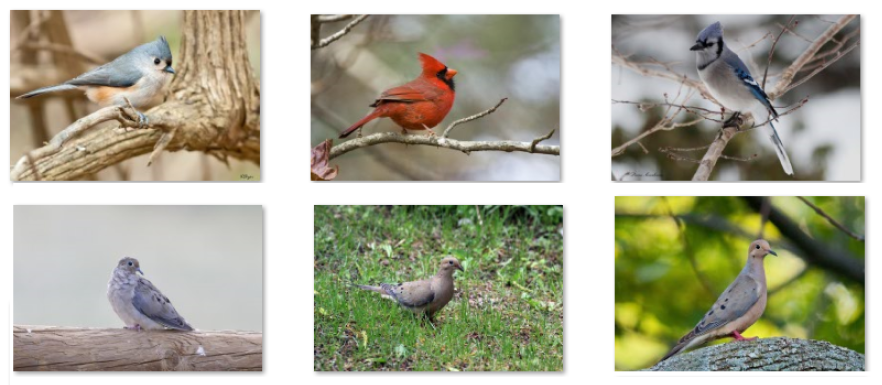

As an ornithologist, you study the behavior, physiology, and conservation of birds and bird habitats. This work often involves surveying, recording, and reporting on bird activity.

You want to build a machine learning model that will identify the birds to help with gathering data. Additionally you want to better document endangered birds species to help the populations increase. We will be using the NA Bird dataset from Cornell to train a model that will recognize bird species and help you document the different trends and patterns of the bird habits.

In this module, you will use Azure Cognitive Services Custom Vision to create a model to identify species of birds, in all their variety. Learning more about birds is a great way to educate yourself and others about natural phenomena in your local area.

The data was provided by the Cornell Lab of Ornithology, with a special thanks to photographers, contributors, and visitors to the [All About Birds website](https://www.allaboutbirds.org/news/). This material is based upon work supported by the National Science Foundation under Grant No. 1010818. This module includes a subset of the full dataset. To access the full dataset, visit [this site](https://dl.allaboutbirds.org/nabirds), and refer to [this paper](https://www.cv-foundation.org/openaccess/content_cvpr_2015/papers/Horn_Building_a_Bird_2015_CVPR_paper.pdf) for specific dataset details.

## Learning objectives

In this module, you will:

- Get an introduction to Custom Vision.
- Get an introduction to machine learning.
- Learn how to use prebuilt machine learning models in Azure Cognitive Services.
- Learn how to use the Custom Vision service in Azure.
- Build a custom machine learning model.
- Deploy the model created by using Custom Vision.
