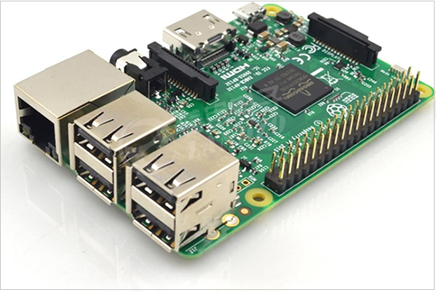

For many businesses, the Internet of Things is new territory, opened up by the cloud. It is a technology that enables a mass of devices, with _some_ computational power, to connect to a single cloud process with a mass of computational power.

The amount of data that IoT devices can capture creates a significant  challenge for IT Operations. Businesses will be looking to IT administrators to help them understand what data to collect, and help them realize the full potential of that data.

## Flatten the IoT learning curve

IT professionals that have plenty of experience with computer technology, but are new to the Internet of Things (IoT), will want to experiment with test hardware, or simulated IoT devices. Getting one "thing" communicating with the Azure cloud is a giant step in gaining confidence and knowledge with working with this new technology.

A "thing" in the IoT world is often a sensor device. The device will have some processing power, but is not a computer that can compare with a smartphone, laptop, PC, or workstation. The sensor device typically takes some measurements (temperature, velocity, acceleration, humidity, and so on), at a specified time interval, and transmits the values for processing to the cloud. These values are called _telemetry_.

As another, topical, example. IoT can be harnessed to capture and run predictive analytics on data from heart monitors alerting users when they're at risk. These same heart monitors could collect information
enabling doctors to make more informed treatment plans for their patients. All handled remotely.

In addition to the transmitting of data, IoT devices can receive some instructions from the cloud. For example, the time interval could be changed, additional sensors could be enabled or disabled. Or, for a more complex device that both records telemetry, and can change settings using a fan, the device can receive from the cloud _desired_ values. The device will then adjust the fan settings to try to match the desired values it has received. These values could be temperature, humidity, velocity, and so on.

In the world of IoT devices, there are the key concepts of _recorded_ values, and _desired_ values. In this module, we'll only be testing recorded values.

Imagine a scenario where there are many sensor devices. For example, devices recording weather data, devices recording the temperature of the contents of refrigeration units, devices recording the vibration in a series of conveyor belts, and many other scenarios. All the telemetry data is transmitted to a single source for processing. That source is an Azure IoT Hub. And you've been assigned the job as administrator of that hub!

In this module, you'll learn the basics of hub administration.

A popular device for getting experience with IoT is the Raspberry Pi device. This is a small circuit board with some LED lights, some sensors including temperature, and the ability to communicate with an IoT hub. Some developers will want to physically connect the device, and gain experience that way. There is an even simpler alternative, to use Microsoft's Raspberry Pi Simulator, and do everything in software on your computer. This is the approach we take in this module: you'll set up an IoT hub, define a single device, then use the simulator to send telemetry to the hub.

As the hub admin, you'll learn about the portal used to set up, monitor, and control, external devices.

Let's get started by learning a bit more about the Raspberry Pi Simulator.

## Learning objectives

In this module, you will:

- Get an introduction to IoT  
- Configure an Azure IoT Hub to capture data
- Interact with a Raspberry Pi Simulator
- Navigate the IoT hub left-hand menu
  
