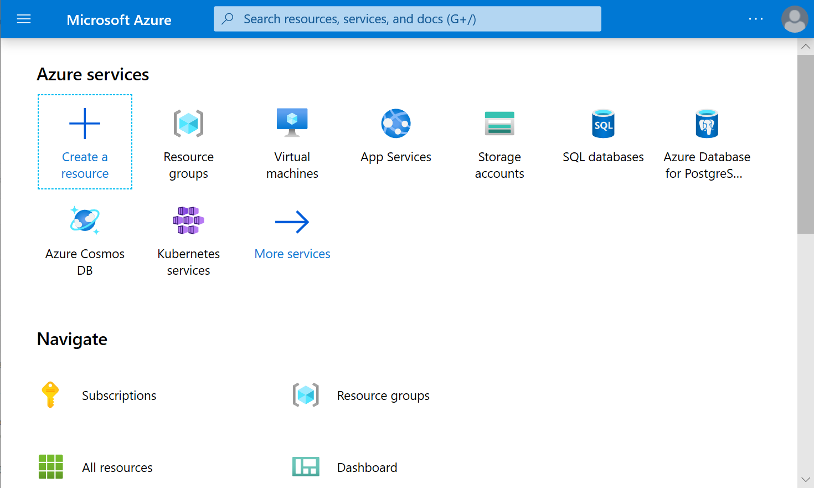
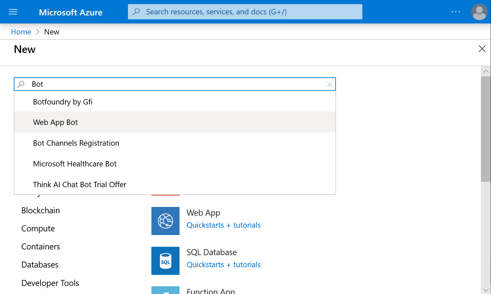
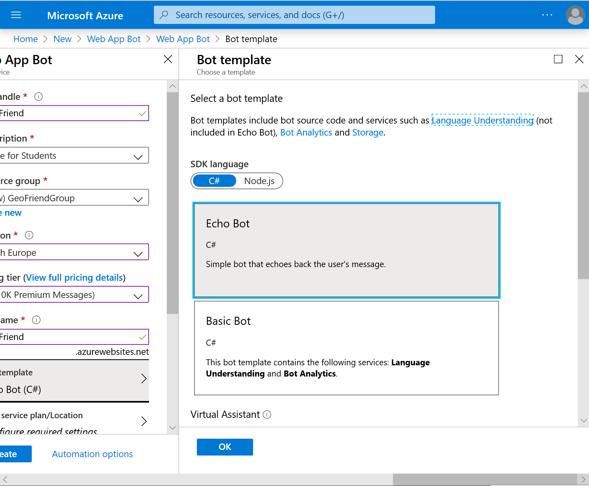
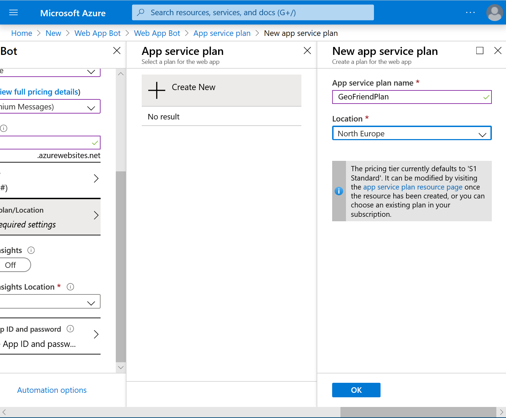
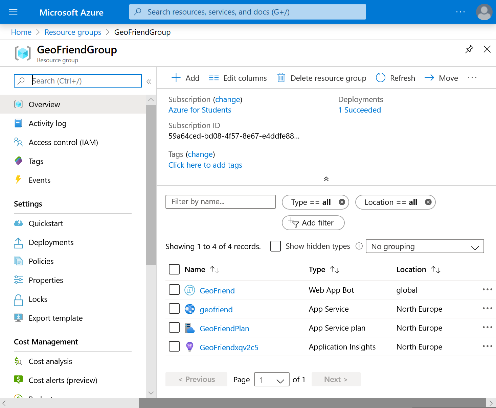
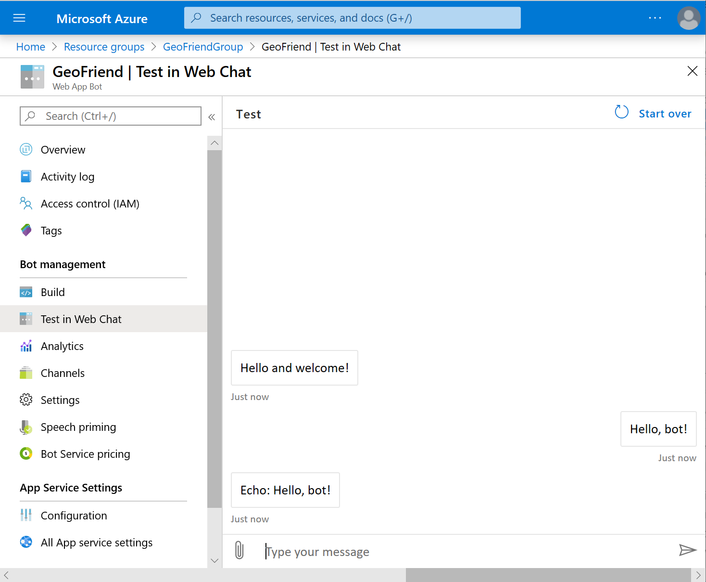

# Microsoft Bot Framework and Microsoft Bot Service

Any conversational experience involves a user sending some messages to a bot, and the bot responding to the the user. Those conversations can happen in different **channels**: in a chat bot on a web site, or in some messenger application such as Facebook Messenger or Telegram. Those **messaging platforms** have their own principles and APIs for creating chat bots, thus developing a bot for Facebook would require different skills than creating a web chat.

Microsoft unifies this process using **[Bot Framework][BotFW]**, a set of core libraries that standardize bot development. Using this framework, we develop a bot as **Web API**, which is essentially a function that we call over the internet. We give it the user input, and it figures out the desired output of the bot.

To connect this function to actual channels, we use **[Azure Bot Service][BotService]**, which allows us to define connections to those channels through web interface on Azure Portal. Once we have developed a bot, we can connect exactly the same code to several channels, providing an **inclusive omnichannel experience**.

Another important role of Bot Framework is to provide some useful developer abstractions to structure the logic of the bot. Complex conversations are difficult to program as simple request-response pattern. Bot Framework provides abstractions to define **dialogs**, **form filling**, etc. and allows us to compose complex conversational behavior from more simple building blocks.

# Cognitive Services

To make bots intelligent, we often want to use some AI techniques. For example, figuring out what user wants without the need to specify the exact phrase requires some **natural language understanding**. Those intelligent tasks can be handled using so-called **[Cognitive Services][CoServ]** - a set of pre-trained neural network models that are available in the cloud.

In our module, we will be using **[Language Understanding Intelligent Service][LUIS]** (LUIS for short) that you can train on a set of phrases, specifying sample input phrase and it's meaning (so-called **intent**). The service will then try to automatically figure out the best intent for each user's input phrase.

Cognitive Services are very often used with bots, that's why they occupy the large part of the figure above.

# Creating a Bot

Let's start creating our **GeoFriend** Assistant chat bot. The easiest way to start is to create a new Azure Bot Service:

1. Go to [Azure Portal][AzPortal] and log in with your Azure Account.

1. Click on "Create a Resource" button (large +), type "Bot" in the search box, and select **Web App Bot**.

After that, on a new page, click **Create** button.

1. Fill in parameters for the bot:
      - Type bot name in **Bot Handle** field. I will use **GeoFriend**, but you can invent something else.
      - In the resource group name, select **Create New**, and come up with some name for resource group.
      - In **Location**, select the data center location closest to you.
      - Change **Pricing Tier** to **F0**, which means "free up to a certain amount of premium messages"
      - Leave **App Name** to its default value      

1. Click on the **Bot Template** field. You will be taken to a pane with several template options:

Here you can select desired programming language (**C#** or **Node.js**, we will go with C#) and one of the templates that provides some pre-defined functionality:

     - **Echo Bot** - the one we will use - is the simplest bot that echoes back any message typed by a user. We will start with this one, since it is the easiest to understand.
     - **Basic Bot** is a traditional template that includes language understanding service and bot analytics
     - **Virtual Assistant** is a very complex example of enterprise-level bot that can integrate different **skills**, and provides integration of many different services.
     - **Language Understanding Bot** creates a bot that connects to existing **LUIS** language model
     - **Q&A Maker Bot** allows you to create bots that answer simple questions based on questions and answers table  

1. Now create **App Service Plan**. Click on "App Service Plan/Location", then **Create New**, and type in a suitable name for App Service Plan. This plan determines how much of compute resources would be allocated to your bot.

By default, the **S1** plan is used. If you want your bot to be hosted on another service plan (for example, on free Azure Web Site), you would need to adjust the service plan afterwards separately, as described [here][AdjustServicePlan].

1. Finally, fine tune **Application Insights** settings. It is useful for monitoring the behavior of your bot. For the sake of this course you can turn application insights off, or specify the Azure datacenter location closest to you.

1. Once all fields are filled in - click **Create**.

It will take some time for all bot resources to be created. Once you see the notification that deployment is complete - go to bot' resource group to check out what has been created. 

# Bot Page on the Azure Portal

From the Azure Portal start page, click **Resource Groups**, and select the group you have specified on step 3.

There are two important components here:

* The first **GeoFriend** resource you see if the web bot application that establishes connection between your bot code and different communication channels. This resource also provides access to bot code, and ability to test the bot in web chat.
* The second **geofriend** resource is a web application that contains the code for your bot. Later on, when we will deploy the bot code from Visual Studio, we will select this application.

Two other resources are the bot app service plan (we should adjust it if we want to scale the bot to handle more requests, or move it to free plan), and application insights instance.

Let's click on the first **GeoFriend** link. We are taken to the Bot page on the portal:

This page is the main starting point for configuring the bot. On the first **overview** tab you can see the typical sequence of steps that we need to do in order to complete the bot project. It all starts with the idea or a **Plan**, followed by the **Build** stage, at which we are now. We will discuss how to build the bot in the next unit. 

# Running the Bot

Right from this page, we can try our newly created bot in action. Click on **Test in Web Chat** tab on the left pane, and you will see a chat box that you can use to converse with the bot.

Try typing in some text, and see how the bot responds.

Let's move on to the next unit to see how we can alter the bot's behavior.

[BotFW]: https://dev.botframework.com/
[BotService]: https://azure.microsoft.com/services/bot-service/
[CoServ]: http://microsoft.com/cognitive
[AzPortal]: https://portal.azure.com
[AdjustServicePlan]: https://docs.microsoft.com/azure/app-service/app-service-plan-manage
[LUIS]: https://docs.microsoft.com/azure/cognitive-services/luis/