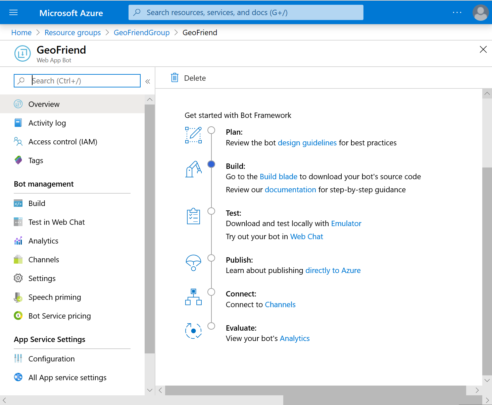
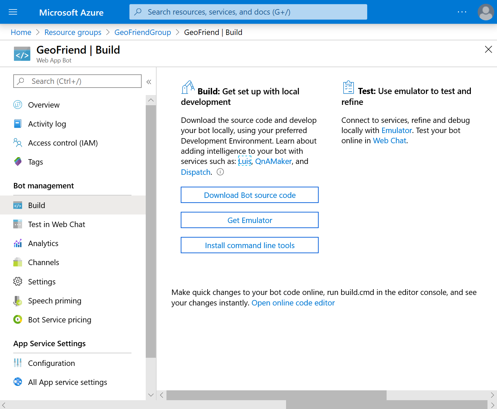
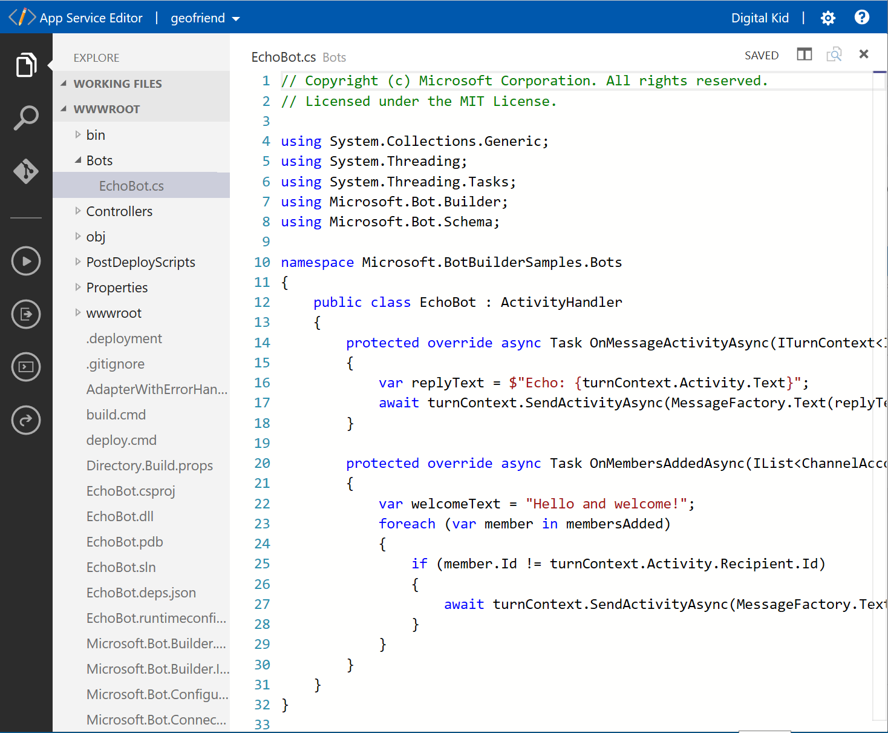
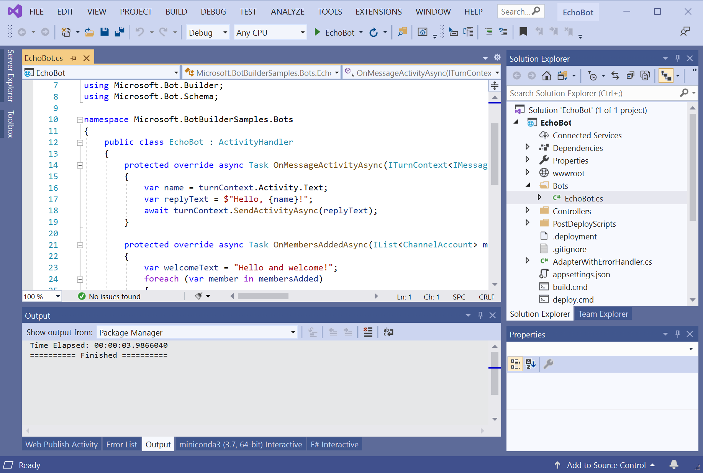
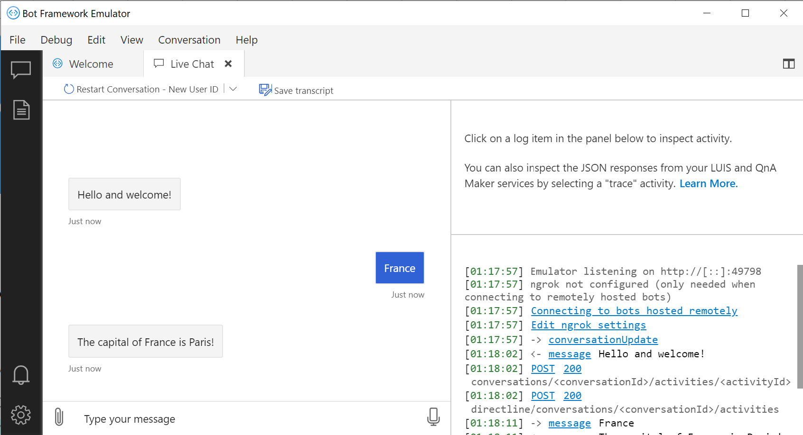
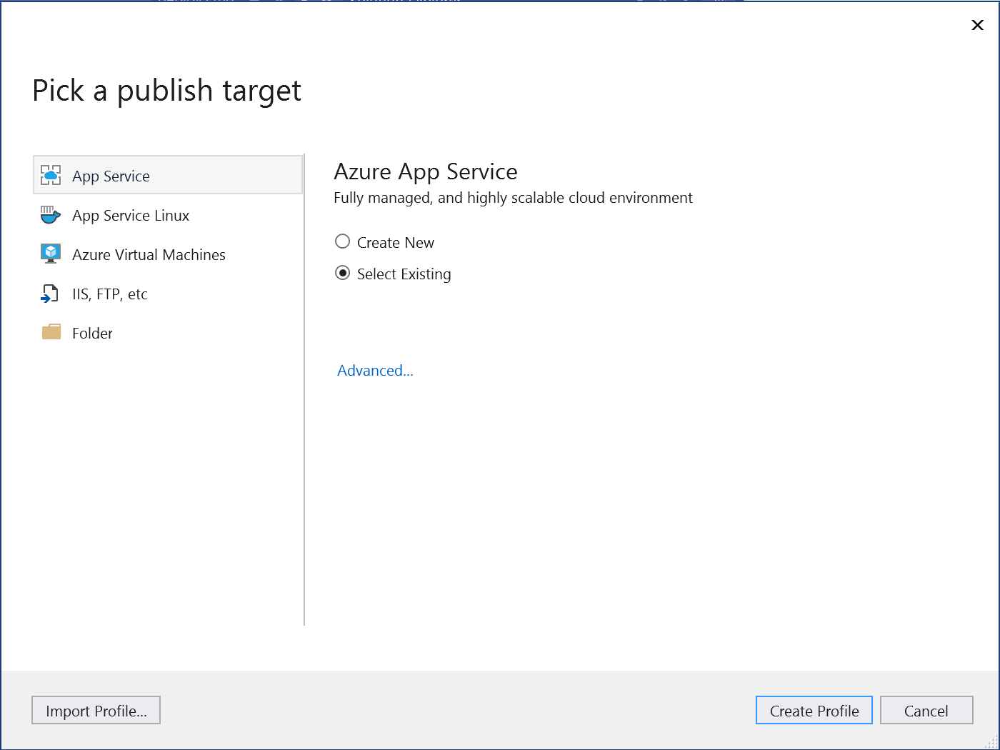
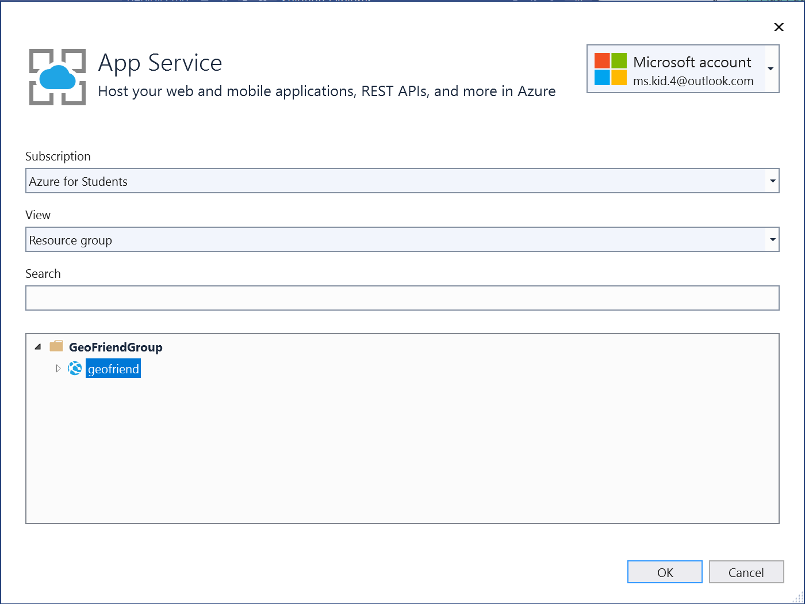
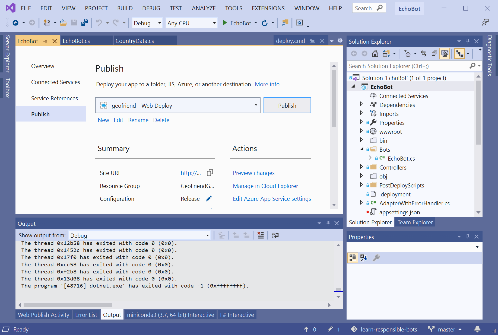

# Bot Development

In the last unit, we have created an echo bot from template, which echos back anything that the user types. Now let's see how can we change this behavior, and how the bot code looks like. 

Open the bot page on Azure Portal:


The bot creation timeline on the right shows, that we are at the **Build** stage. It suggests that you should go to **Build Blade** to download the source code for the bot. Go ahead and click on **Build blade** link:


From here, you have two main options:

* Use full-fledged **Visual Studio 2019** to do your code development. In this case, you need to **Download the source code** of the bot to local directory, and then use it to develop the bot on a local computer. This is the preferred option, because you will have the power of Visual Studio, including **autocomplete**, and the whole development would be much easier. However, you need to have Visual Studio installed on your machine.
* Use **Online Editor** right from the browser - in this case you need to click small **Open online code editor** link. This is especially useful if you want to make some small changes to your bot.

# Exploring Bot's Code in Online Editor

Let's first explore the online editor option. Click on the **open online code editor** link to bring up the web app code editor:


Here on the left you have the list of files. Navigate to `Bots` directory, and click on `EchoBot.cs` file.

If you are familiar with ASP.NET web development, you would probably recognize that the code on the left corresponds to ASP.NET web site. In fact, Azure Bot Service bot is a web application that defines API endpoint `/api/messages`, which is called by the Bot Connector.

If that sounds too complicated - don't worry. All you need to know is that `EchoBot.cs` is the main file that defines the functionality of the bot. In this file, `OnMessageActivityAsync` is the main function that is called each time the bot receives a message from the user. Here is the code responsible for printing out the echo message:

```csharp
protected override async Task OnMessageActivityAsync(ITurnContext<IMessageActivity> turnContext, CancellationToken cancellationToken)
{
    var replyText = $"Echo: {turnContext.Activity.Text}";
    await turnContext.SendActivityAsync(MessageFactory.Text(replyText, replyText), cancellationToken);
}
```

As you can probably understand, `turnContext.Activity` contains all information related to input message, including `turnContext.Activity.Text` - the input message text. It also contains other information, such as attachments, sender address, etc. To send the reply to the user, we use `SendActivityAsync` function.

Another useful function here is `OnMembersAddedAsync`, which is called whenever a new person enters the chat. In our case, we use it to display the initial welcome message to the user.

# Using Online Editor to change the code

Let's change bot's behavior a little bit, and make it greet us by name. I will assume that the user types in his name, and the bot responds with *Hello, name!*.

To do that, I will change the `OnMessageActivityAsync` function a little bit. I will also slightly simplify the code for the sake of clarity:
```csharp
protected override async Task OnMessageActivityAsync(ITurnContext<IMessageActivity> turnContext, CancellationToken cancellationToken)
{
    var name = turnContext.Activity.Text;
    var replyText = $"Hello, {name}!";
    await turnContext.SendActivityAsync(replyText);
}
```

Once the code has been changed, we need to **build** the application to incorporate changes. Locate the `build.cmd` script amond the files in the left pane, right-click on it, and select **Run from console**. This will execute the script in the online editor that will re-build the site:


To test that the bot is working, navigate to the bot portal page, select **Test in Web Chat**, and try talking to the bot:

You should see that the bot greets you in response to your name.

# Using Visual Studio

To make more serious changes to the bot, it would be easier to use Visual Studio IDE. While this requires you to have Visual Studio installed on your machine, it offers several advantages:

* You have very flexible editor with autocomplete, and a lot of useful features
* You can easily start and debug the code locally on your machine, which is faster than doing rebuild process in the cloud. Once you are happy with the bot - you do the final deployment.

>[!TIP]
> If you are going to do any serious development - you should definitely [install Visual Studio][InstallVS]!

>[!NOTE]
>You can still follow the course without Visual Studio Installation, by using Online Editor described above. In this case you would have to adjust the instructions a little bit, and use **web chat** to test the bot instead of the emulator. You would also have to execute **build** script after changes to the code. 

To start working with the bot code in Visual Studio, do the following:

* From the **Build** blade on the bot's portal page, select **Download Bot's Source Code**.
* Answer **Yes** to the following question, indicating that you want to include `appSetting.json` file into the project. This file contains some sensitive keys that are used to communicate with Bot application, so you should not distribute this file to third parties when creating production bots.
* Creating zip-file will take some time. After that you can download the compressed folder with bot's source code.
* Unzip this file somewhere (I will use `c:\demo` directory on my Windows machine) and start `EchoBot.sln` file. This should open the Visual Studio 2019 with the same code that we have seen previously.



# Creating Capital Dictionary

Let's try to make our bot do something useful. Consider the problem of learning country's capital cities. Our first exercise would be to turn our bot into "capital dictionary", which will return the capital of any given country.

>[!TIP]
>During this course, I will describe a series of steps that add some functionality to the bot, and provides pieces of code. The best way to learn would be to try and develop the bot yourself alongside those instructions. However, the code for the bot at different stages is available [in this GitHub Repository][GithubSample], and you can always grab the complete code from there. The only thing you would need to do is copy `appsettings.json` file from your project into the root directory.

If we look at the [list of national capitals](https://en.wikipedia.org/wiki/List_of_national_capitals) on Wikipedia, we will immediately realize that we are facing an important **fairness** and **data complexity** problem. Some countries (like Switzerland) might not have a *de juro* capital at all, while for other countries (like Israel) the capital is not officially recognized.

There is no easy way to solve this problem. For our course, we will take the simplest solution, and will just indicate the source of data to the user. However, we might want to take more complex approach, where we will change the returned result based on the language the user speaks, or using some other technology mechanism to accommodate for this issue.

Another important issue here is that capitals and countries change. So we need to make sure to update our bot periodically, in order to keep trust of our users. We may also want to display "last updated" date in order to make it clear how recent the data is.

As a starting point for our data, we will use [Basic City list from SimpleMaps.com](https://simplemaps.com/data/world-cities). Download the basic database [from this page](https://simplemaps.com/data/world-cities) and extract `worldcities.csv` file into the root directory of our project.

Lines in `worldcities.csv` look like this:
```
"city","city_ascii","lat","lng","country","iso2","iso3","admin_name","capital","population","id"
"Tokyo","Tokyo","35.6850","139.7514","Japan","JP","JPN","Tōkyō","primary","35676000","1392685764"
"New York","New York","40.6943","-73.9249","United States","US","USA","New York","","19354922.0","1840034016"
...
```

To handle the data, let's create a new class called `CountryData` in the root of out project. In Visual Studio, you can right-click on **EchoBot** project, and then select **Add** -> **Class**. 

>[!IMPORTANT]
> To make the project compile correctly, you need to change the namespace name from `EchoBot` to the namespace used in other project files - `Microsoft.BotBuilderSamples`. 


To represent country data, we will create `Country` class:
```csharp
public class Country
{
    public Country(string s)
    {
        var t = s.Split(',');
        Capital = t[0].Trim('"');
        Name = t[4].Trim('"');
        float res;
        Population =
            float.TryParse(t[9].Trim('"'), out res) ? (int)res : 0;
    }

    public string Name { get; set; }
    public string Capital { get; set; }
    public int Population { get; set; }
}
```
Constructor of this class takes one line from `worldcities.csv` table, and parses the data into corresponding fields.

For simplicity, we can put this class definition into the same `CountryData.cs` file. 

To load the whole table, let's use `CountryData` class:

```csharp
public class CountryData
{
    protected Country[] Countries { get; set; }

    public CountryData(string fn)
    {
        var data = File.ReadAllLines(fn);
        Countries = (from z in data.Skip(1)
                     select new Country(z)).ToArray();
    }
}
```
Here, we use **LINQ** expression to go through each line of the data file, convert it to `Country` objects, and then store them as an array.

Finally, to get the capital for a given country, let's create `GetCapital` function:

```csharp
    public string GetCapital(string country)
    {
        return Countries.FirstOrDefault(
            c => c.Name.ToLower() == country.ToLower())?.Capital;
    }
```
This function will return `null` if the country was not found in the list.

> [!NOTE]
> In this code, we do not care too much about performance, and we prefer simple code in favor of more performant one. In proper implementation, we should probably use hash table structure to store the dictionary of countries and capitals, to ensure faster access.

Now, to implement the bot logic, we need to go to `Bots\EchoBot.cs` file and change the code inside `OnMessageActivityAsync` function:

```csharp
    var name = turnContext.Activity.Text;
    var f = System.IO.Path.Combine(Environment.CurrentDirectory, @"worldcities.csv");
    var cd = new CountryData(f);
    var cap = cd.GetCapital(name);
    var replyText = cap == null 
        ? "I do not know this country" 
        : $"The capital of {name} is {cap}!" ;
    await turnContext.SendActivityAsync(replyText);
```

>[!TIP]
> If you are not sure that you have made all changes correctly, you can find the complete version of the bot code [on GitHub][GitHubSampleStage1]. To make it work with the bot you have recently created, you need to place `appsettings.json` file from your bot into the root of the GitHub project.

# Testing the Bot locally

Once we have made changes to the bot, we can test it on our local machine. To do that, we need to install [Bot Framework Emulator][BotEmulator].

Testing the bot involves the following steps:
* Copy **Application Id** and **Application Secret** from `appsetting.json` file
* Run the project in Visual Studio. If the bot compiles correctly, this should open the browser window
* Start Bot Framework Emulator and select **Open Bot**
* Provide the endpoint address, which usually looks like this: `http://localhost:3978/api/messages`. You can verify the site address and port number in the browser window opened in the previous step
* Paste Application Id and Application Password into corresponsing text fields and click **Connect**
* Start chatting with your bot!



# Deploying bot to Azure

To deploy the bot back to the cloud, the easiest way is to use Visual Studio:

1. Right-click on the **EchoBot** project in Visual Studio and select **Publish**.
2. In the next dialog, select **App Service** on the left, and **Select Existing** App Service.
3. In the next dialog, make sure the correct App Service name is selected as deployment target.

 | 
---|---
> [!TIP]
> You may be asked to log into your Azure account at this point. If you do not see the correct App Service, make sure that you are logged into your Azure Account - check the drop-down in the top right corner of the dialog.
4. Once this is completed, you will have a deployment profile created, and can deploy with one click of a **Publish** button:


After the deployment, you can switch to your bot page on the Azure Portal, and talk to your bot using **Test in Web Chat**.

# Conclusion

In this unit, we have developed our bot into a useful tool. However, it does not follow any responsible conversational UI principles, and in fact it is completely unusable without specific instructions. In the next units, we will make this bot understand human language, and apply some responsible AI principles.

[BotEmulator]: https://aka.ms/abs/build/emulatordownload
[GitHubSample]: https://github.com/MicrosoftDocs/learn-responsible-bots
[GitHubSampleStage1]: https://github.com/MicrosoftDocs/learn-responsible-bots/tree/t1-capdict
[InstallVS]: https://docs.microsoft.com/visualstudio/install/install-visual-studio?view=vs-2019