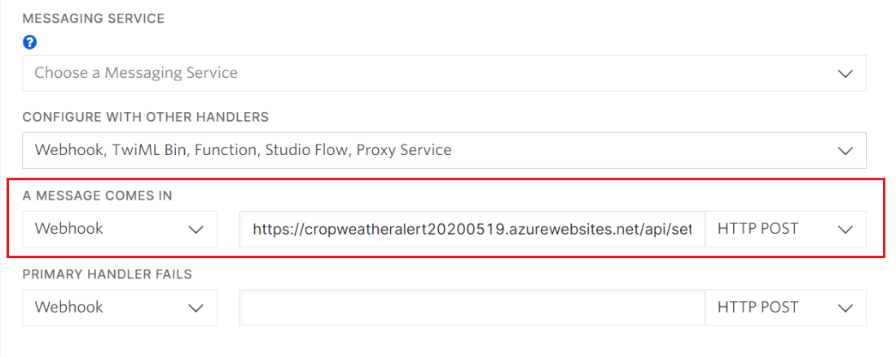
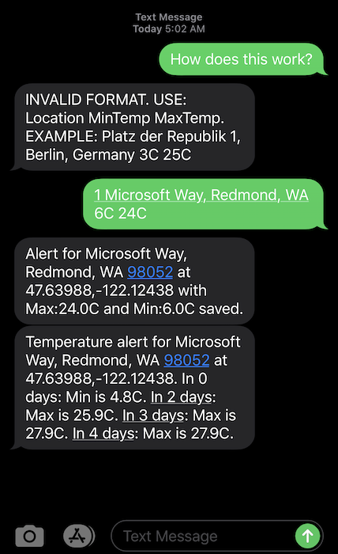

In this unit, you'll connect your Twilio phone number to the Azure function app to receive text messages.

## Connect Twilio to the function app for incoming text messages

Now that everything is set up, the only thing left to do is to make Twilio call our function app endpoint for incoming text messages.

1. Log in to [Twilio](https://www.twilio.com?azure-portal=true).

1. On the left pane, select the ellipsis (**...**).

    > [!div class="mx-imgBorder"]
    > 

1. Select **Super Network** > **Phone Numbers** > **Manage Numbers** > **Active Numbers**, and then select your phone number.

1. In the **Messaging** section, paste the function endpoint URL that you copied from the previous unit as the webhook destination for arriving messages.

    > [!div class="mx-imgBorder"]
    > 

1. For the webhook request method, select **HTTP Post**.

1. Select **Save**.

## Test the application

You can now get started using the application by sending a text message to your Twilio phone number. Send a text message that contains your location and a temperature range. Every 10 minutes you'll receive a reply that contains the temperature ranges for the next five days if the forecast is below or above your specified temperature range.

> [!div class="mx-imgBorder"]
> 
