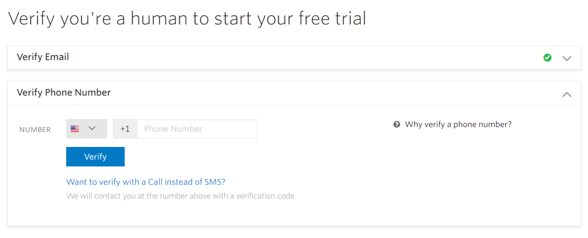

## Create a Twilio account

To be able to send SMS messages from an Azure Function, you'll need a Twilio account. The free account is more than enough to get started.

1. Head to [twilio.com](https://www.twilio.com?azure-portal=true).

1. Click the **Sign Up** button in the top-right corner.

1. Fill in your details and click **Get Started**.

1. Twilio will send you an email to verify your email address. Click the link in the email to verify it.

1. Enter your phone number to verify it. Twilio free accounts let you send messages only to verified phone numbers to stop them from being used for spam. Twilio will send you a verification code that you need to enter to verify your phone.

    
1. Answer the next set of questions to choose your product, what you want to build, and how you want to build it.  

1. Click **Get Started with Twilio** and you’ll be logged into your account.

1. Click **Get a trial phone number** on your account dashboard. Twilio assigns you a phone number that's used to send messages.

    > [!NOTE]
    > These assigned numbers may not be able to send messages in some countries. The Twilio documentation lists [which countries have restrictions](https://support.twilio.com/hc/articles/223183068-Twilio-international-phone-number-availability-and-their-capabilities?azure-portal=true), and shows ways to send SMS messages using an [international number or AlphaNumeric sender Id](https://support.twilio.com/hc/articles/226690868-Using-Twilio-when-SMS-numbers-are-unavailable-in-your-country?azure-portal=true).

1. Take a note of your new Twilio Trial Number; you will need it later in this module. You can also get this number anytime on your dashboard under **Account Info**.

    

1. Note your **ACCOUNT SID** and **AUTH TOKEN** because you will need these values later.

## Launch Visual Studio

For this module, you'll develop the mobile app and Azure Functions app using Visual Studio 2022. Although Xamarin.Forms apps can be built to run on iOS, Android, and Universal Windows Platform (UWP), this module will just focus on UWP.

Launch Visual Studio 2022 on your system.

## Summary

In this unit, you created a Twilio account that you'll use to send SMS and launched Visual Studio. Next, you'll learn how to create a Xamarin.Forms app and add the Xamarin.Essentials NuGet package.

> [!IMPORTANT]
> Keep note of the Twilio  **ACCOUNT SID** and **AUTH TOKEN** and **Active Phone Number** values that you gathered in this unit, because you'll need these values later.
