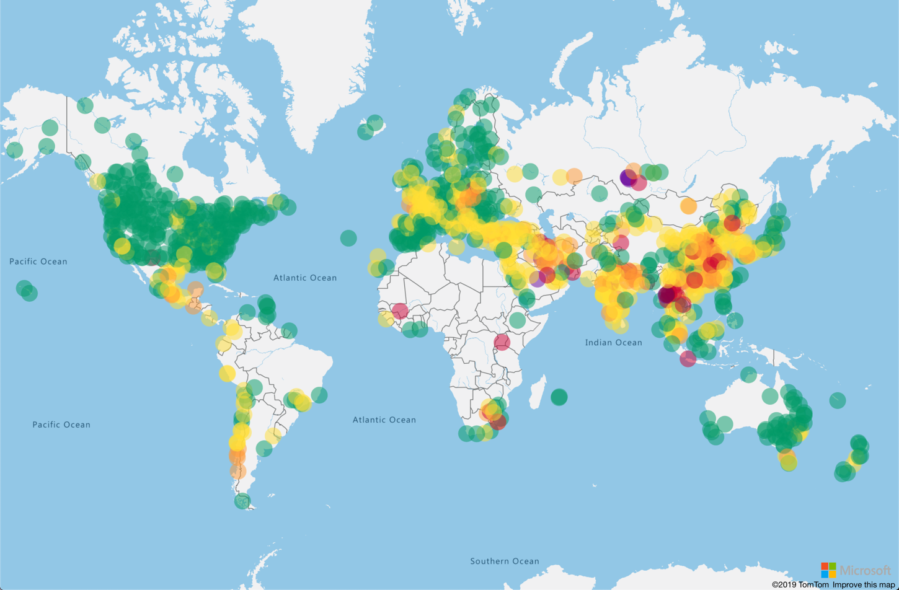

Azure Maps is a collection of geospatial services that use fresh mapping data to provide geographic context to web and mobile applications. These services include APIs for maps, vehicle routing, weather, and geofencing. Azure Maps also has a web SDK to visualize a map on a web page.

In this module, you'll learn how to use the Azure Maps web SDK to visualize air pollution data.

## The scenario

Air pollution can be incredibly harmful to human and animal health, and is caused by a number of factors, both natural and artificial. Factory output, burning different types of fuel and natural wildfires all contribute to a rise in air pollution. This pollution is airborne, and won't stay where it was produced, but can be carried many kilometers across the globe by the wind. In late 2019, for example, the smoke from wildfires in Australia reached New Zealand, over 2,000 kilometers away.

Air pollution is measured using the **Air Quality Index** on a scale from 0-500. The higher the level, the greater the health risk. AQI values under 50 means little to no risk, but values above 300 means the air is hazardous to everyone. The Air Quality index looks at a few different pollutants:

- Ground-level ozone
- Particulates
- Carbon monoxide
- Sulphur dioxide
- Nitrogen dioxide

> [!NOTE]
> You can read more about the Air Quality index on the [AirNow AQI Basics page](https://www.airnow.gov/aqi/aqi-basics/).

In this module, you'll get air pollution data using a free API, and plot this data on an interactive map on a web page using Azure Maps. The app you'll create will look like this:

