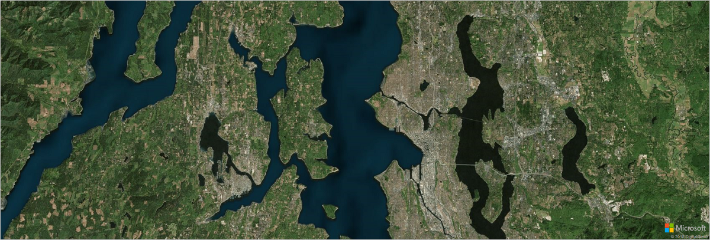

The Azure Maps web SDK has a whole host of different tools to visualize spatial data on an interactive Map on a web page. Before getting started adding the map to a web page, lets look at some of the capabilities.

## Render a map

The Azure Maps web SDK has an interactive map JavaScript control that can be added to a web page. Maps are rendered using the **Spherical Mercator projection coordinate system**, the de facto standard for web-based mapping applications. This system stretches the map at both the North and South poles to create a square map that can be drawn on screen. This stretching does mean that the further away from the equator you get, the more stretched the map is. The end result is countries like Greenland appear substantially larger than they are in reality.

Maps can be rendered in a number of different styles. These styles include:

- Road

    This map style is a standard map that displays roads, natural and artificial features along with the labels for those features.

    

- Satellite

    This map style is a combination of satellite and aerial imagery.

    

- Satellite with road labels

    This map style is a combination of satellite and aerial imagery, with roads and labels overlaid on top.

    

- High contrast

    This map style is a dark road map style with higher contrast than other styles.

    

More styles are described in the [Azure Maps supported maps styles documentation](https://docs.microsoft.com/azure/azure-maps/supported-map-styles)

## Navigate around the map

The Azure Maps control can be configured to be fully interactive, allowing the user to zoom, move or rotate the map, tilt the view. When zoomed in and tilted, the map can show 3D representations of the shape of buildings. Navigation is done using a mouse, trackpad, or touch screen, and supports pinching to zoom, or dragging to move the camera around. The map control has zoom, compass, pitch, and style picker controls that can be enabled and shown on the map.

Navigation can also be done in code, such as setting the camera location to a specific location. The different user navigation capabilities can be enabled or disabled by settings on the map control.

## Layers

Maps can be augmented with layers, visualizing data on top of the map. In a later unit in this module, you'll use a layer on a map to visualize pollution data.

There are a number of different layer types available, and these layers all render data sources that contain either GeoJSON data or [MapBox vector tiles](https://github.com/mapbox/vector-tile-spec). GeoJSON will be covered in a later unit in this module

The different layer types include:

- Symbol layer

    Symbol layers put either a pin icon, or a custom icon loaded from an image file at a specific location on the map. For example, different icons could show the location of various types of social support in a city, such as food banks, homeless shelters, or refuges.

- Bubble layer

    Bubble layers put circular bubbles at locations on the map. The bubbles can be configured to show the data they're representing, such as setting the bubble size or color. For example, during a pandemic different bubble sizes could show the number of people who have contracted an illness, with the color reflecting the mortality rate.

- Heat map

    Heat map layers represent the density of data using a range of colors to show 'hot spot' areas on a map. For example, a heat map could be used to show the relative risk of earthquakes based off the number and strength of previous earthquakes.

The location of the features in the layer is defined by a data source. THe data source can also provide data that configures controls on the layer, for example what image to display or how large to make a bubble.

In this unit, you learned about the Azure Maps web SDK. including styles, navigation and layers. Next, you'll create an Azure Maps account so you can use the web SDK in a web app.
