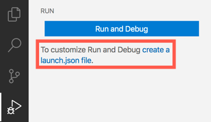
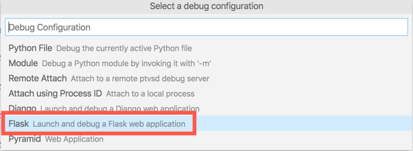
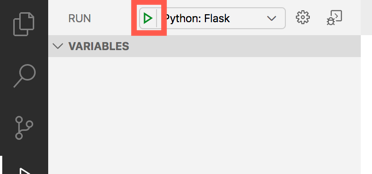
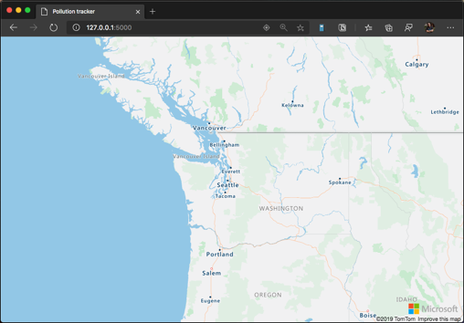

In this unit you will create a Python app using Flask to show the Azure Maps web SDK on a web page

## Build the app

### Create the folders for the Python app

1. Create a folder on your computer to store the code.

1. Open Visual Studio Code, and open the folder you have just created

1. In this folder, create a new file called `app.py`. By creating this Python file, Visual Studio Code will activate the Python extension ready to build this python app. You can see the progress of the extension activation in the bottom status bar.

1. Inside this folder, create a new folder called `templates`. This folder will hold HTML templates used by the Flask app.

### Install the necessary Pip packages

1. Open the Visual Studio Code terminal if it is not open by selecting **Terminal > New terminal**, and create a python virtual environment using the following command:

    ```sh
    python -m venv .venv
    ```

    This will create a virtual environment inside the current folder. Visual Studio Code will detect this, and ask if you want to select the virtual environment for this folder, so select **Yes**.

    

1. Add a file called `requirements.txt` to this folder, and add the following to this file:

    ```sh
    flask
    python-dotenv
    requests
    ```

    This file lists the Pip packages that are needed by this app.

    * `flask` - this package is a web framework for Python
    * `python-dotenv` - this package allows environment variables such as the maps key to be loaded from environment files
    * `requests` - this package makes it easy to make web requests, and will be used later to query pollution data

1. Install the Pip packages from the terminal using the following command:

    ```sh
    pip install -r requirements.txt
    ```

### Create an environment file

The flask app will need to use your Azure Maps key to load the map control onto a page. It is best practice to store data such as this in environment variables so that it is not checked in to source code control, and can be configured to different values when developing or publishing your app. Flask will use the python-dotenv package to look for a file called `.env` in the root of your app, and load environment variables from this file.

1. Create a file in the root of the folder called `.env`

1. Add the following to this file:

    ```sh
    MAP_KEY=<your map key>
    ```

    Replace `<your map key>` with the value of the primary key you retrieved after creating the Azure Maps account in an earlier unit. This value should not be in quotes.

### Create the application Python file

1. Open the  `app.py` file

1. Add the following code to this file

    ```python
    import os, json
    from flask import Flask, render_template, request
    import requests

    # Load the Azure Maps key from the .env file
    MAP_KEY = os.environ["MAP_KEY"]

    # Initialize the Flask app
    app = Flask(__name__)

    # Handle requests to the root of the web site, returning the home page
    @app.route("/")
    def home():
        # Create data for the home page to pass the maps key
        data = { "map_key" : MAP_KEY }
        # Return the rendered HTML page
        return render_template("home.html", data = data)
    ```

    This code will handle requests to '/', so the root of the web site. When this page is loaded, the app will use the key from the `.env` file to create some data which is used to render the `home.html` file as a parameter called `data`.

1. Save the file

  > [!NOTE]
  > If you don't want to have to remember to save files after every change, you can turn on Auto Save by selecting **File > Auto Save**

### Create the home.html file

1. Create a new file in the `templates` folder called `home.html`

1. Add the following to this file:

    ```html
    <!doctype html>
    <html>
    <head>
        <title>Air Quality tracker</title>
        <!-- Ensures that IE and Edge uses the latest version and doesn't emulate an older version -->
        <meta http-equiv="x-ua-compatible" content="IE=Edge">
        <meta charset='utf-8'>
        <!-- Ensures the web page looks good on all screen sizes. -->
        <meta name="viewport" content="width=device-width, initial-scale=1, shrink-to-fit=no">
        <!-- Import the Azure Maps control -->
        <link rel="stylesheet" href="https://atlas.microsoft.com/sdk/javascript/mapcontrol/2/atlas.min.css" type="text/css">
        <script src="https://atlas.microsoft.com/sdk/javascript/mapcontrol/2/atlas.min.js"></script>
        <style>
            html,
            body {
                margin: 0;
            }
            #myMap {
                height: 100vh;
                width: 100vw;
            }
        </style>
    </head>
    <body>
        <div id="myMap"></div>
        <script type="text/javascript">
            window.addEventListener("DOMContentLoaded", function () {
                // Pick a pre-defined location of the Microsoft Campus
                map_center = [-122.136866, 47.642472]

                // Get the users location if permitted - they will be asked for permission before we can get their location
                if (navigator.geolocation) {
                    navigator.geolocation.getCurrentPosition(function (position) {
                        map_center = [position.coords.longitude, position.coords.latitude]
                    })
                }

                //Create an instance of the map control using the map key from the Flask app
                var map = new atlas.Map('myMap', {
                    authOptions: {
                        authType: 'subscriptionKey',
                        subscriptionKey: '{{ data.map_key }}'
                    }
                });

                // when the map is ready, center the map on the users location
                map.events.add('ready', function () {
                    map.setCamera({
                        center: map_center,
                        zoom: 5
                    })
                })
            })
        </script>
    </body>
    </html>
    ```

    This web page will render a full screen `div` element with the id of `myMap`. After the page is fully loaded, the users location is retrieved. This will cause the browser to ask for permission, and will only get the location if permission is granted, otherwise the location of the Microsoft campus in Redmond, Washington, USA will be used.

    > Maps uses longitude and latitude for the coordinates. Longitude measures around the Earth from east to west, with 0° at the Prime Meridian, a line from the North to South Poles running through the UK, going east to 180° on the opposite side of the globe roughly between Alaska and Russia and west to -180°. Latitude goes north to south, with the North Pole at 90°, the equator at 0° and the South Pole at -90°,

    The map control is then into the div. The maps key is set to `{{ data.map_key }}`, and this is the Flask notation to render data into the HTML file. What this means is that when this page is returned to the users web browser, the value `{{ data.map_key }}` is replaced by the value of the `map_key` set on the `data` object. This object was passed to the `render_template` call in the `app.py` file, and the `map_key` is set to the Azure Maps primary key loaded from the `.env` file.

    Once the control is ready, a camera is set up over the users location. The camera is used to define what to show on screen, so having the camera over the users location will center the map view over that location. The zoom value shows how far above the Earth the camera should be, and determines how many meters of the map are shown per pixel on screen. You can read more on the different zoom values in the [Zoom levels and tile grids documentation](https://docs.microsoft.com/azure/azure-maps/zoom-levels-and-tile-grid).

1. Save the file

## Run the app

Visual Studio Code can be configured run and debug Flask apps, and you can use your browser to see the app in action. To configure debugging for your app:

1. Ensure the `app.py` file is open in the editor. The debug options you can configure vary depend on what the active file is.

1. Select the **Run** tab from the activity bar, or select **View > Run**

   

1. Select the **create a launch.json file** link

   

1. A dropdown will appear to select the debug configuration. Select ***Flask** Launch and debug a Flask web application*.

    

A new file will be created called `launch.json` inside a folder called `.vscode`. This folder contains configuration settings for Visual Studio Code to use for your app. This file will be opened in the editor, but you can just close it.

To run your app, select the green run triangle from the **Run** activity pane.



The app will start, and in the output you will see the local URL it is running on.

```output
 * Serving Flask app "app.py"
 * Environment: development
 * Debug mode: off
 * Running on http://127.0.0.1:5000/ (Press CTRL+C to quit)
```

Open the URL in your web browser, and you will see the map, centered on your location if you give the site permission to get your location, otherwise it will be centered on the Microsoft Campus in Redmond, Washington, USA.



Try navigating around the map by dragging, using the mouse wheel, or pinching to zoom in and out.

## Troubleshooting

### Exception has occurred: KeyError

If your app stops as soon as it's run and shows an exception with the message `Exception has occurred: KeyError`, then your maps key hasn't been added to the `.env` file.


Check the following:

* Is there a file called `.env` in the root of your application?
* This file should contain a key/value pair in the format of `key=value`. The key needs to be `MAP_KEY`, and the value needs to be your Primary key for the Azure Maps account.

### No data on the map

If you don't see any data on the map, but you do see the Microsoft logo, then you are not using a valid key for the map control. Check the value in the `.env` file to ensure it is correct. This value should not be in quotes.
