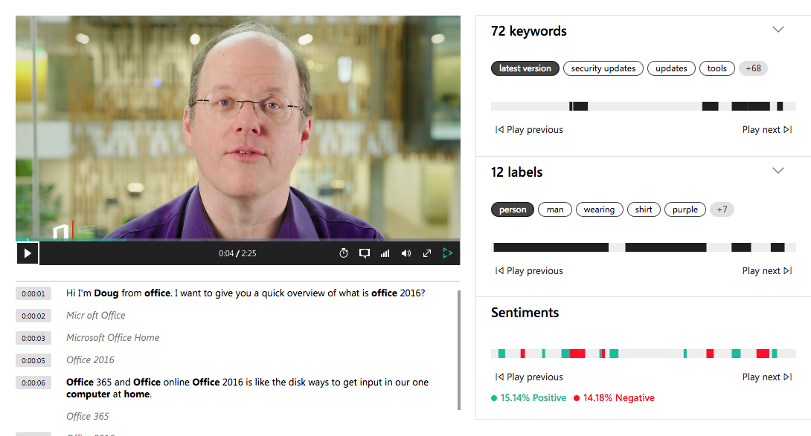

Every time you use a voice assistant on your mobile phone, or there’s a suggestion to tag a friend in a photo on social media, that’s deep learning.

### Natural language processing

Natural language processing (NLP) uses AI models to analyze language for you. NLP includes spell checking, translation between languages, speech recognition, chatbots, sentiment analysis, key phrases extraction, and many other areas.  

### Computer vision

Computer vision, sometimes known as image recognition, can analyze images and extract features from them (such as objects, colors, locations, or animals). Computer vision can be extended to videos for real-time information. Some services combine this with speech recognition for video analytics.

Computer vision has significantly enhanced the ability to use search engines for images. Custom vision allows users to easily train their own computer vision models in the browser for individual applications, such as checking for hard-hat compliance in dangerous work areas.

### Recommendations

TV shows you may be interested in, new products based on your previous purchases, friends to add to your networks, and advertisements that appear when you browse the web are all applications of deep learning recommendation systems.
