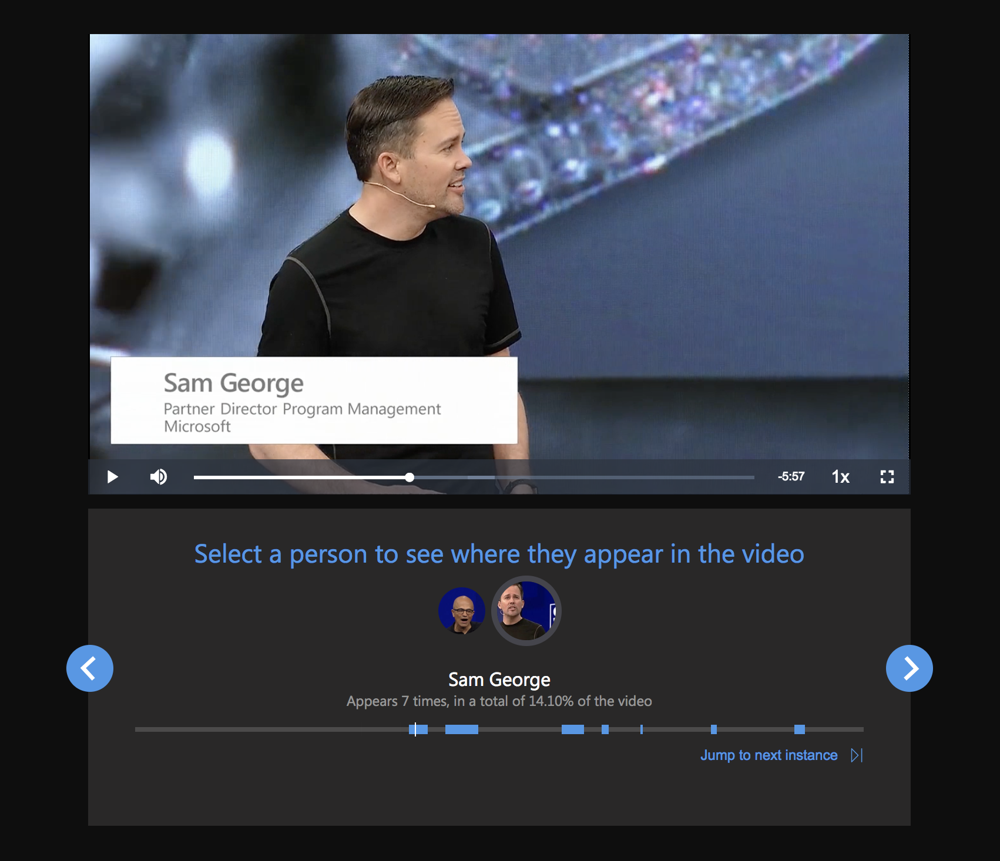

Deep learning is where all the recent hype for AI comes from. Recent advances with social network filtering, computer vision, speech recognition, and natural language processing have produced user-friendly applications that many people use in their everyday lives - perhaps without even knowing it.

Deep learning is a family of machine learning algorithms based on learning data representations, rather than algorithms that specifically solve one task. For example, a deep learning computer vision model can predict objects in an image.

Deep learning uses variations of neural networks with multiple hidden layers, each layer slightly transforms the data - eventually different layers can recognize different features, such as an eye in an image. This process is the neural network learning what the input data represents. It allows deep learning to learn sophisticated class boundaries and data trends that even human experts might not be able to learn.

Deep learning algorithms can learn which features should be represented at each layer of the network by themselves. However, user input guides the size and number of hidden layers, and which activation functions the layers use.

### Types of deep learning

Recurrent neural networks (RNNs) and deep neural networks make up the majority of deep learning applications. There are many variations of deep neural networks to suit different applications, but at their core they are very similar to the neural networks we have already covered.

RNNs are a class of neural network, otherwise known as sequence models. They are good for analyzing and predicting data that is in a sequence, such as text or music. Advances in applying RNNs have successfully extended their use to complex video games, such as DotA 2.

Deep neural networks are neural networks with multiple hidden layers - RNNs can sometimes be considered a deep neural network. Convolutional neural networks (CNNs) are the other main variation of deep neural networks used today, which are primarily used for computer vision applications, but also speech recognition.

Deep neural networks are particularly prone to overfitting and long training times. Because of this, it is best to spend a good proportion of your time preparing your data - so you do not train a model for two days only to realize your dataset needs more work.

## Summary

That's the introduction! We covered:

* __Deep learning__ is primarily variations of __neural networks__.
* Deep learning models learn what different data represents, rather than solve one specific task.
* Deep learning algorithms can learn which features should be represented at each layer of the network by themselves.
* The user still has to tell the model the size and number of hidden layers, and which activation functions the layers use.
* __Recurrent neural networks__ (RNNs) analyze data that is in a sequence.
* __Convolutional neural networks__ (CNNs) are primarily used for image applications.

Next we will look over different applications of deep learning.