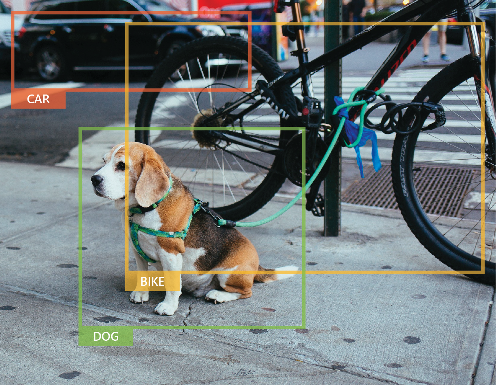

## Introduction to CNNs

Convolutional neural networks (CNNs) are a class of deep neural networks, most commonly used in computer vision applications. 

Convolutional refers to the network pre-processing data for you. This task was traditionally programmed by data scientists. The neural network can learn how to do pre-processing, applying filters for things such as edge detection.

In the image above, the convolutional layers prepare the data from the image before a large neural network analyses it.

Pre-processing allows the data to be transformed into a state where the neural network can analyse it more easily - providing very accurate results.

## You Only Look Once - YOLO

YOLO is a popular CNN algorithm written in Python which is used for real-time object detection. YOLO uses a single neural network on an image - predicting bounding boxes and class probabilities.

Having the entire detection pipeline in a single neural network gives YOLO major performance benefits. YOLO can perform accurate analysis of over 9000 different object categories in real-time.

YOLO can analyse every frame from most cameras. You are able to make a tradeoff - increasing the speed of analysis for a slight decrease in accuracy. However YOLO performs quite well analyzing between 30 and 60 images per second.

### Optional: Softmax
Softmax is an activation function used in neural networks. CNNs commonly use softmax in the final layers of a classification model because softmax outputs probabilities for multiple classes. This has proven to be quite successful for multiclass classifications using CNNs and other deep neural networks.  
  

  
As you can see above, Softmax outputs multiple probabilities adding up to 1. The probability that the data softmax has analysed represents a lion is given as 0.98, whereas the next closest  is a wolf at 0.008 - we will predict the original image is a lion.  

### Programming exercise
 
> Let's try out making a simple CNN in Azure Notebooks. We’re going to use a CNN to recognize handwritten digits.
>  
> **Python users** click __[here](https://notebooks.azure.com/home/libraries/Python "here")__ to go to your library.  
> Select the exercise `10. Convolutional Neural Networks - Python.ipynb`.  
> Then click then click __'Run on Free Compute'__.  
>  
> **R users** click __[here](https://notebooks.azure.com/home/libraries/R-Exercises "here")__ to go to your library.  
> Select the exercise `10. Convolutional Neural Networks - R.ipynb`.  
> Then click then click __'Run on Free Compute'__.  
>  
> If you haven’t set up your library and Azure Notebooks account the links above won't work. For instructions to get started click [__here__](https://aischool.microsoft.com/en-us/machine-learning/learning-paths/ml-crash-course/introduction-to-ai/introduction-to-azure-notebooks).