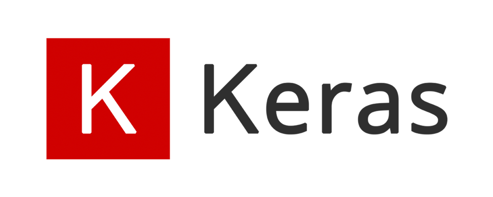
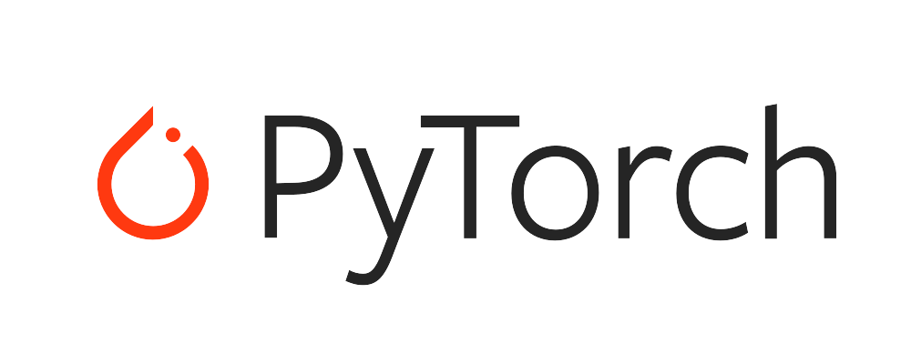

There are many modern tools for deep learning. Services such as text analytics, custom vision, and content moderator all allow custom applications of deep learning with ease. Engineering tools such as TensorFlow, Keras, and PyTorch are also extremely popular open-source libraries.

## TensorFlow

TensorFlow is a Python library that can be extended to multiple languages. TensorFlow can be run on different types of processors, from cloud and desktop CPUs and GPUs, to small IoT devices, and in your browser. TensorFlow has many different capabilities, but it primarily excels at neural networks and deep learning.

It's sometimes considered a ‘low-level’ library because other libraries, such as Keras, use TensorFlow behind the scenes to produce models and analyze data.

## Keras

Keras is a ‘high-level’ neural networks Python library. Keras uses TensorFlow and a few other libraries to make building deep neural networks easy, reducing the number of actions a user has to take to build a successful model.

It's common for AI practitioners to use Keras to test if a certain type of model could be successfully applied to a problem. If the Keras model shows potential, it may be worth investing time to build and tune a model using TensorFlow.

## PyTorch

PyTorch is a deep learning research platform that allows flexibility and performance. PyTorch is still in its early stages of development - version 1.0 hasn’t been released yet.

Despite this, PyTorch is extremely popular and is known especially for its ease of use and customizable CNN models. PyTorch also contains many tools for pre-processing of data, replacing NumPy that is commonly used elsewhere.

## NumPy

NumPy is an open-source Python library which provides a large toolkit of mathematical functions and support for large data structures. Similar to how we have used it in this course, NumPy is extremely popular for data pre-processing before we build sophisticated AI models.

### ResNets

Residual Networks (ResNet) are a specialized type of neural network, usually implemented to handle difficult problems that require deep neural networks. The ‘Res’ in ResNet refers to a residual block - a part of the neural network which allows data to skip layers.  
  

  
This helps solve a common problem with deep neural networks - degradation of accuracy with many hidden layers. Data is transformed as it travels from layer to layer, and low accuracy can occur when data transformation is too high.
  
Implementations of ResNets have shown very high accuracy for image analysis.
