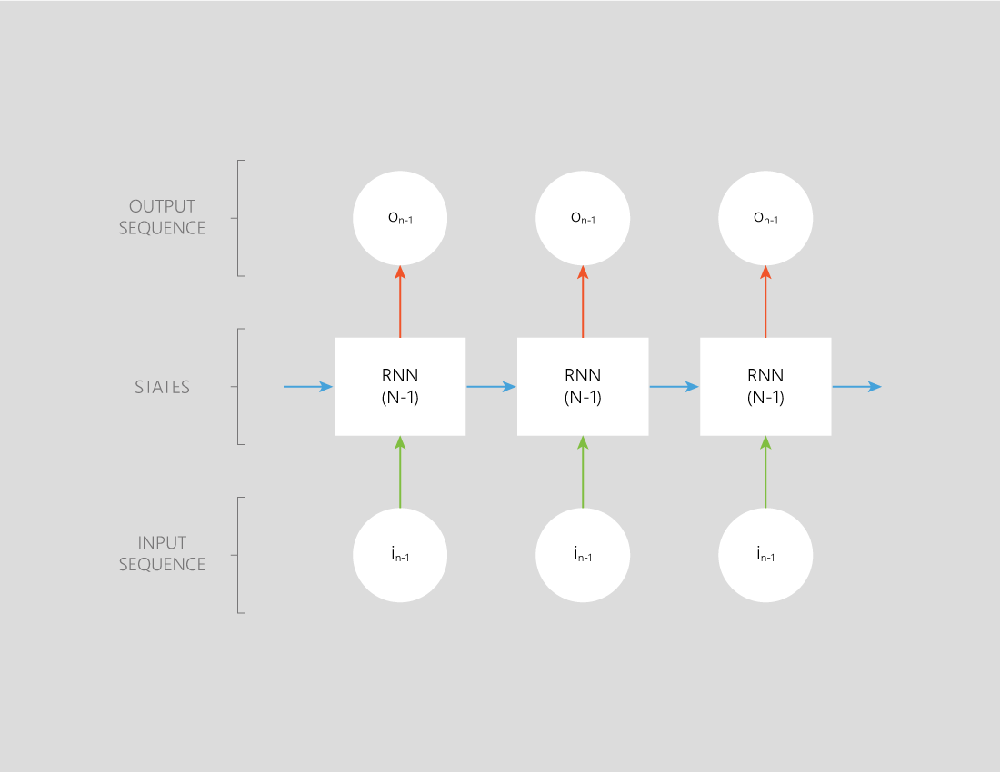
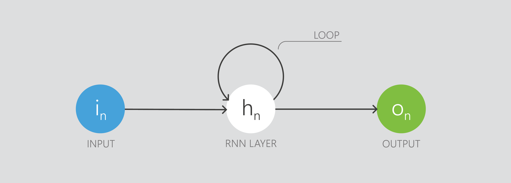
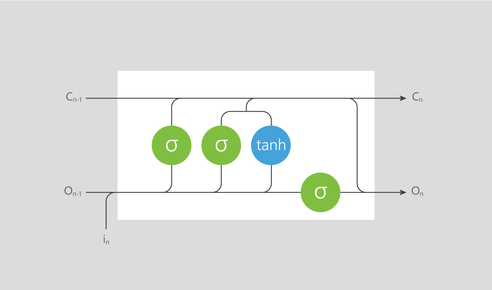
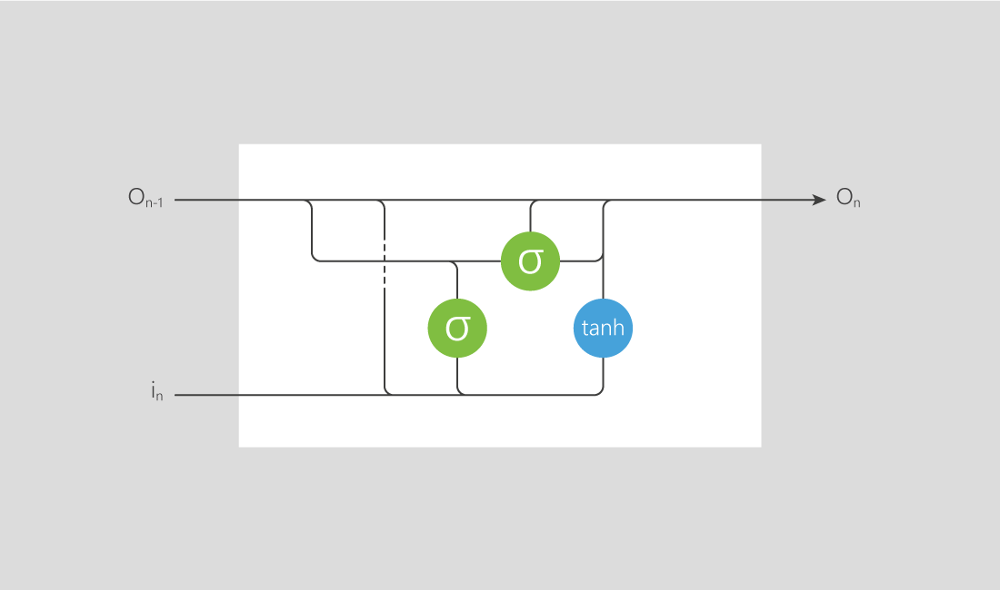

Some problems may require us to look at recent data to help perform current analysis - such as analysis of connected handwriting.

A recurrent neural network (RNN) is a class of neural network that excels when your data can be treated as a sequence - such as text, music, speech recognition, connected handwriting, or data over a time period.

An RNN can analyze or predict a word based on the previous words in a sentence - they allow a connection between previous information and current information. RNNs are neural networks with loops, allowing data to be temporarily stored to help with later analysis.

RNNs contain cells - where additional state is stored. This additional state is useful because the RNN can remember important information used for predictions - such as past tense. If early on in a sentence a user has written “We '__were__' going to”, an RNN can remember that the word 'were' is in the past tense inside a unit, so it may output “We were going to __fly__ to Canada” instead of “We were going to __flew__ to Canada.”

Standard RNNs struggle when there is a large gap between previous data that is relevant and current data. To solve this problem, AI practitioners commonly use two similar types of RNNs - __long short-term memory__ networks (__LSTM__), and __gated recurrent unit__ networks (__GRU__).

### LSTM

LSTMs are a special type of RNN which dramatically improves the model’s ability to connect previous data to current data where there is a long gap. For example, a standard RNN may struggle to accurately predict the sentence “My favorite artist is Mozart” because there may be a large gap between information about the context of the word artist - the context may have previously been about a painter.

LSTMs are quite complex behind the scenes so we won’t worry about the in-depth details for now. Where a normal RNN contains a single layer per cell, LSTMs contain four interacting layers.

### GRU

With GRUs, what you need to know for now is that they hold some advantages over LSTM networks for sequence problems because they are simpler. Training time decreases with simplification, allowing better results in some circumstances because training is more effective overall.

## Summary

In this section we covered:

* __Recurrent neural network__ (RNN) - a class of neural network that excels at analyzing and predicting data in a sequence.
* __LSTM__ - a variation of RNNs that is very good at connecting previous data to current data where there is a long gap.
* __GRU__ - a variation of LSTM that is simpler - meaning a decrease in training time, which can be quite beneficial sometimes.

Next up we'll build an RNN model in Azure Notebooks.