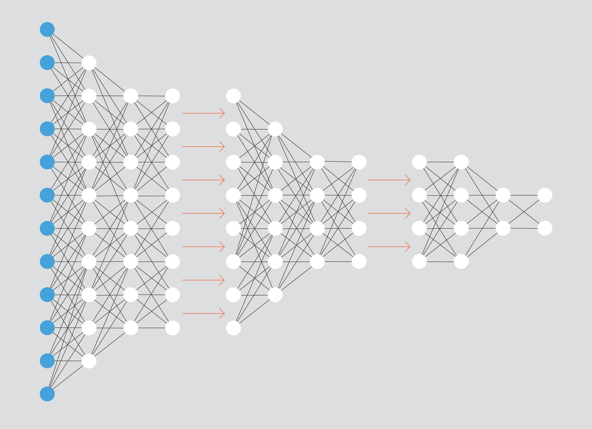

## Layers

Layers are the key component of neural networks. We choose how many nodes each layer contains and how many layers there are in order to maximize the accuracy of our output.

We can have large layers

and lots of layers

With each layer, the neural network transforms the data we input.

### Edges

The connections between nodes from one layer to the next are called edges. Edges transform the data when it travels through them by simple multiplication.

### Weights

When data travels through the edges, it is multiplied by a value which we call a weight. Each edge has a different weight which starts off as a random value. The value of weights can be positive or negative. Weights are then optimized by gradient descent to give accurate outcomes.