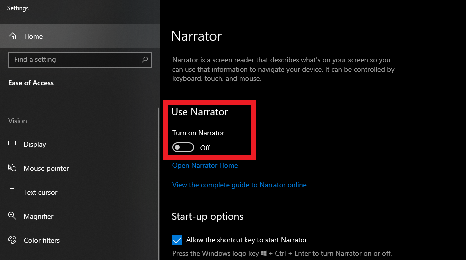

The first step before implementing accessible features in the app is to turn on the screen reader. Let's walk through how to turn on the screen reader for each operating system to test accessibility in the app.

## Enable Windows screen reader

Narrator is a screen reader built directly into Windows to enable users to complete common tasks without a mouse. You can enable Narrator in one of two ways:

- Press the **Windows logo key** + **Ctrl** + **Enter** together to start Narrator. Press these keys again to stop Narrator. (On older versions of Windows, the command was the **Windows logo key** + **Enter**.) On many keyboards, the Windows logo key is located on the bottom row of keys, to the left or right of the Alt key.

- Press the **Windows logo key** + **Ctrl** + **N** to open Narrator settings, and then turn on the toggle under Use Narrator.

It is recommended to go through the Narrator tutorial, which can be found in the Narrator settings screen.

// Should we walk through macOS VoiceOver? Mobile? Seems repetitive and unnecessary for web since they're all similar.