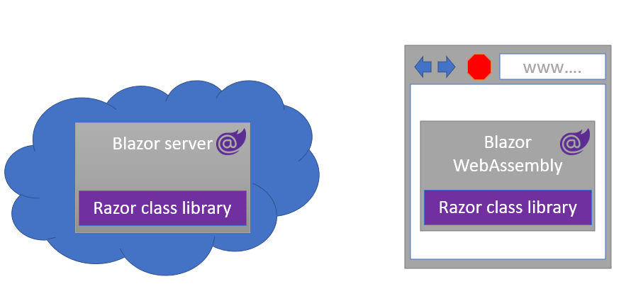

By using Razor class libraries, you can share and reuse user-interface components between Blazor applications. In this module, you'll focus on building and sharing components for Blazor applications.

## Example scenario

Let's suppose that you work for a consulting firm, where you build web applications for various clients.  You have a collection of web features, such as modal window components, that you make available to your clients.  To save time, you want to be able to reuse these features across applications.  

By using Razor class libraries, you can share the features across the applications that you build for your customers.

## What will we be doing?

In this module, you'll create a Razor class library to accomplish the following goals:

- Present a modal dialog box with default theming
- Use and customize the modal dialog in a Blazor application
- Package the modal window dialog for use with other applications

## What is the main goal?

By the end of the module, you'll be able to design a modal window component that you can share and customize across other Blazor applications.