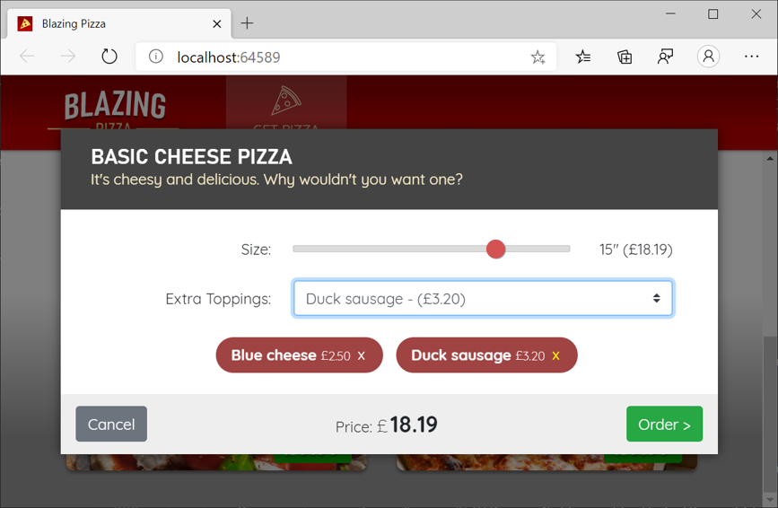

Razor Class Libraries let you share and reuse user-interface components between Blazor applications.  In this module, we're going to focus on building and sharing components for Blazor applications

## Example scenario

Suppose you work for a consulting firm where you build web applications for your various clients.  You've got a collection of web features like a modal window component that you make available to your clients.  To save time, you want to be able to reuse these features across applications.  With Razor Class Libraries, you can share that feature across the applications you build for your customers.

## What will we be doing?

You'll create a Razor class library to accomplish the following goals:

- Present a modal dialog box with default theming
- Use and customize the Modal dialog in a Blazor Application
- Package the Modal dialog for use with other applications

## What is the main goal?

By the end of this session, you'll design and share a modal window component.  That component can then be used and customized in other Blazor applications.