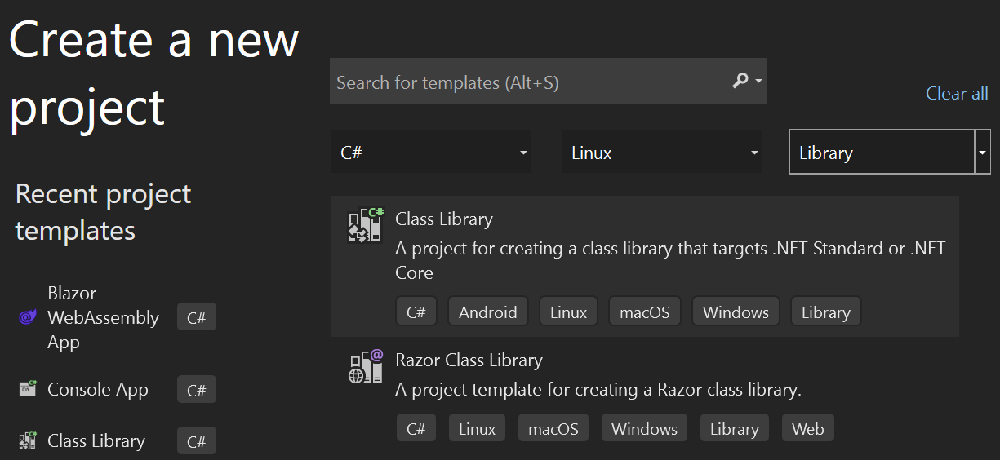

Components in web applications give developers the freedom to reuse portions of the user-interface throughout their application. Razor Class Libraries allow those components to be shared and reused in many applications.

Here, you will learn how to create a Razor class library and how to use it to share rendered and static content for Blazor applications to customize and present.

## Defining Razor Class Libraries

A Razor class library is a .NET project type that contains Razor Components, Pages, HTML, CSS, JavaScript, images, and other static web content that can be referenced by a Blazor application.  Just like other .NET Class Library projects, they can be bundled as a NuGet package and shared on NuGet package repositories like NuGet.org

Let's look at the default template for creating a Razor Class library.

## Create a project with the default template

You can create a Razor class library in Visual Studio through the typical File - New Project dialog



Projects can also be created at the command line with this command:

```dotnetcli
dotnet new razorclasslib -o MyProjectName
``` 

This template delivers an initial component called `Component1` that demonstrates several important features your components can use:

- Isolated CSS with a CSS Stylesheet named `Component1.razor.css` located in the same folder as `Component1.razor` that is conditionally included by a Blazor application that references the `Component1` component.
- Static content like images and JavaScript files that are available to a Blazor application at runtime and referenced inside of `Component1`.  This content is delivered in a `wwwroot` folder that behaves the same as a `wwwroot` folder in an ASP.NET Core or Blazor application.
- .NET code that executes functions residing in the included JavaScript file


### Differences between Class Library and Razor class library

A Class Library is a common package delivery structure in .NET applications, and the Razor class library is similar in structure with a few other features configured in the project file.

```xml
<Project Sdk="Microsoft.NET.Sdk.Razor">

  <PropertyGroup>
    <TargetFramework>net6.0</TargetFramework>
    <Nullable>enable</Nullable>
    <ImplicitUsings>enable</ImplicitUsings>
  </PropertyGroup>

  
  <ItemGroup>
    <SupportedPlatform Include="browser" />
  </ItemGroup>

  <ItemGroup>
    <PackageReference Include="Microsoft.AspNetCore.Components.Web" Version="6.0.0" />
  </ItemGroup>

</Project>
```

- The project file contains an SDK reference to `Microsoft.NET.Sdk.Razor` to declare it contains and creates razor content as a Razor class library
- The `SupportedPlatform` entry declares that this library can be used in a `browser` platform - namely WebAssembly.
- The `PackageReference` to the `Microsoft.AspNetCore.Components.Web` library gives access to the base Blazor components that are shipped with the framework.  This allows developers to use those simple components to help them build more complex components.

### Razor Component Contents

The initial Razor component delivered is simple, containing just an HTML `div` element with a short block of text:

```razor
<div class="my-component">
    This component is defined in the <strong>FirstRazorLibrary</strong> library.
</div>
```

This component will interact with other Blazor components and pages that reference it in the same way that you would expect a component delivered in the same project to behave, with the CSS isolated script in `Component1.razor.css` rendered inline with the rest of the application's CSS in the application.css file.

### Static Asset Delivery

The contents of the `wwwroot` folder can be referenced relatively among the other contents of that folder and the components individual CSS files like `Component1.razor.css` as files in the same base folder.  For example, the default CSS adds a background image style using the `background.png` image in the `wwwroot` folder.  No paths are required to make this reference from the CSS to the content residing in the `wwwroot` folder.

```css
.my-component {
    background-image: url('background.png');
}
```

The contents of the `wwwroot` folder are available to be referenced by hosted Blazor applications with an absolute folder reference in the format:

```dotnetcli
/_content/{PACKAGE_ID}/{PATH_AND_FILENAME_INSIDE_WWWROOT}
```

### Referencing a Razor class library

In a .NET solution, where our Razor class library resides on disk next to a Blazor application that will reference the library, we can update the Blazor application to reference the Razor class library using the standard Visual Studio `Add Reference` dialog and using the .NET CLI add reference command.

```dotnetcli
dotnet add reference ../MyClassLibrary
```

For libraries that are delivered to us in NuGet package form, we can add a reference using the Visual Studio NuGet package installer or using the .NET CLI add package command.

```dotnetcli
dotnet add package MyClassLibrary
```
