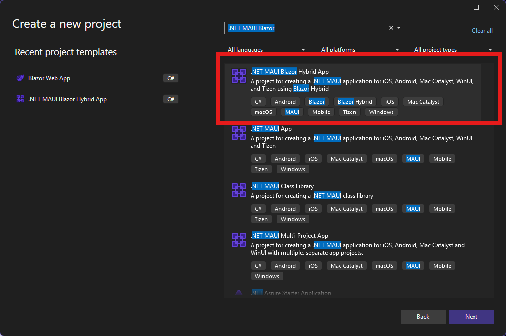
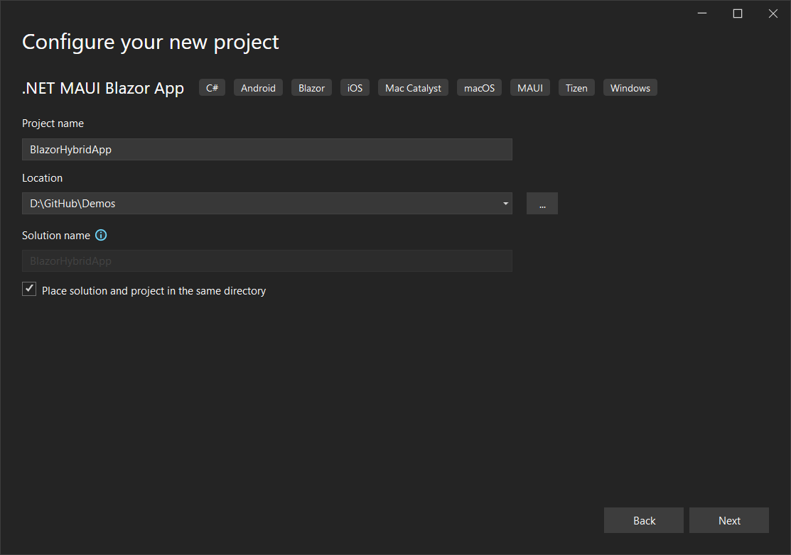
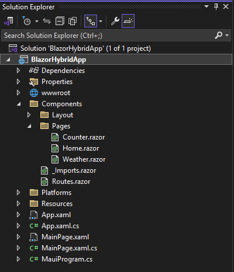
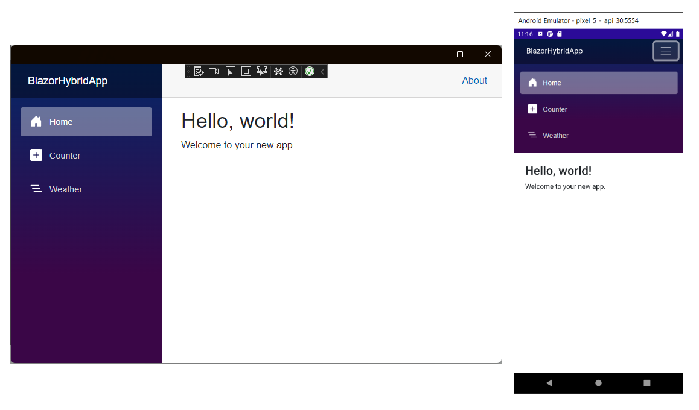

Let's start by creating our first Blazor web app.

This module uses Visual Studio 2022 for local development. After you complete this module, you can apply its concepts using a development environment like  Visual Studio for Mac (macOS).

## Requirements for Blazor Hybrid development

To create Blazor Hybrid apps with .NET MAUI apps, you currently require Visual Studio version 17.3 Preview (the latest preview build of Visual Studio 2022) with the following workload installed:

- .NET Multi-Platform App UI development.
- ASP.NET and web development.

The other prerequisites are required to install:

- [Microsoft Edge WebView2](https://developer.microsoft.com/microsoft-edge/webview2/): `WebView2` is required on Windows when running a native app. When developing Blazor Hybrid apps with .NET MAUI and only running them in Visual Studio's emulators, `WebView2` isn't required.
- [Enable hardware acceleration](/dotnet/maui/android/emulator/hardware-acceleration) to improve the performance of the Android emulator.


## Create a new Blazor Hybrid app

To set up a Blazor Hybrid project to work with, we'll use Visual Studio 2022.

1. In Visual Studio 2022, select **File** > **New Project**.

2. In the search box at the top of the "Create a new project" dialog, key in ".NET MAUI Blazor" and select ".NET MAUI Blazor App" and select "Next"

	

3. On the subsequent screen, name your project "BlazorHybridApp" and specify a location on disk with settings like the following and then select 'Next':

     

4. On the 'Additional Information' screen, select ".NET 6.0 (Long-term support)" in the Framework combobox. Leave the other settings as is and select 'Create'

5. This command creates a basic Blazor Hybrid project powered by .NET MAUI with all required files and pages.

	You should now have access to these files and your solution explorer in Visual Studio 2022 will look similar to:

	

## Blazor Hybrid with .NET MAUI project structure and startup

The project contents include the following items for both Blazor components and .NET MAUI applications:

### Blazor project files

- **Pages**. This folder contains three `razor` files, `Counter.razor`, `FetchData.razor`, and `Index.razor` that define the Blazor user interface.

- **Shared**. This folder contains shared Razor components including the main navigation menu of the app.

- **wwwroot**. This folder includes all static assets for Blazor including css, JavaScript files, and images.

- `Main.razor`. This file defines the routing of the Blazor app that is displayed.

- `_Imports.razor`. This file defines namespaces that are imported into each Razor component.

### .NET MAUI project files

- **App.xaml**. This file defines the application resources that the app will use in the XAML layout. The default resources are located in the `Resources` folder and define app wide colors and default styles for every built-in control of .NET MAUI. 

- **App.xaml.cs**. This is the code-behind for the App.xaml file. This file defines the App class. This class represents your application at runtime. The constructor in this class creates an initial window and assigns it to the `MainPage` property; this property determines which page is displayed when the application starts running. Additionally, this class enables you to override common platform-neutral application lifecycle event handlers. Events include `OnStart`, `OnResume`, and `OnSleep`.

- **MainPage.xaml**. This file contains the user interface definition. The sample app generated by the .NET MAUI Blazor App template comprises of a `BlazorWebView` that loads the `Main` component that has multiple tabs including the `Index`, `Counter`, and `FetchData`.

    ```xml
    <?xml version="1.0" encoding="utf-8" ?>
    <ContentPage xmlns="http://schemas.microsoft.com/dotnet/2021/maui"
        xmlns:x="http://schemas.microsoft.com/winfx/2009/xaml"
        xmlns:local="clr-namespace:BlazorHybridApp"
        x:Class="BlazorHybridApp.MainPage"
        BackgroundColor="{DynamicResource PageBackgroundColor}">

        <BlazorWebView HostPage="wwwroot/index.html">
            <BlazorWebView.RootComponents>
                <RootComponent Selector="#app" ComponentType="{x:Type local:Main}" />
            </BlazorWebView.RootComponents>
        </BlazorWebView>

    </ContentPage>
    ```

- **MainPage.xaml.cs**. This is the code-behind for the page. In this file, you define the logic for the various event handlers and other actions that are triggered by the .NET MAUI controls on the page. The example code in the template only has the default constructor as all of the user interface and events are located in the Blazor components.

    ```csharp
    namespace BlazorHybridApp;

    public partial class MainPage : ContentPage
    {
        public MainPage()
        {
            InitializeComponent();
        }
    }
    ```

- **MauiProgram.cs**. Each native platform has a different starting point that creates and initializes the application. You can find this code under the **Platforms** folder in the project. This code is platform-specific, but at the end it  calls the `CreateMauiApp` method of the static `MauiProgram`class. You use the `CreateMauiApp` method to configure the application by creating an app builder object. At a minimum, you need to specify which class describes your application. You do this with the `UseMauiApp` generic method of the app builder object; the type parameter specifies the application class. The app builder also provides methods for tasks such as registering fonts, configuring services for dependency injection, registering custom handlers for controls, and more. The following code shows an example of using the app builder to register a font, registering the weather service, and adding support for Blazor Hybrid with the `AddMauiBlazorWebView` method:

    ```csharp
    using Microsoft.AspNetCore.Components.WebView.Maui;
    using BlazorHybridApp.Data;

    namespace BlazorHybridApp;

    public static class MauiProgram
    {
      public static MauiApp CreateMauiApp()
      {
        var builder = MauiApp.CreateBuilder();
        builder
          .UseMauiApp<App>()
          .ConfigureFonts(fonts =>
          {
            fonts.AddFont("OpenSans-Regular.ttf", "OpenSansRegular");
          });

        builder.Services.AddMauiBlazorWebView();

        #if DEBUG
        builder.Services.AddBlazorWebViewDeveloperTools();
        #endif
        
        builder.Services.AddSingleton<WeatherForecastService>();

        return builder.Build();
      }
    }
    ```

 
## Run the app

1. In Visual Studio, select **Debug** > **Start Debugging**

    This will build and start the app on Windows, and then rebuild and restart the app whenever you make code changes. The app should automatically open on Windows. You can also change the deployment target through the debug drop-down menu to deploy to Android or other platforms.

    

You'll use this Blazor Hybrid app in the following exercises.
