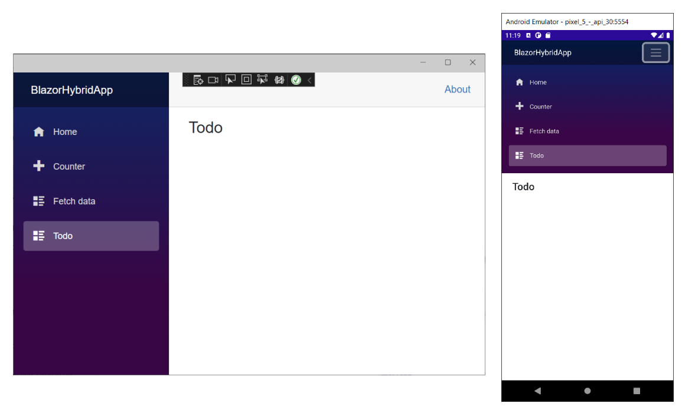
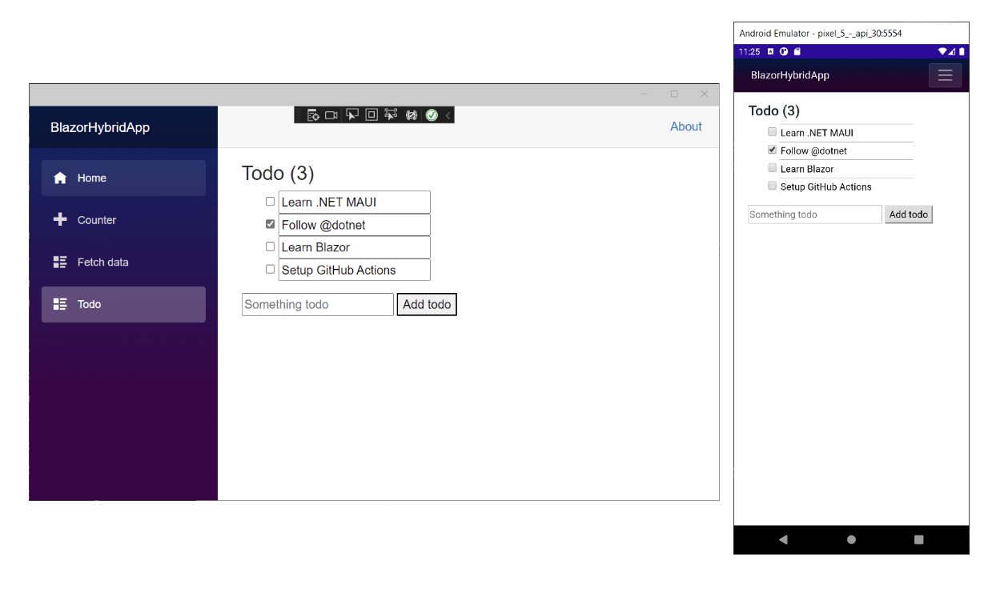

In this exercise, you'll create a basic to do list component inside our Blazor app.

## Create the ToDo page


1. Create the Todo page:

   In Visual Studio, right-click on the `Pages` folder in **Solution Explorer** and select **Add** > **Razor Component...**. Name the component `Todo.razor`.

   > [!IMPORTANT]
   > Razor component file names require a capitalized first letter. Open the `Pages` folder and confirm that the `Todo` component file name starts with a capital letter `T`. The file name should be `Todo.razor`.

2. Open the `Todo` component and add an `@page` Razor directive to the top of the file with a relative URL of `/todo`.

    ```cshtml
    @page "/todo"

    <h3>Todo</h3>

    @code {
    
    }
    ```

3. Save the `Pages/Todo.razor` file

## Add the Todo component to the navigation bar

The `NavMenu` component is used in the app's layout. Layouts are components that allow you to avoid duplication of content in an app. The `NavLink` component renders an HTML anchor tag that can be styled to provide a cue in the app's UI when the app URL matches the link.

In the `<nav>...</nav>` section of the NavMenu component, add the following new `<div>...</div>` and `NavLink` component for the `Todo` component.

In `Shared/NavMenu.razor`:

```razor
<div class="@NavMenuCssClass" @onclick="ToggleNavMenu">
    <nav class="flex-column">

        <!-- ... -->

        <div class="nav-item px-3">
            <NavLink class="nav-link" href="todo">
                <span class="oi oi-list-rich" aria-hidden="true"></span> Todo
            </NavLink>
        </div>
    </nav>
</div>
```

Save the `Shared/NavMenu.razor` file. The browser should refresh automatically and now have the Todo entry on the navigation bar:



## Create a Todo Item

Create a new class in the `Data` folder of the project named `TodoItem.cs` to hold a C# class that represents a todo item.

Use the following C# code for the `TodoItem` class. Declare the `Title` as a nullable string by using `?`.

```csharp
namespace BlazorHybridApp.Data;

public class TodoItem
{
    public string? Title { get; set; }
    public bool IsDone { get; set; } = false;
}
```

## Bind a list of TodoItems

You're now ready to bind a collection of `TodoItem` objects to HTML in Blazor. We'll accomplish this by making the following changes in the `Pages/Todo.razor` file.

- Add the using declaration for `TodoItem` with `@using BlazorHybridApp.Data`.
- Add a field for the todo items in the `@code` block. The `Todo` component uses this field to maintain the state of the todo list.
- Add unordered list markup and a `foreach` loop to render each todo item as a list item (`<li>`).

```cshtml
@page "/todo"
@using BlazorHybridApp.Data

<h3>Todo</h3>

<ul class="list-unstyled">
    @foreach (var todo in todos)
    {
        <li>@todo.Title</li>
    }
</ul>

@code {
    private List<TodoItem> todos = new();
}
```

## Add form elements to create todos

1. The app requires UI elements for adding todo items to the list. Add a text input (`<input>`) and a button (`<button>`) below the unordered list (`<ul>...</ul>`):

    ```razor
    @page "/todo"
    @using BlazorHybridApp.Data
    
    <h3>Todo</h3>
    
    <ul>
        @foreach (var todo in todos)
        {
            <li>@todo.Title</li>
        }
    </ul>
    
    <input placeholder="Something todo" />
    <button>Add todo</button>
    
    @code {
        private List<TodoItem> todos = new();
    }
    ```

1. When the `Add todo` button is selected, nothing happens because an event handler isn't attached to the button.

    Add an `AddTodo` method to the `Todo` component and register the method for the button using the `@onclick` attribute. The `AddTodo` C# method is called when the button is selected:

    ```razor
    <input placeholder="Something todo" />
    <button @onclick="AddTodo">Add todo</button>
    
    @code {
        private List<TodoItem> todos = new();
    
        private void AddTodo()
        {
            // Todo: Add the todo
        }
    }
    ```

1. To get the title of the new todo item, add a `newTodo` string field at the top of the `@code` block:

    ```razor
    @code {
        private List<TodoItem> todos = new();
        private string? newTodo;
    
        // Omitted for brevity...
    }
    ```

    Modify the `<input>` element to bind `newTodo` with the `@bind` attribute:

    ```razor
    <input placeholder="Something todo" @bind="newTodo" />
    ```

1. Update the `AddTodo` method to add the `TodoItem` with the specified title to the list. Clear the value of the text input by setting `newTodo` to an empty string:

    ```razor
    @page "/todo"
    @using BlazorHybridApp.Data
    
    <h3>Todo</h3>
    
    <ul class="list-unstyled">
        @foreach (var todo in todos)
        {
            <li>@todo.Title</li>
        }
    </ul>
    
    <input placeholder="Something todo" @bind="newTodo" />
    <button @onclick="AddTodo">Add todo</button>
    
    @code {
        private List<TodoItem> todos = new();
        private string? newTodo;
    
        private void AddTodo()
        {
            if (!string.IsNullOrWhiteSpace(newTodo))
            {
                todos.Add(new TodoItem { Title = newTodo });
                newTodo = string.Empty;
            }
        }
    }
    ```

1. Save the `Pages/Todo.razor` file. Rebuild and restart the app.

1. The title text for each todo item can be made editable, and a checkbox can help the user keep track of completed items. Add a checkbox input for each todo item and bind its value to the `IsDone` property. Change `@todo.Title` to an `<input>` element bound to `todo.Title` with `@bind`:

    ```razor
    <ul>
        @foreach (var todo in todos)
        {
            <li>
                <input type="checkbox" @bind="todo.IsDone" />
                <input @bind="todo.Title" />
            </li>
        }
    </ul>    
    ```

1. Update the `<h3>` header to show a count of the number of todo items that aren't complete (`IsDone` is `false`).

    ```razor
    <h3>Todo (@todos.Count(todo => !todo.IsDone))</h3>
    ```

1. Save the `Pages/Todo.razor` file and run the app again.

1. Add items, edit items, and mark todo items done to test the component.

   
