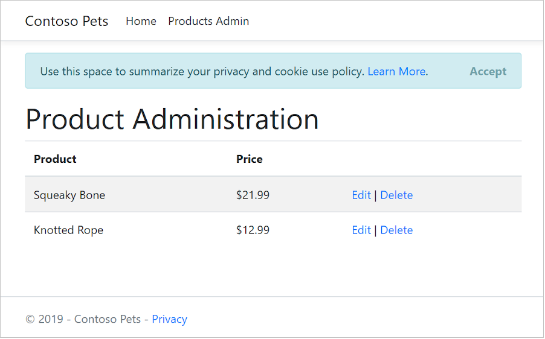

In this unit, you'll use the .NET Core CLI to build, compile, and run an example web application within the Cloud Shell's command shell to the right. Then the current project will be deployed to a pubic endpoint on Azure so you can tour through the running example project to understand the UI experience it provides so far.

The .NET Core CLI is the simplest way to create, build, and run an ASP.NET Core web application. The CLI is pre-installed in the Azure Cloud Shell environment used in this unit.

## Run the Razor Pages project and explore its UI


### Build and run the *:::no-loc text="ContosoPets.UI":::* project

1. Run the following command in the command shell to verify you are still at the *:::no-loc text="ContosoPets.UI":::* directory:

    ```bash
    cd ~/contoso-pets/src/ContosoPets.Ui
    ```

    [!INCLUDE[OS-specific keyboard shortcuts](../../../includes/azure-cloudshell-copy-paste-tip.md)]

    The current directory is now at the *:::no-loc text="ContosoPets.UI":::* directory.

1. If required, run the following command in the command shell to view the project:

    ```bash
    code .
    ```

1. Run the following .NET Core CLI command in the command shell:

    ```bash
    dotnet run
    ```

    The preceding command:

    * Locates the project file at the current directory.
    * Retrieves and installs any required project dependencies for this project.
    * Builds the project code.
    * Hosts the web application with ASP.NET Core's Kestrel web server.

The web application is hosted at both `http://localhost:5000` and `https://localhost:5001` by default. This module uses the secure URL beginning with `https`.

You can stop the *:::no-loc text="ContosoPets.UI":::* application from running at any time by pressing <kbd>Ctrl+C</kbd>. 

We can't view the *:::no-loc text="ContosoPets.UI":::* application's pages in a browser, since it is not yet hosted on a public endpoint.  We will host the the app on a public endpoint in a following step.

A variation of the following output displays to indicate your application is being hosted:

```console
Hosting environment: Development
Content root path: [your application directory here]\src\ContosoPets.UI
Now listening on: https://localhost:5001
Now listening on: http://localhost:5000
```

The preceding output indicates the application is running and listening on ports 5000 and 5001.

1. Press <kbd>Ctrl+C</kbd> to stop the app.

If you run the app on your own machine, you'd be able to direct a browser to 'https://localhost:5001' to view the resulting page. To view the application, deploy it to a public endpoint hosted on Azure App Service.

### Deploy your *:::no-loc text="ContosoPets.UI":::* application to a public endpoint hosted on Azure App Service

1. Run the following command in the command shell:

    ```bash
    az webapp up
    ```

[!INCLUDE[OS-specific keyboard shortcuts](../../../includes/azure-cloudshell-copy-paste-tip.md)]

The preceding Azure CLI command provisions a public endpoint for this project. Be patient, as the first deployment of the application will take longer.

A variation of the following output eventually displays to indicate the web UI is being deployed:

```console
Starting zip deployment.  This operation can take a while to complete...
```

Once your project has been successfully hosted, you should see something like the following:

```console
You can launch the app at http://webapp<random instance ID number here>.azurewebsites.net
```

Now that your *:::no-loc text="ContosoPets.UI":::* application has been hosted on a public endpoint, let's tour the unfinished application.

## Tour the web pages generated by the running ContosoPets.UI application

1. Run the following command in the command shell to get the hosted application's URL:

    ```bash
    echo $webAppUrl
    ```

1. Click on the resulting URL in the command shell to view the running web application in your local default browser.

1. Click on *:::no-loc text="Products Admin":::* near the top.

You should see the following page:



This is the rendered *:::no-loc text="Index.cshtml":::* Razor Page located in the *:::no-loc text="Pages/Product/":::* directory of your *:::no-loc text="ContosoPets.UI":::* project. The URL ends with *:::no-loc text="Product":::*. Razor Pages is using the directory structure within the *:::no-loc text="Pages":::* directory as the convention for routing requests by default.

This Razor Page has requested a list of available products from the web API. Currently, you can only choose to read the current list of products and edit or delete an existing product.

Now that you have verified you can successfully build, run, and deploy the existing project, let's modify it so the user can create new product entries that are validated and sent to the web API.
