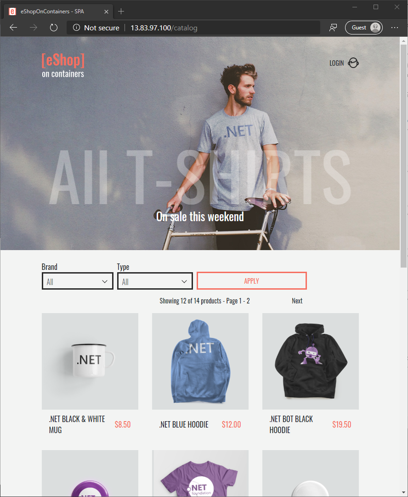

In this unit, you'll deploy the eShop app to AKS. You'll also gain an understanding of the microservices architecture used.

## Set up development environment

Run the following command in the command shell. Be patient, as setup can take a few minutes to complete.

```bash
. <(wget -q -O - https://aka.ms/microservices-aspnet-core-setup)
```

[!INCLUDE[OS-specific keyboard shortcuts](../../../includes/azure-cloudshell-copy-paste-tip.md)]

The preceding command retrieves and runs a setup script from a GitHub repository. The script completes the following steps:

* Clones the eShop project from a GitHub repository.
* Provisions an AKS and Azure Container Registry (ACR) resource.
* Launches the Cloud Shell Editor to view the code.
* Deploys the containers to AKS.
* Displays connection information upon completion

> [!NOTE]
> Non-blocking warnings are expected in the deployment process.

## Review code and architecture

Soon after launching the script, a code editor window will appear. You may investigate the code while the script continues to deploy the containers to AKS.

The following directories contain .NET Core projects, each of which are built to containers and deployed to AKS:

| Project directory | Description |
|-------------------|-------------|
| *src/Aggregators/* | Services to aggregate across multiple microservices for certain cross-service operations. |
| *src/BuildingBlocks/* | These services provide cross-cutting functionality, such as the app's event bus used for inter-service events. |
| *src/Services/* | These projects implement the business logic of the app. Each microservice is autonomous with its own database or other data store. They showcase different software patterns, including Create-Read-Update-Delete (CRUD), Domain Driven Design (DDD), and Command-query Separation (CQRS).
| *src/Web/* | ASP.NET Core apps that implement user interfaces. *WebSPA* is the storefront UI. *WebStatus* is the health check app for monitoring the operational status of the app.


As depicted in the diagram, the event bus is used for integrating events across microservices. The implementation that has been deployed in AKS uses RabbitMQ in a container, but a service such as Azure Service Bus would also be appropriate.

## Test deployment

When the app is done deploying to AKS, you will see a message similar to this in the console:

```console
The eShop-Learn application has been deployed.

You can begin exploring these services (when available):
- Centralized logging       : http://13.83.97.100/seq/#/events?autorefresh (See transient failures during startup)
- General application status: http://13.83.97.100/webstatus/ (See overall service status)
- Web SPA application       : http://13.83.97.100/
```

Select the link indicated by the **General application status** link. This health check page shows the status of all the microservices in the deployment.


When the services are all healthy, you may select the **Web SPA application** link to test the eShop on Containers web app.



Login to the app (the credentials are provided on the login page) and then browse the shop. Add some items to the cart, and then complete the purchase.

## Add the Coupon service

The code for the Coupon service has been provided in *src/Services/Coupon*. 

The service has the following traits, etc. etc.:


## Clean up Azure resources

To de-provision... 

