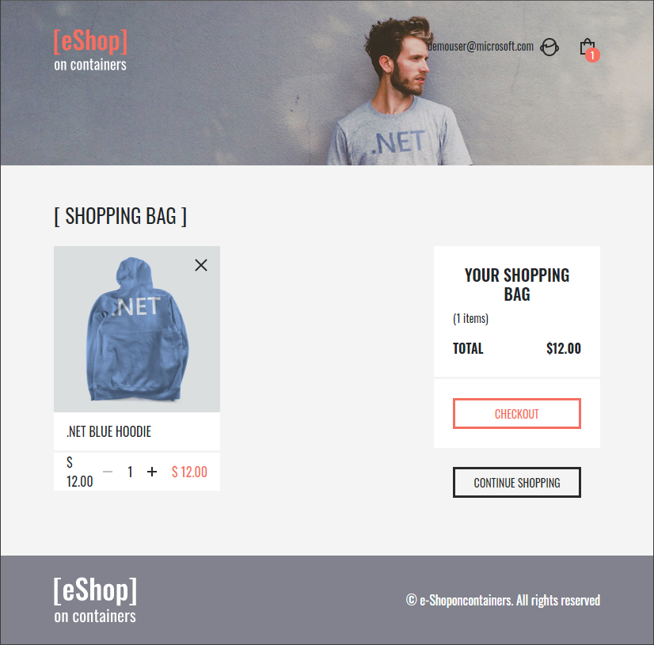

Soon after launching the setup script, the [Azure Cloud Shell editor](/azure/cloud-shell/using-cloud-shell-editor) opens the starter solution to the *~/clouddrive/source/eShop-Learn/* directory. You may investigate the solution while the script continues to deploy the Docker containers to AKS, even if the script is still running. 

## Review code

The following directories in *src/* contain .NET Core projects, each of which is containerized and deployed to AKS:

| Project directory | Description |
|-------------------|-------------|
| *Aggregators/* | Services to aggregate across multiple microservices for certain cross-service operations. This is implemented by the *ApiGateways/Aggregators/Web.Shopping.HttpAggregator* project. |
| *BuildingBlocks/* | Services that provide cross-cutting functionality, such as the app's event bus used for inter-service events. |
| *Services/* | These projects implement the business logic of the app. Each microservice is autonomous with its own data store. They showcase different software patterns, including **C**reate-**R**ead-**U**pdate-**D**elete (CRUD), DDD, and **C**ommand and **Q**uery **R**esponsibility **S**egregation (CQRS). The new **Coupon.API** project has been provided, but it's incomplete. |
| *Web/* | ASP.NET Core apps that implement user interfaces:<br>*WebSPA* is a storefront UI built with Angular.<br>*WebStatus* is the health checks dashboard for monitoring the operational status of each service. |

## Verify deployment to AKS

Once the app has deployed to AKS, you'll see a variation of the following message in the Azure Cloud Shell:

```
The eShop-Learn application has been deployed.

You can begin exploring these services (when available):
- Centralized logging       : http://13.83.97.100/seq/#/events?autorefresh (See transient failures during startup)
- General application status: http://13.83.97.100/webstatus/ (See overall service status)
- Web SPA application       : http://13.83.97.100/
```

Even though the app has been deployed, it may take a few minutes to come online. Verify the app is deployed and online with the following steps:

1. Select the **General application status** link to view the *WebStatus* health checks dashboard. The resulting page displays the status of each microservice in the deployment.

    

    > [!NOTE]
    > While the app is warming up, you may receive an HTTP 500 response from the server. You may retry after a few seconds. The Seq logs viewable at the **Centralized logging** URL will be available before the other endpoints. 

1. Once all the services are healthy, select the **Web SPA application** link to test the *eShopOnContainers* web app.

    

1. Complete a purchase as follows:
    1. Select the **Login** link in the upper right to sign into the app (the credentials are provided on the login page).
    1. Add the **.NET Blue Hoodie** to the shopping bag by clicking on the image.
    1. Select the shopping bag icon in the upper right.
    1. Select **Checkout**, then select **Place Order** to complete the purchase.

    

Now that you've seen the existing *eShopOnContainers* app, you'll add the coupon microservice in the next unit.
