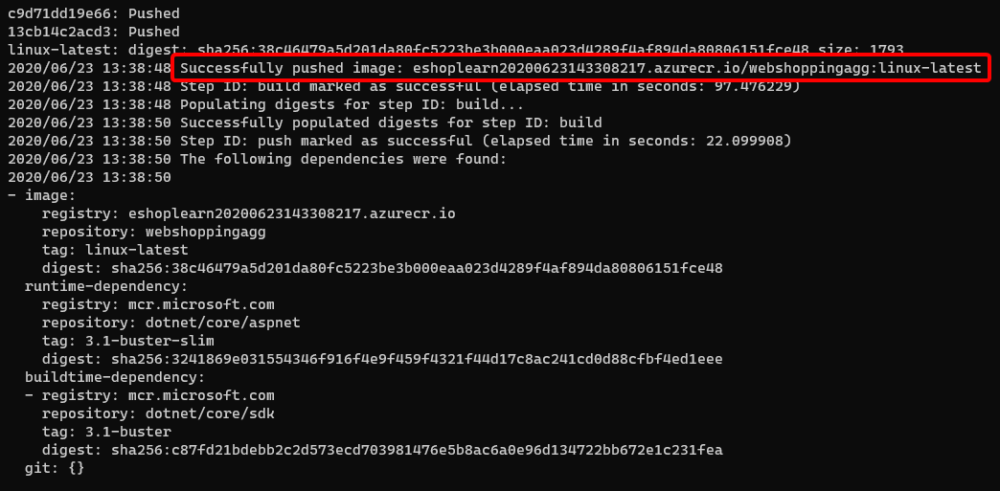
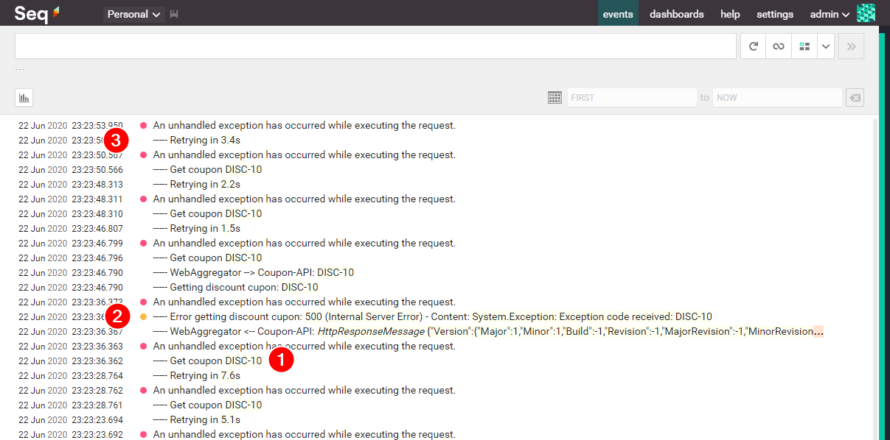

<!--begin paste-->
<!-- TODO: move the app verification content to its own unit -->

Soon after launching the setup script, the [Cloud Shell editor](/azure/cloud-shell/using-cloud-shell-editor) opens the starter solution. The editor opens to the *:::no-loc text="~/clouddrive/aspnet-learn/src/":::* directory. You can investigate the solution while the script continues to deploy the Docker containers to Azure Kubernetes Service (AKS). While doing so, the script will continue to run.

> [!NOTE]
> If your Cloud Shell session disconnects due to inactivity, reconnect and run the following command to return to this directory and open the Cloud Shell editor:
>
> ```bash
> cd ~/clouddrive/aspnet-learn/src/ && \
>   code .
> ```

## Review code

The following *:::no-loc text="src":::* subdirectories contain .NET Core projects, each of which is containerized and deployed to AKS:

| Project directory | Description |
|-------------------|-------------|
| *:::no-loc text="Aggregators/":::* | Services to aggregate across multiple microservices for certain cross-service operations. An HTTP aggregator is implemented in the *:::no-loc text="ApiGateways/Aggregators/Web.Shopping.HttpAggregator":::* project. |
| *:::no-loc text="BuildingBlocks/":::* | Services that provide cross-cutting functionality, such as the app's event bus used for inter-service events. |
| *:::no-loc text="Services/":::* | These projects implement the business logic of the app. Each microservice is autonomous, with its own data store. They showcase different software patterns, including Create-Read-Update-Delete (CRUD), Domain-Driven Design (DDD), and Command and Query Responsibility Segregation (CQRS). The new *:::no-loc text="Coupon.API":::* project has been provided, but it's incomplete. |
| *:::no-loc text="Web/":::* | ASP.NET Core apps that implement user interfaces. *:::no-loc text="WebSPA":::* is a storefront UI built with Angular. *:::no-loc text="WebStatus":::* is the health checks dashboard for monitoring the operational status of each service. |

## Verify deployment to AKS

After the app has deployed to AKS, you'll see a variation of the following message in the command shell:

```console
The eShop-Learn application has been deployed.

You can begin exploring these services (when available):
- Centralized logging       : http://13.83.97.100/seq/#/events?autorefresh (See transient failures during startup)
- General application status: http://13.83.97.100/webstatus/ (See overall service status)
- Web SPA application       : http://13.83.97.100/
```

> [!TIP]
> To display these URLs again, run the following command:
>
> ```bash
> cat ~/clouddrive/aspnet-learn/deployment-urls.txt
> ```

Even though the app has been deployed, it might take a few minutes to come online. Verify that the app is deployed and online with the following steps:

1. Select the **General application status** link in the command shell to view the *:::no-loc text="WebStatus":::* health checks dashboard. The resulting page displays the status of each microservice in the deployment. The page refreshes automatically, every 10 seconds.

    :::image type="content" source="../media/4-review-code-verify-deployment/health-check.png" alt-text="Health check page" border="true" lightbox="../media/4-review-code-verify-deployment/health-check.png":::

    > [!NOTE]
    > While the app is starting up, you might initially receive an HTTP 503 response from the server. Retry after a few seconds. The Seq logs, which are viewable at the **Centralized logging** URL, are available before the other endpoints.

1. After all the services are healthy, select the **Web SPA application** link in the command shell to test the *:::no-loc text="eShopOnContainers":::* web app. The following page appears:

    :::image type="content" source="../media/4-review-code-verify-deployment/eshop-spa.png" alt-text="eShop SPA" border="true" lightbox="../media/4-review-code-verify-deployment/eshop-spa.png":::

1. Complete a purchase as follows:
    1. Select the **LOGIN** link in the upper right to sign into the app. The credentials are provided on the page.
    1. Add the **.NET BLUE HOODIE** to the shopping bag by selecting the image.
    1. Select the shopping bag icon in the upper right.
    1. Select **CHECKOUT**, and then select **PLACE ORDER** to complete the purchase.

    :::image type="content" source="../media/4-review-code-verify-deployment/eshop-spa-shopping-bag.png" alt-text="shopping cart with .NET Blue Hoodie" border="true" lightbox="../media/4-review-code-verify-deployment/eshop-spa-shopping-bag.png":::

In this unit, you've seen the *:::no-loc text="eShopOnContainers":::* app's existing checkout process. You'll review the design of the new coupon service in the next unit.

<!-- end paste -->
In this exercise, you'll implement a resiliency handler with Polly. The initial *eShopOnContainers* deployment includes a failure simulation feature when validating a coupon from the checkout basket. This feature allows you to configure how many times a request for a specific discount coupon code should fail.

In this exercise, you will:

- Explore the app's response when resiliency isn't implemented.
- Update the app's code to implement failure handling using Polly.
- Create an ACR instance and deploy the updated app to AKS.
- Explore the system response under failure after implementing resiliency.

## Explore the response of a non-resilient app

Complete the following steps to see how the app responds without a resiliency solution in place.

### 1. Buy some stuff

To configure a simulated failure, you need at least one item in the basket. Complete the following steps:

1. Log in to *eShopOnContainers*.
1. Select the **.NET FOUNDATION PIN**.
1. Select the basket icon at the top right of the page.
1. Select **CHECKOUT**.

### 2. Configure simulated failure

1. Go to the **HAVE A DISCOUNT CODE?** input at the bottom of the page.
1. Enter the code *:::no-loc text="FAIL 2 DISC-10":::* to have the coupon service raise an exception twice, when validating the *:::no-loc text="DISC-10":::* discount code.
1. Select **APPLY**.
1. You should receive a confirmation message with number of failures configured for the code: **CONFIG: 2 failure(s) configured for code "DISC-10"!** as shown in the next image.

    

This configuration will make the next two requests for the *:::no-loc text="DISC-10":::* code to throw an exception.

### 3. Apply the failing discount coupon

1. Enter the coupon code *:::no-loc text="DISC-10":::*.
1. Select **APPLY**.
1. You should receive the message **ERROR: 500 - Internal Server Error!**.
1. If you select **APPLY** again, you should receive the same message once more.
1. On the third try, the code validation should succeed and the discount should be applied to the order.

Notice that you receive the error message immediately.

If you check the log traces, you should see something like this:


In the preceding image, you can see that:

- The first two requests (#1, #2) fail when getting the values.
- The third request (#3) succeeds and,
- Returns the expected value (#4).

## Add failure handling code using Polly

The basic idea is to have the app automatically handle retrying the operation until it succeeds, or give up because it looks like a severe failure.

When validating a discount coupon, the request goes to the web shopping aggregator, as the implementation of the [Backends For Frontends pattern](https://samnewman.io/patterns/architectural/bff) (BFF). The BFF implementation:

- Initiates another REST API request to the coupon service to get the required information.
- Handles resiliency using [IHttpClientFactory](/aspnet/core/fundamentals/http-requests) and [Polly](http://www.thepollyproject.org).

In this case, you'll implement two policies to handle failure: the Retry and Circuit Breaker policies from the previous unit.

Using Polly with `IHttpClientFactory` to add resiliency to web apps is one of the archetypical solutions to handle failures. Complete the following steps to implement failure handling for the coupon service:

1. Run the following command:

    ```dotnetcli
    dotnet add src/ApiGateways/Aggregators/Web.Shopping.HttpAggregator/Web.Shopping.HttpAggregator.csproj \
        package Microsoft.Extensions.Http.Polly
    ```

    The preceding command installs the Polly `IHttpClientFactory` integration package, named `Microsoft.Extensions.Http.Polly`, in the *Web.Shopping.HttpAggregator* project. The actual `Polly` package is installed as a dependency of this integration package.

1. Configure the `HttpClient` to apply Polly policies.

    To implement this, you'll use the `AddHttpClient` extension method to register a specific configuration for the `HttpClient` that will be injected into `CouponService`.

    Apply the following changes to the *src\ApiGateways\Aggregators\Web.Shopping.HttpAggregator\Extensions\ServiceCollectionExtensions.cs* file:

    1. Replace the comment `// Add the GetRetryPolicy method` with the following code:

        ```csharp
        public static IAsyncPolicy<HttpResponseMessage> GetRetryPolicy() =>
            HttpPolicyExtensions.HandleTransientHttpError()
                .WaitAndRetryAsync(5, retryAttempt =>
                    TimeSpan.FromMilliseconds(Math.Pow(1.5, retryAttempt) * 1000), (_, waitingTime) =>
                {
                    Log.Logger.Information("----- Retrying in {WaitingTime}s", $"{ waitingTime.TotalSeconds:n1}");
                });
        ```

    1. Replace the `// Add the GetCircuitBreakerPolicy method` comment with the following code:

        ```csharp
        public static IAsyncPolicy<HttpResponseMessage> GetCircuitBreakerPolicy() =>
            HttpPolicyExtensions.HandleTransientHttpError()
                .CircuitBreakerAsync(15, TimeSpan.FromSeconds(15));
        ```

    1. Call the `AddPolicyHandler` extension method twice. The first occurrence should accept a `GetRetryPolicy()` method call. The second occurrence should accept a `GetCircuitBreakerPolicy()` method call. Chain the method calls to the `AddHttpMessageHandler` method call for the coupon service:

        ```csharp
        services.AddHttpClient<ICouponService, CouponService>()
            .AddHttpMessageHandler<HttpClientAuthorizationDelegatingHandler>()
            .AddPolicyHandler(GetRetryPolicy())
            .AddPolicyHandler(GetCircuitBreakerPolicy());
        ```

    1. In the *src\ApiGateways\Aggregators\Web.Shopping.HttpAggregator\Extensions\ServiceCollectionExtensions.cs* file, replace the comment `// Add the using statements` with the following code:

        ```csharp
        using Polly;
        using Polly.Extensions.Http;
        using Serilog;
        ```

        The preceding code imports the `Polly`, `Polly.Extensions.Http`, and `Serilog` namespaces to resolve references downstream in the class.

    The *Startup.cs* file will resemble the following code:

    <!-- TODO: add line highlighting to show differences -->
    :::code language="csharp" source="../code/src/apigateways/aggregators/web.shopping.httpaggregator/startup.cs":::

    The preceding code configures a retry policy with an exponential back-off that increases the retry time as a power of 1.5 seconds. This value is typically a power of 2 seconds in most samples. To decrease wait times for this exercise, 1.5 seconds is used instead.

    You can also see that the Circuit Breaker policy "opens the breaker" for 15 seconds, after 15 continuous failures. This policy configuration gives the server some time to recover.

## Deploy the updated microservice

Complete the following steps to deploy the changes that you've implemented:

1. Run the following script from the *deploy/k8s* directory to create an ACR instance:

    ```bash
    ./create-acr.sh
    ```

    The preceding script:

    - Provisions a private ACR instance to publish the updated `webshoppingagg` image.
    - Permits the AKS cluster to retrieve images from the ACR instance.
    - Generates a variation of the following output:

        

1. Run the following script to publish the updated image to ACR:

    ```bash
    ./build-to-acr.sh --charts webshoppingagg
    ```

    The preceding script builds and publishes the updated image to ACR. An [ACR quick task](/azure/container-registry/container-registry-tasks-overview#quick-task) is used to build the `webshoppingagg` image and push it to the ACR instance. You'll see a variation of the following output:

    

    And this when finished:

    

1. Run the following script to deploy the updated image in ACR to AKS:

    ```bash
    ./deploy-application.sh --charts webshoppingagg
    ```

    The preceding script uninstalls the old `webshoppingagg` Helm chart and installs it again. The AKS cluster uses the new image from the ACR instance. You should get a result like this:

    

## Explore the system response when implementing resiliency

### Simple retries

You're going to repeat now what was done in the initial exploration, only you've already deployed the resilient BFF.

Consider the situation in which you configure the same two coupon failures with the code *:::no-loc text="FAIL 3 DISC-10":::*. When you enter the *:::no-loc text="DISC-10":::* code, it will take a few seconds to get the response back. Fortunately, you won't have to deal with the retrying.

If you check the log traces, you should see something like this:


In the preceding image, you can see:

- The log traces when configuring the simulated failures (#1) and
- Three retries until the aggregator could finally get the value (#2).

### Circuit breaker

For this case, you'll configure the code for 20 failures, using *:::no-loc text="FAIL 20 DISC-10":::*, as shown next:


Now enter the code *:::no-loc text="DISC-10":::* again and select **APPLY**. You'll have to wait about 20 seconds to get the error 500 message. When you do, select **APPLY** again. After the second failure, select **APPLY** for the third time.

On the third try, notice that the error 500 message came in much faster. That's because the circuit breaker was activated. If you select **APPLY** once again, you'll get the error message immediately.

You'll see this clearly in the log traces, as show next:



In the image above, you see that:

- After waiting for 7.6 seconds (#1), you get the error 500 message with the retry policy (#2) but
- The next time you try, you validate the code, you get the error 500 message after waiting only 3.4 seconds (#3) and you don't see the "Get coupon..." trace, meaning it failed without going to the server.
- If you check the details on this last trace, you should something like this:

    

Where you can see that the last trace has the "The circuit is now open..." message.

Let's move on to the deployment of Linkerd in the next unit.
