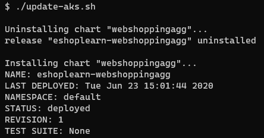
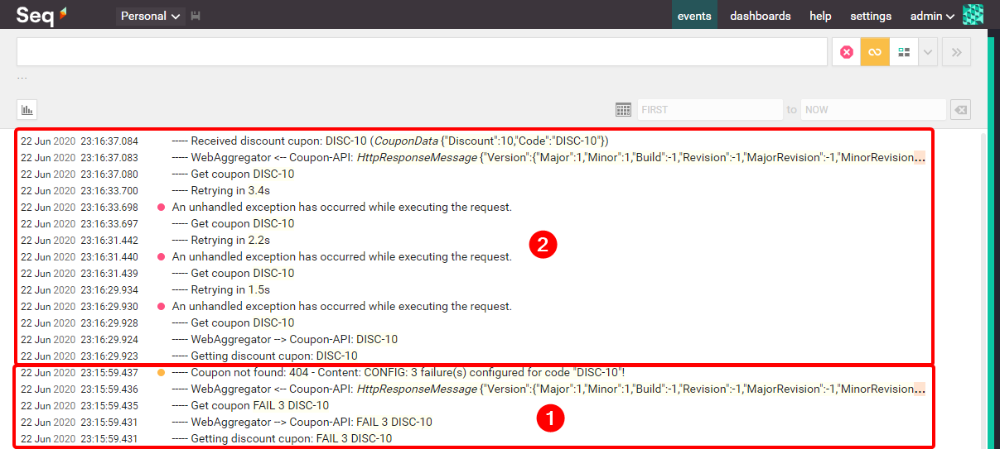

In this exercise, you'll implement a resiliency handler with Polly. The initial eShop-Learn deployment includes a failure simulation feature when validating a coupon from the checkout basket. This feature allows you to configure how many times a request for a specific discount coupon code should fail.

In this exercise, you will:

- Explore the app's response when resiliency isn't implemented.
- Update the app's code to implement failure handling using Polly.
- Create an Azure Container Registry (ACR) instance and deploy the updated app to AKS.
- Explore the system response under failure after implementing resiliency.

## Explore the response of a non-resilient app

### 1. Buy some stuff

To configure a simulated failure, you need at least one item in the basket. Complete the following steps:

1. Log in to *eShopOnContainers*.
1. Select the **.NET FOUNDATION PIN**.
1. Select the basket icon at the top right of the page.
1. Select checkout.

### 2. Configure simulated failure

1. Go to the **HAVE A DISCOUNT CODE?** input at the bottom of the page.
1. Enter the code *:::no-loc text="FAIL 2 DISC-10":::* to have the coupon service raise an exception twice, when validating the *:::no-loc text="DISC-10":::* discount code.
1. Select **APPLY**.
1. You should receive a confirmation message with number of failures configured for the code: **CONFIG: 2 failure(s) configured for code "DISC-10"!** as shown in the next image.

    

This configuration will make the next two requests for the *:::no-loc text="DISC-10":::* code to throw an exception.

### 3. Apply the failing discount coupon

1. Enter the coupon code *:::no-loc text="DISC-10":::*.
1. Select **APPLY**.
1. You should receive the message **ERROR: 500 - Internal Server Error!**.
1. If you select **APPLY** again, you should receive the same message once more.
1. On the third try, the code validation should succeed and the discount should be applied to the order.

Notice that you receive the error message immediately.

If you check the log traces, you should see something like this:


In the preceding image, you can see that:

- The first two requests (#1, #2) fail when getting the values.
- The third request (#3) succeeds and,
- Returns the expected value (#4).

## Add failure handling code using Polly

The basic idea is to have the app automatically handle retrying the operation until it succeeds, or give up because it looks like a severe failure.

When validating a discount coupon, the request goes to the web shopping aggregator, as the implementation of the [Backends For Frontends pattern](https://samnewman.io/patterns/architectural/bff) (BFF). The BFF implementation:

- Initiates another REST API request to the coupon service to get the required information.
- Handles resiliency using [IHttpClientFactory](/aspnet/core/fundamentals/http-requests) and [Polly](http://www.thepollyproject.org).

In this case, you'll implement two policies to handle failure: the Retry and Circuit Breaker policies from the previous unit.

Using Polly together with `IHttpClientFactory` to add resiliency to web apps is one of the archetypical solutions to handle failures. Complete the following steps to implement the failure handling:

1. Run the following command from the *src\ApiGateways\Aggregators\Web.Shopping.HttpAggregator* directory:

    ```dotnetcli
    dotnet add . package Microsoft.Extensions.Http.Polly
    ```

    The preceding command adds the `Microsoft.Extensions.Http.Polly` NuGet package to the *Web.Shopping.HttpAggregator* project. The actual `Polly` package is installed as a dependency of this package.

1. Configure the `HttpClient` to apply Polly policies.

    To implement this, you'll use the `AddHttpClient` extension method to register a specific configuration for the `HttpClient` that will be injected into `CouponService`.

    Edit the *src\ApiGateways\Aggregators\Web.Shopping.HttpAggregator\Startup.cs* file and make the following changes:

    - Import the `Polly`, `Polly.Extensions.Http`, and `Serilog` namespaces with `using` statements.
    - Include the `AddPolicyHandler(GetRetryPolicy())` and `AddPolicyHandler(GetCircuitBreakerPolicy())` to the `AddHttpClient` method for the `CouponService` dependency injection registration.
    - Add the `GetRetryPolicy` and `GetCircuitBreakerPolicy` methods.

    <!-- TODO: move code snippet to external .cs file and add line highlighting to show differences -->
    Check the following code for details:

    ```csharp
    using System
    ...
    using Polly;
    using Polly.Extensions.Http;
    using Serilog;
    ...

    public class Startup
    {
        // code omitted for brevity
    }

    public static class ServiceCollectionExtensions
    {
        ...
        public static IServiceCollection AddApplicationServices(this IServiceCollection services)
        {
            ...
            services.AddHttpClient<ICouponService, CouponService>()
                .AddHttpMessageHandler<HttpClientAuthorizationDelegatingHandler>()
                .AddPolicyHandler(GetRetryPolicy())
                .AddPolicyHandler(GetCircuitBreakerPolicy());

            return services;
        }

        static IAsyncPolicy<HttpResponseMessage> GetRetryPolicy()
        {
            return HttpPolicyExtensions
                .HandleTransientHttpError()
                .WaitAndRetryAsync(5, retryAttempt => TimeSpan.FromMilliseconds(Math.Pow(1.5, retryAttempt) * 1000), (_, waitingTime) =>
                {
                    Log.Logger.Information("----- Retrying in {WaitingTime}s", $"{ waitingTime.TotalSeconds:n1}");
                });
        }

        static IAsyncPolicy<HttpResponseMessage> GetCircuitBreakerPolicy()
        {
            return HttpPolicyExtensions
                .HandleTransientHttpError()
                .CircuitBreakerAsync(15, TimeSpan.FromSeconds(15));
        }
    }
    ```

    The preceding code configures a retry policy with an exponential back-off that increases the retry time as a power of 1.5 seconds. This value is typically a power of 2 seconds in most samples. To decrease wait times for this exercise, 1.5 seconds is used instead.

    You can also see that the Circuit Breaker policy "opens the breaker" for 15 seconds, after 15 continuous failures. This policy configuration gives the server some time to recover.

## Deploy the updated microservice

Complete the following steps to deploy the changes that you've implemented:

1. Run the following script from the *deploy/k8s* directory to create an ACR instance:

    ```bash
    ./create-acr.sh
    ```

    The preceding script:

    - Provisions a private ACR instance to publish the updated `webshoppingagg` image.
    - Permits the AKS cluster to retrieve images from the ACR instance.
    - Generates a variation of the following output:

        

1. Run the following script to publish the updated image to ACR:

    ```bash
    ./build-to-acr.sh --charts webshoppingagg
    ```

    The preceding script builds and publishes the updated image to ACR. An [ACR quick task](/azure/container-registry/container-registry-tasks-overview#quick-task) is used to build the `webshoppingagg` image and push it to the ACR instance. You'll see a variation of the following output:

    

    And this when finished:

    

1. Run the following script to deploy the updated image in ACR to AKS:

    ```bash
    ./deploy-application.sh --charts webshoppingagg
    ```

    The preceding script uninstalls the old `webshoppingagg` Helm chart and installs it again. The AKS cluster uses the new image from the ACR instance. You should get a result like this:

    

## Explore the system response when implementing resiliency

### Simple retries

You're going to repeat now what was done in the initial exploration, only you've already deployed the resilient BFF.

Consider the situation in which you configure the same two coupon failures with the code *:::no-loc text="FAIL 3 DISC-10":::*. When you enter the *:::no-loc text="DISC-10":::* code, it will take a few seconds to get the response back. Fortunately, you won't have to deal with the retrying.

If you check the log traces, you should see something like this:



In the preceding image, you can see:

- The log traces when configuring the simulated failures (#1) and
- Three retries until the aggregator could finally get the value (#2).

### Circuit breaker

For this case, you'll configure the code for 20 failures, using *:::no-loc text="FAIL 20 DISC-10":::*, as shown next:


Now enter the code *:::no-loc text="DISC-10":::* again and select **APPLY**. You'll have to wait about 20 seconds to get the error 500 message. When you do, select **APPLY** again. After the second failure, select **APPLY** for the third time.

On the third try, notice that the error 500 message came in much faster. That's because the circuit breaker was activated. If you select **APPLY** once again, you'll get the error message immediately.

You'll see this clearly in the log traces, as show next:


In the image above, you see that:

- After waiting for 7.6 seconds (#1), you get the error 500 message with the retry policy (#2) but
- The next time you try, you validate the code, you get the error 500 message after waiting only 3.4 seconds (#3) and you don't see the "Get coupon..." trace, meaning it failed without going to the server.
- If you check the details on this last trace, you should something like this:

    

Where you can see that the last trace has the "The circuit is now open..." message.

Let's move on to the deployment of Linkerd in the next exercise.
