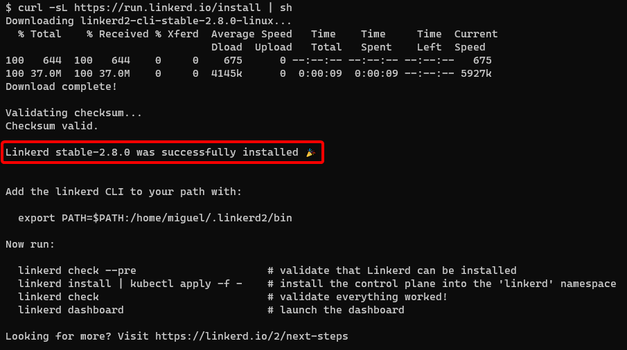
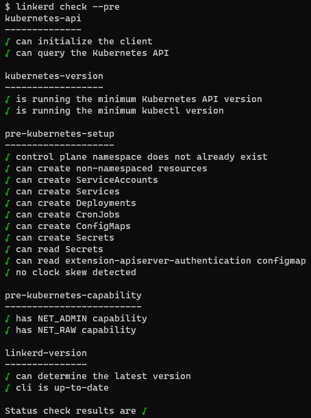
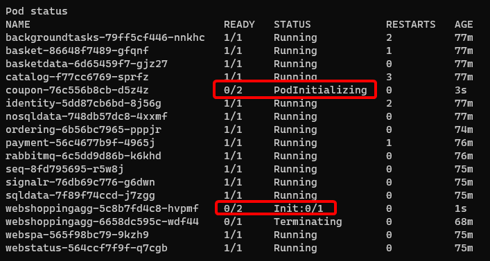
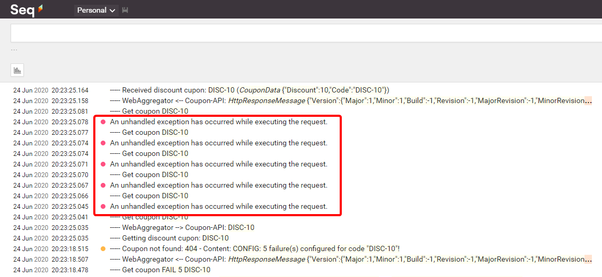

In the previous exercise, you implemented resiliency by adding failure-handling code, in the form of Polly policies. You can certainly say that it was a small change but it's also true that you only updated one microservice. So it could mean a non-trivial effort if you had to update a large application composed of many microservices.

You'll now make the app more fault tolerant by deploying Linkerd.

In this exercise you will:

- Return the application to the original version.
- Deploy Linkerd in your cluster.
- Configure the application to use Linkerd for resiliency.
- Explore the application behavior with Linkerd.

## Return the application to the initial version

Since we're going to explore the effect of Linkerd on the app, we have to go back to the original version, that is, without using Polly.

To achieve this, you have to redeploy the modified service from the original repository, using this command from the *deploy/k8s* folder:

```bash
./deploy-application.sh --registry eshopdev --charts webshoppingagg
```

You can explore the application when it becomes fully available again to verify that it's failing immediately on the configured discount code, as you just did in the previous exercise. As a quick refresher, complete the following tasks:

- Log in to the app.
- Click on the **.NET FOUNDATION PIN**
- Click on the basket icon at the top right of the page.
- Click checkout.
- Go to the **HAVE A DISCOUNT CODE?** input.
- Enter the code **FAIL 2 DISC-10** and click **APPLY**.
- Change the code to **DISC-10** and click **APPLY** twice.
- Verify that you receive the "**ERROR: 500 - Internal Server Error!**" immediately after each click.

## Install Linkerd

### 1. Install the Linkerd CLI

Run the following command:

```bash
curl -sL https://run.linkerd.io/install | sh
```

You should get something like this after a few seconds (depending on your Internet connection):



Next, add Linkerd to your path by running the following command:

```bash
export PATH=$PATH:$HOME/.linkerd2/bin
```

> [!NOTE]
> You'll have to run the above command every time you start a session, unless you update the *~/.profile* file accordingly.

Check the Linkerd CLI is running correctly using:

```bash
linkerd version
```

You should get something like this:


### 2. Validate your Kubernetes cluster

To be sure all Linkerd prerequisites are met, run this command:

```bash
linkerd check --pre
```

You should get something like this:



### 3. Install Linkerd onto the cluster

Run this command:

```bash
linkerd install | kubectl apply -f -
```

You should see the list of objects being created.

### 4. Verify the Linkerd status in the cluster

Run this command:

```bash
linkerd check
```

You should see a checklist similar to the pre-install one, but longer. It's also probable that the check pauses several times while waiting for the components to become ready. Eventually, you should get to something like this:


## Configure the app to use Linkerd

To keep the exercise short and focused, you'll implement Linkerd on two services only: `webshoppingagg` and `coupon-api`. To achieve this, you'll:

- Modify the deployments so Linkerd creates its proxy container in the pods
- Add a `ServiceProfile` object to the cluster, to configure the retries on the selected route.
- Configure headers for the related Nginx ingress.

You could check the app behavior now, but it will be the same as before. Linkerd only retries on the routes configured in the `ServiceProfile`.

### 1. Modify the `webshoppingagg` and `coupon` deployments

Edit the `coupon` chart *deployment.yaml* file (*deploy/k8s/helm-simple/coupon/templates/deployment.yaml*) and add the following annotations in line 20:

```yml
      annotations:
        linkerd.io/inject: enabled
```

The updated file must look like this:

```yml
apiVersion: apps/v1
kind: Deployment
metadata:
  name: coupon
  labels:
    app: eshop
    type: application-service
    service: coupon
spec:
  replicas: 1
  selector:
    matchLabels:
      service: coupon
  template:
    metadata:
      labels:
        app: eshop
        type: application-service
        service: coupon
      annotations:
        linkerd.io/inject: enabled
    spec:
      ...
```

The `linkerd.io/inject: enabled` annotation instructs Linkerd to add the `linkerd-proxy` container when creating the pod.

> [!NOTE]
> It's important to maintain correct indentation in YAML manifests.

In a similar way, edit the `webshoppingagg` chart *deployment.yaml* file (*deploy/k8s/helm-simple/webshoppingagg/templates/deployment.yaml*) as shown next:

```yml
apiVersion: apps/v1
kind: Deployment
metadata:
  name: webshoppingagg
  labels:
    app: eshop
    type: application-service
    service: webshoppingagg
spec:
  replicas: 1
  selector:
    matchLabels:
      service: webshoppingagg
  template:
    metadata:
      labels:
        app: eshop
        type: application-service
        service: webshoppingagg
      annotations:
        linkerd.io/inject: enabled
    spec:
    ...
```

### 2. Add the ServiceProfile for the GET coupon route

The `ServiceProfile` manifest content is shown next and it's already included in the *deploy/k8s/linkerd* folder, so you just have to run this command from the *deploy/k8s* folder:

```bash
kubectl apply -f linkerd/coupon-serviceprofile.yaml
```

### 3. Configure headers for Nginx

Linkerd needs additional information in the request headers, so you have to add some annotations in the ingress route.

Edit the *deploy\k8s\helm-simple\apigateway\templates\ingress-gateway.yaml* file to insert the following lines in line 89:

```yml
    nginx.ingress.kubernetes.io/configuration-snippet: |
      proxy_set_header l5d-dst-override $service_name.$namespace.svc.cluster.local:$service_port;
      grpc_set_header l5d-dst-override $service_name.$namespace.svc.cluster.local:$service_port;
```

The updated file must look like this:

```yml
...
---
apiVersion: extensions/v1beta1
kind: Ingress
metadata:
  name: ingress-gw-cp
  annotations:
    kubernetes.io/ingress.class: nginx
    nginx.ingress.kubernetes.io/rewrite-target: /webshoppingagg/$2
    nginx.ingress.kubernetes.io/use-regex: "true"
    nginx.ingress.kubernetes.io/proxy-read-timeout: "3600"
    nginx.ingress.kubernetes.io/proxy-send-timeout: "3600"
    nginx.ingress.kubernetes.io/configuration-snippet: |
      proxy_set_header l5d-dst-override $service_name.$namespace.svc.cluster.local:$service_port;
      grpc_set_header l5d-dst-override $service_name.$namespace.svc.cluster.local:$service_port;
  labels:
    app: eshop
spec:
  rules:
{{- if .Values.useHostName }}
  - host: {{ .Values.host }}
    http:
{{- else }}
  - http:
{{- end }}
      paths:
      - backend:
          serviceName: webshoppingagg
          servicePort: 80
        path: /apigateway/cp(/|$)(.*)
---
...
```

### 4. Deploy the updated Helm charts

Use the following command to redeploy the updated charts:

```bash
./deploy-application.sh --registry eshopdev --charts apigateway,coupon,webshoppingagg
```

You should see that the updated pods have two containers now (`0/2`). One is the service container and the other is `linkerd-proxy`:



## Explore the app behavior with Linkerd

Let's explore the app behavior now with a similar process:

- Log in to the app.
- Click on the **.NET FOUNDATION PIN**
- Click on the basket icon at the top right of the page.
- Click checkout.
- Go to the **HAVE A DISCOUNT CODE?** input.
- Enter the code **FAIL 5 DISC-10** and click **APPLY**.
- Change the code to **DISC-10** and click **APPLY**.
- You'll notice that this time, you receive the correct response almost immediately.

If you check the log traces, you should see something like this:



As mentioned in the review unit, Linkerd follows a different approach to resiliency from what we saw with Polly. Linkerd retried five times in fast sequence so we didn't notice any failure at all.

For more information about Linkerd configuration, see:

- [Configuring Retries - Linkerd documentation](https://linkerd.io/2/tasks/configuring-retries/)
- [Configuring Timeouts - Linkerd documentation](https://linkerd.io/2/tasks/configuring-timeouts/)
- [How we designed retries in Linkerd 2.2 - Linkerd blog](https://linkerd.io/2019/02/22/how-we-designed-retries-in-linkerd-2-2/)
