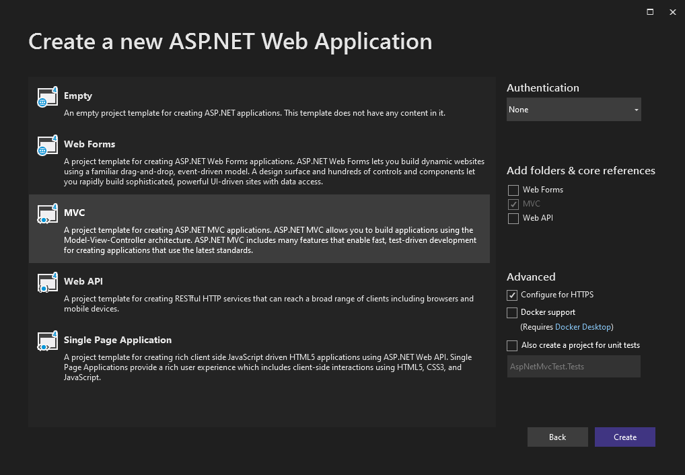
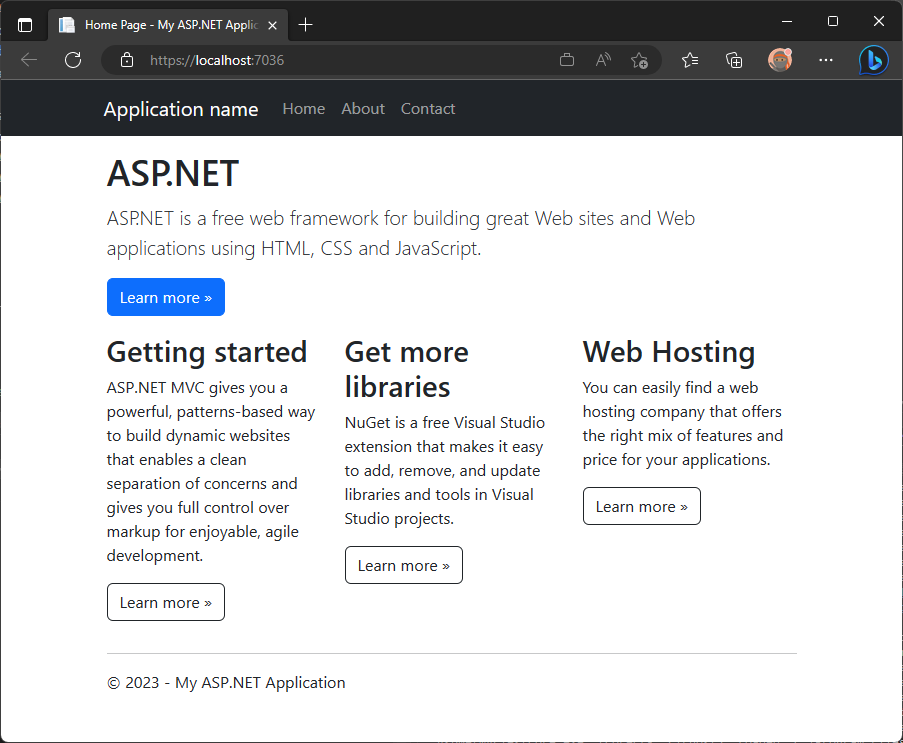

In this unit, you'll upgrade an ASP.NET MVC 5 application to ASP.NET Core using the Upgrade Assistant.

## Upgrade .NET Framework ASP.NET MVC apps

This section demonstrates running the .NET Upgrade Assistant against a newly created ASP.NET MVC app targeting .NET Framework 4.6.1.

## Create an ASP.NET MVC 5 app

1. Using Visual Studio, create a new ASP.NET Web Application project using .NET Framework.

   

1. Name the project **AspNetMvcTest**. Configure the project to use **.NET Framework 4.6.1**.

   

1. In the next dialog, choose **MVC** application, then select **Create**.

   

   Review the created project and its files.

1. Before converting the project, we'll want to look at the project file. Right-click the project in the Solution Explorer and select **Unload Project**. The source for the project file (`AspNetMvcTest.csproj`) will be displayed in the editor.

1. Close Visual Studio.

## Install the .NET Upgrade Assistant

1. Open a console window and run the following command:

   ```dotnetcli
   dotnet tool install -g upgrade-assistant
   ```

### Run the Upgrade Assistant

1. In your console window, navigate to the folder where the target project or solution is located.

1. Run the `upgrade-assistant` command, passing in the name of the project you're targeting (you can run the command from anywhere, as long as the path to the project file is valid).

   ```dotnetcli
   upgrade-assistant upgrade AspNetMvcTest.csproj
   ```

   The tool runs and shows you a list of the steps it will do.

   

   As each step is completed, the tool provides a set of commands allowing the user to apply or skip the next step, see more details, configure logging, or exit the process. If the tool detects that a step will perform no actions, it automatically skips that step and continues to the next step until it reaches one that has actions to do. Pressing <kbd>Enter</kbd> will start the next step if no other selection is made.

1. In this example, you will chose the the apply step each time. The first step is to back up the project. Type **1** and press the <kbd>Enter</kbd> key to continue.

   

   The tool prompts for a custom path for the backup, or to use the default, which will place the project backup in the same folder with a `.backup` extension.

1. The next step is to convert the project file to SDK style. Press the <kbd>Enter</kbd> key to proceed.

    

1. Once the project format has been updated, the next step is to clean up NuGet package references. Press the <kbd>Enter</kbd> key to continue.

   

1. Next, you will use the Upgrade Assistant to update the TFM of the project. Press the <kbd>Enter</kbd> key to continue.

   

1. Next, the tool updates the project's NuGet packages. Several packages need updates, and a new analyzer package is added. Press the <kbd>Enter</kbd> key to continue.

   

   Once the packages are updated, the next step is to add template files, if any. The tool notes there are four expected template items that must be added, and then adds them. The following is a list of the template files:

   - `Program.cs`
   - `Startup.cs`
   - `appsettings.json`
   - `appsettings.Development.json`

   These files are used by ASP.NET Core for [app startup](/aspnet/core/fundamentals/startup) and [configuration](/aspnet/core/fundamentals/configuration). Press the <kbd>Enter</kbd> key to continue.

   

1. Next, the tool migrates config files. The tool identifies app settings and disables unsupported configuration sections, then migrates the `appSettings` configuration values. Press the <kbd>Enter</kbd> key to continue.

   

   The tool completes the migration of config files by migrating `system.web.webPages.razor/pages/namespaces`.

   

1. The tool applies known fixes to migrate C# references to their new counterparts. Press the <kbd>Enter</kbd> key to continue.

   

1. Finally, the tool updates C# source code where possible, and notes manual updates that will need to be completed. Press the <kbd>Enter</kbd> key to continue.

   

1. Since this is the last project, the next step, "Move to next project", prompts to complete the process of migrating the entire solution. Press the <kbd>Enter</kbd> key to finalize the upgrade and exit the Upgrade Assistant.

   

## Complete Manual Upgrade Steps

After completing the steps in the Upgrade Assistant, you will need complete some manual steps to complete the upgrade.

> [!NOTE]
> Since both NuGet packages and the Upgrade Assistant are regularly updated, you may not hit the issues listed below, or you may encounter different issues. Troubleshooting steps are provided in the [Upgrade Assistant documentation](/aspnet/core/migration/upgrade-assistant).

### Remove unneeded NuGet packages

The Upgrade Assistant will attempt remove any packages that are no longer needed, but in some cases, the tool cannot determine if a package is no longer needed. These packages will need to be reviewed removed manually.

As you upgrade your existing projects, you will need to decide how you adapt to some architectural and stylistic changes. In this walkthrough, we will be removing a NuGet reference to `Newtonsoft.Json` since a newer version already included in the `Microsoft.AspNetCore.Mvc.NewtonsoftJson` package. Additionally, we will be removing NuGet packages which are used to include static JavaScript and CSS libraries.

1. Open the project file in Visual Studio.
1. Delete the **PackageReference** elements for the following packages:

   - `bootstrap`
   - `jQuery`
   - `jQuery.Validation`
   - `Microsoft.jQuery.Unobtrusive.Validation`
   - `Modernizr`
   - `Newtonsoft.Json`

1. Save and close the project file.

### Delete unused source files

1. Attempt to build the project. You will see multiple build errors in `BundleConfig.cs`, `FilterConfig.cs`, `RouteConfig.cs`, `HomeController,cs`, and `Global.asax.cs`.

   In a production application, you would need to review all of these files and manually migrate any custom code. Since this is a default project without any customizations, we can simply delete all of these files files with the exception of `HomeController.cs`.

1. Delete the `App_Start` directory.
1. Delete `Global.asax.cs`.
1. Delete `web.config`.

### Remove unnecessary Using directives in the HomeController

The `HomeController` has an error due to a `using` directive that references `System.Web.Mvc`. This `using` statement will need to be removed in order to make the code compile. However, we can take advantage of the new [implicit usings](/dotnet/core/tutorials/top-level-templates#implicit-using-directives) feature in C# 6.0 to simplify our code further but removing all `using` directives from the `HomeController`.

1. Open the `HomeController.cs` and delete the top 5 lines to remove all `using` directives from the file.

### Move static files to *wwwroot*

Static files that should be served by the web server should be moved to an appropriate folder within a root level folder named `wwwroot`. See [Static files in ASP.NET Core](/aspnet/core/fundamentals/static-files) for details.

For this upgrade, we are going to follow the structure in a new ASP.NET Core 6 project, but you are free to structure the static files in `wwwroot` however you like.

1. Create a new `wwwroot` directory in the root of the project.
1. Drag the `Scripts` directory into the `lib` directory.
1. Rename the `Scripts` directory to `lib`.
1. Drag the `Content` directory into the `wwwroot` directory.
1. Rename the `Content` directory to `css`.
1. Open the project file and delete the entire `<ItemGroup>` element that contains the JavaScript and CSS files that have been moved to `wwwroot`.

> [!NOTE]
> If you encounter build errors due to JavaScript references, you can close and re-open the project in Visual Studio.

### Update static file references in the Layout page

1. Open `Views/Shared/_Layout.cshtml`.
1. Delete the following lines from the `<head>` element:

   ```razor
    @Styles.Render("~/Content/css")
    @Scripts.Render("~/bundles/modernizr")
   ```

1. Replace the above lines with:

   ```html
    <link rel="stylesheet" href="~/css/bootstrap.min.css" />
    <link rel="stylesheet" href="~/css/bootstrap-theme.min.css" />
    <link rel="stylesheet" href="~/css/site.css" />
   ```

1. Delete the following lines from the bottom of the `<body>` element:

   ```razor
    @Scripts.Render("~/bundles/jquery")
    @Scripts.Render("~/bundles/bootstrap")
   ```

1. Replace the above lines with:

   ```html
    <script src="~/lib/jquery-3.4.1.min.js"></script>
    <script src="~/lib/jquery.validate.min.js"></script>
    <script src="~/lib/jquery.validate.unobtrusive.min.js"></script>
    <script src="~/lib/modernizr-2.8.3.js"></script>
    <script src="~/lib/bootstrap.min.js"></script>
   ```

### Run the application

At this point, the application should build and run successfully. Congratulations!

   

## Summary

In this section, you completed an upgrade for a simple, specific test scenario: a default ASP.NET MVC 5 app with no authentication, data access, additional NuGet packages, or custom code. In a more complex scenario, you will need to complete additional migration steps as detailed in the [ASP.NET Core Migration Guide](/aspnet/core/migration/index).
