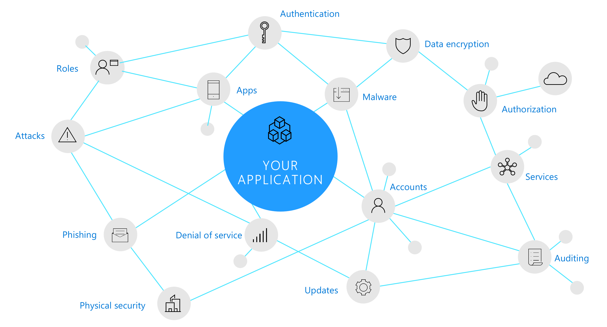

This module explores OWASP TOP 10: 2021 edition. It covers the most common security weaknesses and how you as an app developer or architect can reduce the risk of security bugs infecting your systems. This module introduces techniques, tools, and best practices that can improve your product’s security posture.

### Threat landscape

Implementing secure and high-quality software can be challenging. Malware, exploits, and many other cyber threats are on the rise. Attacks happen by exploiting vulnerabilities in an application. A vulnerability is just an unintended flaw or weakness in that application. How data is processed and stored and how services are configured are examples of where a vulnerability could be introduced.

News stories about a company being hacked or data being stolen and posted on dark web are now common. According to the 2021 Identity Theft Resource Center (ITRC) Annual Data Breach Report, the cost of a data breach increased by nearly 10% between 2020 and 2021. Data breaches are increasing and getting more costly.

> [!IMPORTANT]
> NIST defines [Software Vulnerability](https://csrc.nist.gov/glossary/term/Software_Vulnerability) as security flaw, glitch, or weakness found in software code that could be exploited by an attacker (threat source).

### The world of application security

Every developer writes their code to the best of their ability. As authors of ever more complex systems, we're responsible for the success of our products, and part of that success is providing our customers with a secure and reliable solution. The [security development lifecycle](https://www.microsoft.com/securityengineering/sdl/practices) starts with training. Understanding the risk associated and discussed in OWASP Top 10 is a great start.

Application Security, often referred to as AppSec, is the process of finding, fixing, and preventing security vulnerabilities at the application level.

[Image source](https://www.informationisbeautiful.net/visualizations/worlds-biggest-data-breaches-hacks/)

AppSec logically falls under the wider context of **Information Security (InfoSec)**, term covering protection of information and systems from unauthorized access, use, disruption, or destruction. InfoSec also covers areas like as network security, intrusion detection, digital forensics, and governance, risk, and compliance, for example.

**The Security Development Lifecycle (SDL)** consists of a set of practices that support security assurance and compliance requirements. The SDL helps developers build more secure software by reducing the number and severity of vulnerabilities in software.

**DevSecOps** is an evolution in the way development organizations approach security by introducing a security-first mindset culture and automating security into every phase of the software-development lifecycle from design to delivery.​

### Meet the team

Suppose you're joining a new IT company with an established team working on a legacy software. Your team's main focus is maintaining, supporting, and developing new features of a rich web application customers all around the world use. The website and its underlying infrastructure have only recently been migrated to Microsoft Azure cloud.

The team you're part of has a mix of talent, including early-career and seasoned enterprise developers.

In the past, your team was slowed down by the manual-release process that proved to be unreliable, error-prone, and heavy on manual interaction. As part of its cloud migration, your team is looking to adopt modern CI/CD automation.

The company hasn't fully grasped the concepts behind secure DevOps practices. With new personnel onboarded, the company is looking to spread security best practices not only within the team, but the company as a whole.

Your team lead asked you to conduct design and code reviews of a team-owned codebase, with extra attention paid to the solution's security aspects. You discovered the OWASP report, which you plan to use as a reference in your code review.
