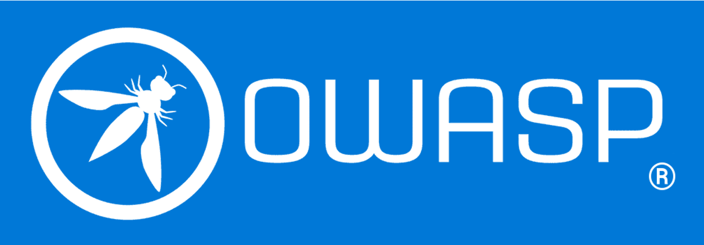

As the application complexity becomes more increases, so does the effort of making it secure. Modern applications, in contrast with single-project monolith legacy application, depend on external libraries, services for hosting, building and releasing to name a few. None of these services are simple plug and play affairs, developers need to understand them, and know how to configure and implement the flows and processes – the interactions - securely in their own code.

:::row:::
   :::column span="2":::
        Security is everyone’s job. Developers, service engineers, and program and product managers must understand security basics and know how to build security into software and services to make products more secure while still addressing business needs and delivering user value.

        Training and education stage is the essential step in application development lifecycle (or SDL). For developers, OWASP Top 10 is a great start.

        Your team's security journey, from software development point of view, should begin by familiarizing yourself with concepts behind each category.
   :::column-end:::
   :::column span="":::
     
   :::column-end:::
:::row-end:::

To quote first pillar of [Microsoft's Secure Development Lifecycle practices](https://www.microsoft.com/en-us/securityengineering/sdl/practices) *training will complement and re-enforce security policies, SDL practices, standards, and requirements of software security, and be guided by insights derived through data or newly available technical capabilities.
Although security is everyone’s job, it’s important to remember that not everyone needs to be a security expert nor strive to become a proficient penetration tester. However, ensuring everyone understands the attacker’s perspective, their goals, and the art of the possible will help capture the attention of everyone and raise the collective knowledge bar.*

### What is OWASP?

The [Open Web Application Security Project (OWASP)](https://owasp.org/) is a global nonprofit organization focused on improving software security.
This is the recently updated list for 2021, and you can see how each category covers different areas of application security. Their mission is to make software security visible so that individuals and organizations can make informed decisions.

The list is curated and ordered by severity of reported, vulnerabilities, industry suggested guidelines and probability of attracts.

### OWASP Top 10

The OWASP Top 10 (2023) is a standard awareness document for developers and web application security. It represents a broad consensus about the most critical security risks to web applications.

1. **Broken Access Control​**
2. **Cryptographic Failures​**
3. **Injection​**
4. **Insecure Design​**
5. **Security Misconfiguration​**
6. **Vulnerable and Outdated Components​**
7. **Identification and Authentication Failures​**
8. **Software and Data Integrity Failures​**
9. **Security Logging and Monitoring Failures​**
10. **Server-Side Request Forgery​**

### Application security in a wider security context​

AppSec logically falls under the wider context of **Information Security (InfoSec)**, term covering protection of information and systems from unauthorized access, use, disruption, or destruction etc. InfoSec also covers areas like as network security, intrusion detection, digital forensics, and governance, risk, and compliance for example.

**The Security Development Lifecycle (SDL)** consists of a set of practices that support security assurance and compliance requirements. The SDL helps developers build more secure software by reducing the number and severity of vulnerabilities in software.

**DevSecOps** is an evolution in the way development organizations approach security by introducing a security-first mindset culture, and automating security into every phase of the software development lifecycle from design to delivery.​