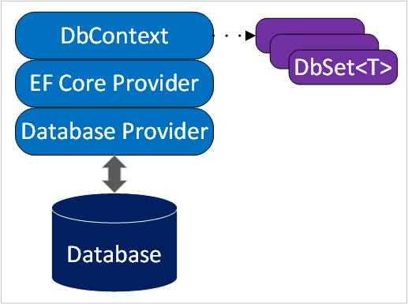

Entity Framework Core is an **object-relational mapper**. ORMs provide a layer between your programming language and the database. With EF Core, the database is abstracted behind .NET POCOs (**P**lain **O**ld **C**LR **O**bjects). As a result, you can focus on your code and EF Core handles direct interaction with the database. 

With EF Core, you can:

- Load data as C# objects (entities).
- Add, modify, and delete data calling methods on those entities.
- Map multiple database tables to a single C# entity.
- Handle concurrency issues that arise when multiple users simultaneously attempt to update the same record.
- Use strongly typed Language Integrated Query (<xref:System.Linq?displayProperty=nameWithType>) syntax to query the database.
- Access [multiple databases](/ef/core/providers/) including SQL Server, Sqlite, Azure Cosmos DB, PostgreSQL, MySQL, and more.
- Build your domain model from an existing database.
- Manage your database schema based on your domain model.

## Review EF Core architecture

The following diagram depicts the architecture behind EF Core.

Classes deriving from `DbContext`:

- Represent an active session with the database.
- Save and query instances of entities.
- Include properties of type `DbSet<T>` representing tables in the database. If a table doesn't already exist in the database, it will be created.

The EF Core Provider translates object graph changes to SQL.

The Database Provider:

- Is a plug-in library designed for a specific database engine, such as SQL Server, Azure Cosmos DB, or PostgreSQL.
- Accepts SQL from the EF Core Provider and executes it in the database.
- Extends EF Core to enable functionality that's unique to the database engine.

## Managing database schemas

EF Core provides two primary ways of keeping your EF Core model and database schema in sync. To choose between the two, decide whether your EF Core model or the database schema is the *source of truth*.

### Migrations (Model as the source of truth)

In real world projects, data models change as app features get implemented. As new entities are added and removed, and database schemas need to be changed accordingly. EF Core migrations provide a way to incrementally update the database schema to keep it in sync with the application's data model while preserving existing data in the database.

When a data model change is introduced, the developer uses EF Core tools to add a corresponding migration. EF Core compares the current model against a snapshot of the old model to determine the differences. C# code to implement the changes is generated. The C# files can be tracked in your project's source control like any other source file.

Once a new migration has been generated, it can be applied to a database in various ways. EF Core records all applied migrations in a special history table. The history table keeps a record of which migrations have been applied.

### Reverse engineering (Database as the source of truth)

Reverse engineering is the process of scaffolding entity model classes and a `DbContext` class based on a database schema. This approach is often used with existing or shared databases where the schema can't easily be changed.

## Getting started

In the next unit, you'll get started with EF Core by using migrations.
