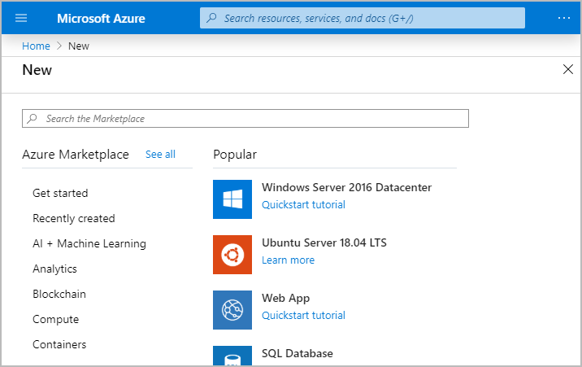
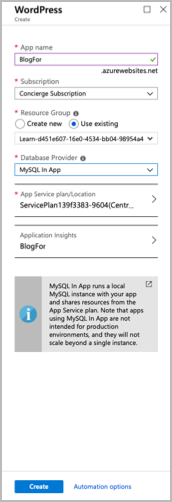
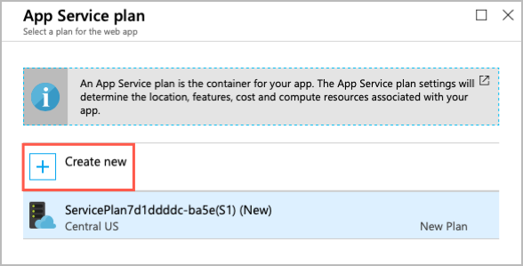
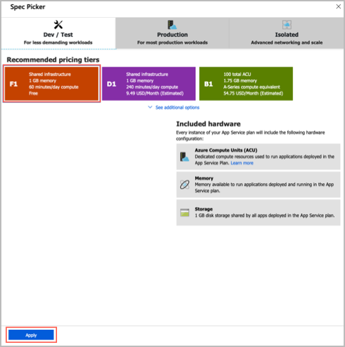
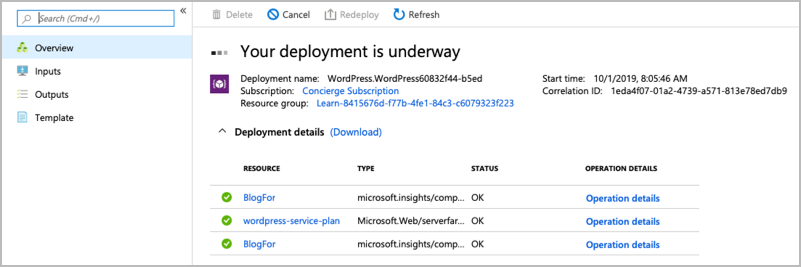

As a developer for Tailwind Traders, you likely have expertise creating applications. As you migrate to Azure, many of the steps that you will follow to set up a website in the cloud will parallel the steps that you have followed when creating websites in your company's datacenter. For example, you need to choose where you will create your website, and then allocate the necessary resources. In Azure, the physical hardware is managed for you, so your tasks are to choose were your website will be located and which resources to provide.

In this exercise, you'll create an Azure App Service to host a WordPress website.

## Azure terminology and concepts.

Before you get started, let's review and discuss some basic terms and concepts that you'll need to know when you create your website.

### What is an App Service?

Azure App Service is an HTTP-based service that enables you to build and host many types of web-based solutions without managing infrastructure. For example, you can host web apps, mobile back ends, and RESTful APIs in several supported programming languages. Applications developed in .NET, .NET Core, Java, Ruby, Node.js, PHP, or Python can run in and scale with ease on both Windows and Linux-based environments.

For this exercise, we want create a website in less than the time it takes to eat lunch. Therefore, we're not going to write any code. Instead, you'll deploy a predefined application from the Microsoft Azure Marketplace.

### What is the Microsoft Azure Marketplace?

The Microsoft Azure Marketplace is an online store that hosts applications that are certified and optimized to run in Azure. Many types of applications are available, ranging from AI + Machine Learning to Web applications. As you'll see in a couple of minutes, deployments from the store are done via the Azure portal using a wizard-style user interface. This user interface makes evaluating different solutions easy.

We're going to use one of the WordPress application options from the Azure Marketplace for our website.

### Creating resources in Azure

Typically, the first thing we'd do is to create a *resource group* to hold all the things that we need to create. The *resource group* allows us to administer all the services, disks, network interfaces, and other elements that potentially make up our solution as a unit. We can use the Azure portal to create and manage our solution's resource groups. However, keep in mind that you can also manage resources via a command line using the Azure CLI. The Azure CLI is a useful option should you need to automate the process in the future.

In the free Azure sandbox environment, you'll use the pre-created resource group **<rgn>[sandbox resource group name]</rgn>**, and you don't need to do this step.

### Choosing a location

[!include]

## Create a WordPress website

1. If you haven't already, verify that you have activated the sandbox above.

    Activating the sandbox will allocate the subscription and resource group you will use in this exercise. This step is required for any Microsoft Learn exercises that use a sandbox.

1. Sign in to the [Azure portal](https://portal.azure.com/learn.docs.microsoft.com?azure-portal=true) using the same account you activated the sandbox with.

1. Expand the left-hand navigation panel.

1. From the top of the Azure portal navigation list, select **Create a resource**.

    

    This option takes you to the **Azure Marketplace**.

    

1. The Azure Marketplace has many services, solutions, and resources available for you to use. Since we know that we want to install WordPress, we can do a quick search for it. In the **Search the Marketplace** box above the listed application options, type in **WordPress**. Select the default *WordPress* option from the list of options available.

    

1. In the newly presented panel, you'll typically find additional information about the item you're about to install, including the publisher, a brief description of the resource, and links to more information. Make sure to review this information. Select **Create** to begin the process to create a WordPress app.

    

1. Next, you're presented several options to configure your deployment. Enter the following information:

    1. **App Name**: Choose a unique value for the App name. It will form part of a Fully Qualified Domain Name (FQDN).
    1. **Subscription**: Make sure the **Concierge Subscription** is selected.
    1. **Resource Group**: Select the **Use existing** radio button, then select the **<rgn>[sandbox resource group name]</rgn>** resource group from the drop-down list.
    1. **Database Provider**: Select **MySQL in App**.
    1. **App Service plan/location**: You'll change the App Service plan in the next step.
    1. **Application Insights**: Leave at the default configuration.

    Your configuration should look like this:

    
    
    > [!NOTE]
    > If you still see a section called **Database**, make sure you selected the correct **Database Provider** described in the configuration above.

1. Now let's configure the App Service plan to use a specific pricing tier. The App Service plan specifies the compute resources and location for the web app. Select **App Service plan/location**.

    

1. In the **App Service plan** panel, select **Create new**.

    

1. In the **New App Service plan** panel, enter a **name** for the new service plan.

1. For **Location**, pick **Central US** to make sure we pick a region that allows the service plan you will pick. Normally, you would pick the region that is closest to your customers while offering the services you need.

1. Select **Pricing tier** to see the performance and feature options of the various types of service plans.

    

1. The **Spec Picker** allows us to select a new pricing tier for our application. This screen opens to the *Production* tab, with the S1 pricing tier selected. We'll select a new pricing tier from the *Dev / Test* tab for our website.

    Select the **Dev / Test** tab and select the **F1** pricing tier. Then select **Apply**.

    

1. Back on the **New App Service plan** panel, select **OK** to create the new plan and close the panel.

1. Finally, select the **Create** button to start the deployment of your new site.

> [!NOTE]
> If you encounter an issue creating the resources, verify you've selected the **F1** pricing tier in the new App Service plan. This is a requirement of the sandbox system when creating this WordPress site.

## Verify your website is running

The deployment of the new website can take a few minutes to complete, and you're welcome to explore the portal further on your own.

We can track the progress of the deployment at any time.

1. Select the **notification bell** icon at the top of the portal. If your browser window width is smaller, it may be shown when you click on the ellipsis (**...**) icon at the top right.

    

1. Select **Deployment in progress...** to see the details about all the resources that are created.

    

    Notice how resources are listed as they're created and the status changes to a green check as each component in the deployment completes.

    

1. Once the deployment status message change to **Your deployment is complete**, you'll notice the status in the notification dialogue changes to **Deployment succeeded**. Select **Go to resource** to navigate to the App Service overview.

    

1. Find the URL in the Overview section.

    

    Copy the **URL** information. Open a new tab in your browser and use the information to browse to your new WordPress site. You can now configure your WordPress website and add content.

    :::image type="content" source="../media/configure-wordpress.png" alt-text="Screenshot showing pre-configured WordPress website waiting on language/location selection." loc-scope="third-party":::
