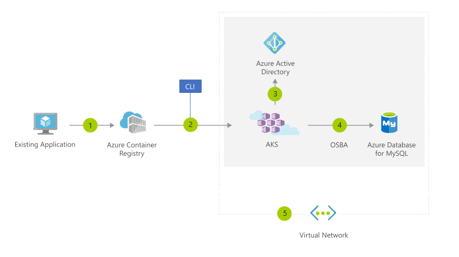

While virtual machines are an excellent way to reduce costs versus the investments that are necessary for physical hardware, they are still limited to a single operating system per virtual machine. If you wish to run multiple instances of an application on a single host machine, containers are an excellent choice.

## What are containers?

Containers are a virtualization environment, and much like running multiple virtual machines on a single physical host, you can run multiple containers on a single physical or virtual host. However, unlike virtual machines, you do not manage the operating system for a container. Whereas virtual machines appear to be an instance of an operating system that you can connect to and manage, containers are lightweight and are designed to be created, scaled out, and stopped dynamically. While it is possible to create and deploy virtual machines as application demand increases, containers are designed to allow you to respond to changes on demand, and quickly restart in case of a crash or hardware interruption. One of the most popular containers is Docker, which is supported by Microsoft Azure.

## Comparing virtual machines to containers

The following video highlights several of the important differences between virtual machines and containers.

> [!VIDEO https://www.microsoft.com/videoplayer/embed/RE2yuaq]

## Managing containers

Containers are managed through a container orchestrator, which can start, stop, and scale out application instances as needed. There are two ways to manage both Docker and Microsoft-based containers in Azure: _Azure Container Instances_ and _Azure Kubernetes Service_.

:::row:::
  :::column span="3":::

### Azure Container Instances (ACI)

[Azure Container Instances](https://azure.microsoft.com/services/container-instances) offers the fastest and simplest way to run a container in Azure without having to manage any virtual machines or adopt any additional services. It is a PaaS offering that allows you to upload your containers, which it will run for you. 

  :::column-end:::
  :::column:::
    :::image type="icon" source="../media/icon-container-instance.png" border="false":::
  :::column-end:::
:::row-end:::

:::row:::
  :::column span="3":::

### Azure Kubernetes Service (AKS)

The task of automating, managing, and interacting with a large number of containers is known as orchestration. [Azure Kubernetes Service (AKS)](https://azure.microsoft.com/services/kubernetes-service) is a complete orchestration service for containers with distributed architectures and large volumes of containers. Orchestration is the task of automating and managing a large number of containers and how they interact. 

  :::column-end:::
  :::column:::
    :::image type="icon" source="../media/icon-kubernetes.png" border="false":::
  :::column-end:::
:::row-end:::

### What is Kubernetes?

The following video discusses some important details about Kubernetes container orchestration.

> [!VIDEO https://www.microsoft.com/videoplayer/embed/RE2yEuX]

## Use containers in your solutions

Containers are often used to create solutions using a _microservice architecture_. This architecture is where you break solutions into smaller, independent pieces. For example, you may split a website into a container hosting your front end, another hosting your back end, and a third for storage. This split allows you to separate portions of your app into logical sections that can be maintained, scaled, or updated independently.

Imagine your website backend has reached capacity but the front end and storage aren't being stressed. You could scale the back end separately to improve performance, or you could decide to use a different storage service, or you could even replace the storage container without affecting the rest of the application.

### What is a microservice?

The following video discusses some important details about microservices.

> [!VIDEO https://www.microsoft.com/videoplayer/embed/RE2yual]

## Migrate applications to containers

You can move existing applications to containers and run them within AKS. You can control access via integration with Azure Active Directory (Azure AD) and access Service Level Agreement (SLA)-backed Azure services, such as Azure Database for MySQL for any data needs, via Open Service Broker for Azure (OSBA).

The preceding figure depicts this process as follows:

1. You convert an existing application to one or more containers, and then publish one or more container images to the Azure Container Registry.
1. By using the Azure portal or the command line, you deploy the containers to an AKS cluster.
1. Azure AD controls access to AKS resources.
1. You access SLA-backed Azure services, such as Azure Database for MySQL, via OSBA.
1. Optionally, AKS is deployed with a virtual network.
