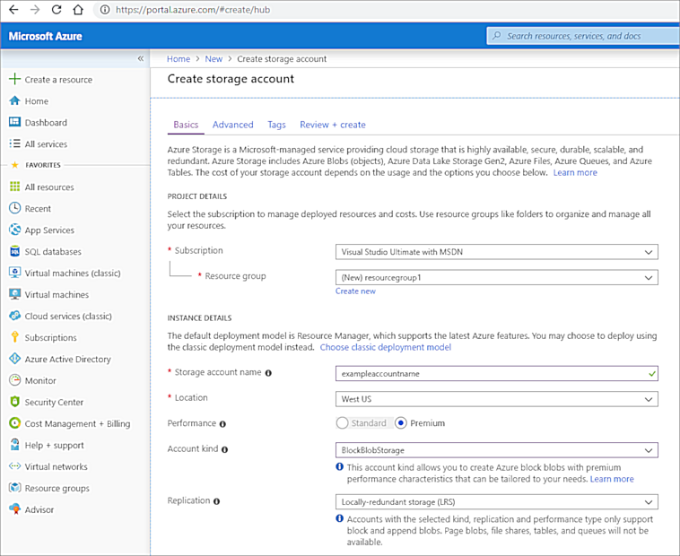
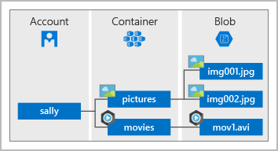

The Chief Technology Officer (CTO) for your company, Tailwind Traders, has tasked your team with migrating all of your files to the cloud, and your team has chosen [Azure Storage](https://azure.microsoft.com/product-categories/storage), which is a service that you can use to store files, messages, tables, and other types of information. You can use Azure Storage on its own (for example as a file share), but developers also often use it as a repository for working data. Such repositories can be used by websites, mobile apps, desktop applications, and many other types of custom solutions. Azure Storage is also used by IaaS virtual machines, and PaaS cloud services.

Your first step to begin using Azure Storage is to create an Azure Storage account to store your data objects. You can create an Azure Storage account using the Azure portal, PowerShell, or the Azure Command Line Interface (CLI).

Your storage account will contain all of your Azure Storage data objects; for example: containers, blobs, files, queues, tables, and disks.

A storage account provides a unique namespace for your Azure Storage data that is accessible from anywhere in the world over HTTP or HTTPS. Data in your Azure storage account is secure, highly available, durable, and massively scalable.

To learn how to create an Azure storage account, see [Create a storage account](https://docs.microsoft.com/azure/storage/common/storage-account-create).
