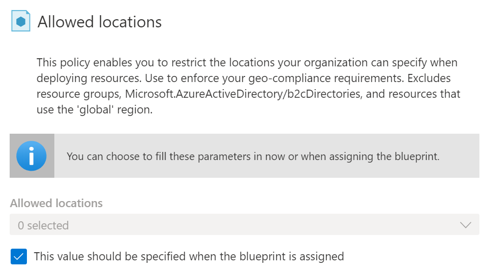

## Azure Blueprints

So far in this module, you've explored a number of Azure features that can help you implement your governance decisions, monitor the compliance of your cloud resource, control access and protect critical resource from accidental deletion. What happens when your cloud environment starts to grow beyond just one subscription? How can you scale the configuration of these features, knowing they will be enforced for resources in new subscriptions? 

Instead of having to configure features like Azure Policy for each new subscription, [Azure Blueprints](https://azure.microsoft.com/services/blueprints?azure-portal=true) enables you to define a repeatable set of governance tools and standard Azure resources that your organization requires. This allows development teams to rapidly build and deploy new environments with the knowledge that they're building within organizational compliance, with a set of built-in components that speed up development and delivery.

Azure Blueprint is a declarative way to orchestrate the deployment of various resource templates and other artifacts, such as:

+ Role assignments

+ Policy assignments

+ Azure Resource Manager templates

+ Resource groups

## Blueprint process

The process of implementing Azure Blueprint consists of the following high-level steps:

1. Create an Azure Blueprint.
2. Assign the blueprint.
3. Track the blueprint assignments.

TODO: 
Could we make a diagram similar to the Azure Policy one? 

With Azure Blueprints, the relationship between the blueprint definition (what should be deployed) and the blueprint assignment (what was actually deployed) is preserved. This connection supports improved deployment tracking and auditing. Blueprints also allow for versioning, so you can track and comment on changes to your Blueprint.

Azure Blueprints are different from Azure Resource Manager Templates.  When Azure Resource Manager Templates deploy resources, they have no active relationship with the deployed resources once they have been actioned (the templates exist in a local environment or in source control). By contrast, with Azure Blueprint, each deployment is tied to an Azure Blueprint package.  This means that the relationship with resources will be maintained, even after deployment. Maintaining relationships, in this way, improves auditing and tracking capabilities.

## How does Tailwind Traders use Azure Blueprints for ISO 27001 compliance?

[ISO 27001](https://www.iso.org/isoiec-27001-information-security.html) is a standard regarding the security of Information Technology sytems, published by the International Organization for Standardization. As part of it's quality process, Tailwind Traders wishes to obtain and maintain certification that it complies with this standard. Azure Blueprints has several built-in blueprint definitions related to ISO 27001.

As the IT Administrator, you decide to investigate the ISO 27001: Shared Services Blueprint definition. 
1. You've started by defining a management group called *PROD-MG*, which all new subscriptions will be added to when they are created. 
1. You then create your own blueprint definition based on the ISO 27001: Shared Services template and publish it.
1. Then, you assign the blueprint to your *PROD-MG* management group. This blueprint deploys all associated, required resource groups, policy assignments and Azure Resource Manager templates to any existing subscriptions in this management group and to any new subscriptions created and added to this management group.

The ISO 27001: Shared services blueprint template contains 16 policy assignments, 8 Azure Resource Manager templates and 5 resource groups.

### Blueprint artifacts
Each component in the blueprint definition is known as an artifact. Artifacts can either have no parameters (for example, the *Deploy threat detection on SQL servers* policy, which requires no further configuration), or they can contain one or more parameters. 

A parameter is a configuration setting which can be defined when the blueprint definition is saved, or it can be defined when the blueprint definition is assigned to a scope. In this way, you can maintain one standard blueprint, but have the flexibility to specify the relevant configuration parameters at each scope where the definition is assigned.   

